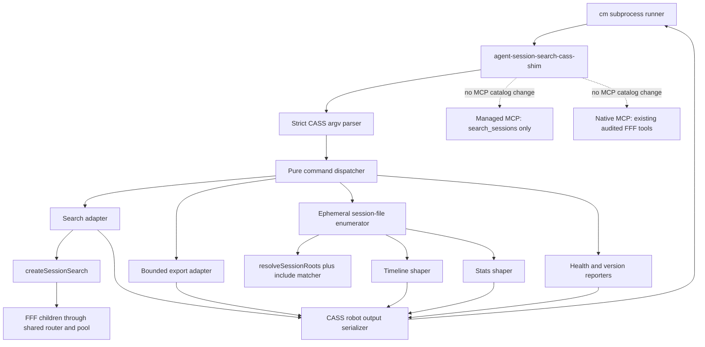

# CASS Compatibility Shim over FFF - Plan

## Goal Capsule

- **Objective:** Ship `agent-session-search-cass-shim`, an index-free CASS robot-CLI compatibility binary that lets `cm` use Agent Session Search and FFF for search, export, timeline, stats, and health without depending on a healthy CASS index.
- **Authority:** `docs/plans/2026-07-20-001-feat-cass-compat-shim-plan.md` defines the compatibility concept; `DESIGN.md`, `CONTEXT.md`, and `docs/adr/0001-fff-core-and-native-policy-strictness.md` define the FFF and MCP boundaries.
- **Execution profile:** Standard cross-cutting TypeScript work: a new CLI adapter and package entrypoint, new compatibility modules, focused fixtures and contract tests, package documentation, and live `cm` acceptance checks.
- **Stop conditions:** Stop before release if the predecessor `days` and `workspace` search filters are not available, the shim changes either MCP tool catalog, any lexical search bypasses FFF, an export path requires a general transcript-parser framework, or `cm context` cannot complete within its eight-second process timeout with safe margin.
- **Tail ownership:** The implementation owns all six command surfaces, packaging, activation and rollback documentation, live `cm` verification, and cleanup of every spawned FFF child. It does not own CASS repair, CASS passthrough, or a new search lane.

---

## Product Contract

### Concept Intent

Decouple `cass-memory` (`cm`) from CASS index health by replacing only the subprocess contract that `cm` consumes. The shim must preserve the useful CASS robot shapes while delegating lexical retrieval to the existing managed search library and FFF. The existing two MCP lanes remain unchanged: `agent-session-search-mcp` still exposes only `search_sessions`, and `agent-session-search-native-mcp` remains the opt-in raw FFF lane. The shim is a non-MCP interoperability adapter, not a third lane.

### Problem Frame

The installed `cm` 0.2.12 checks CASS availability with `--version`, parses every robot-search hit through a strict schema, uses timeline output to discover unprocessed sessions, and calls export for reflection and diary generation. The installed CASS 0.6.22 currently returns a `checkpoint_incomplete` robot error for ordinary search, so an otherwise available binary can still make history retrieval degrade.

Agent Session Search already provides index-free lexical recall through FFF, source-root resolution, canonical paths, deterministic query planning, fanout, ranking, and partial-failure warnings. What it lacks is the narrow CASS command/output facade required by `cm`. Implementing that facade inside this package removes the index dependency without creating another search engine.

### Requirements

**Compatibility process contract**

- R1. The package must ship an executable `agent-session-search-cass-shim` bin whose `--version` path exits zero within the two-second `cm` availability timeout without resolving roots or starting FFF.
- R2. The supported command surfaces must be `--version`, `health`, `search`, `export`, `timeline`, and `stats`; they must ship together, and unsupported commands must fail with usage guidance rather than invoking a real `cass` binary.
- R3. Successful commands must write only their data payload to stdout. Diagnostics and failures must write to stderr; structured failures must use `{error:{code,kind,message,hint,retryable}}` and the compatible exit codes 2, 4, or 9. The shim must never emit CASS index-missing code 3 or claim timeout code 10.
- R4. Parsing must support the exact argument forms used by `cm`, including `--` separators, repeated `--agent`, `--fields`, `--robot`, `--days`, `--workspace`, `--since`, `--json`, and export formats `markdown` and `text`.
- R5. Unknown options must fail closed with exit 2 and a contract-drift hint. Known compatibility-only options such as `--robot`, `--json`, and `--fields` may be accepted without changing the full-fidelity output shape.

**Search behavior**

- R6. `search` must call `createSessionSearch` in-process and must not shell to either package CLI, the native MCP server, or CASS. It must close the search instance in `finally` on success and error.
- R7. The predecessor `days` and `workspace` fields must be passed to the shared search library, while CASS agent slugs are mapped to configured Agent Session Search sources. An unknown agent slug must produce an empty successful result, never a broadened all-source search.
- R8. Candidate-group leads must be flattened in group priority and lead order, deduplicated by source plus canonical path, globally limited, and mapped to the CASS robot envelope. Every hit must include numeric `line_number` with fallback 1, `source_path`, CASS-compatible `agent`, `snippet`, and a monotonic ordinal score; optional fields may be emitted only when grounded.
- R9. Zero search hits must be a successful envelope with `hits: []`. Source and backend warnings may be summarized on stderr, but stdout must remain parseable and one malformed mapped hit must never invalidate the other hits.

**Export and queryless enumeration**

- R10. `export` must read the requested local session file directly and render CASS-compatible markdown or text for the known Claude, Codex, Pi, and generic message shapes. Records without a confident role and text must be skipped so `=== UNKNOWN ===` is never emitted.
- R11. Missing export files must exit 4, while an existing file with no confidently parsed messages must exit 9 so `cm` can use its own fallback parser. The shim must not echo unparsed raw records as conversation text.
- R12. `timeline` and `stats` must use a shared, ephemeral filesystem enumerator over `resolveSessionRoots` plus `pathMatchesInclude`. It must preserve canonical absolute paths, skip symlink-directory traversal, tolerate per-root and per-file failures, and create no index, mirror, cache, or durable aggregate.
- R13. Timeline output must be grouped by UTC hour from file mtime, ordered newest first, and capped after ordering. Stats must report that message counts are not computed and must disclose caps or truncation instead of presenting partial counts as exact.
- R14. `health` must report that the shim searches live session files through FFF and has no index; it must not claim that search, recall equivalence, or export correctness was live-probed unless that command actually performed the probe.

**Architecture and release**

- R15. Neither MCP server, `search_sessions`, native policy, or FFF capability router contract may change. Existing managed and native tool-list smoke tests are release gates for this negative requirement.
- R16. `DESIGN.md` must record the shim as a package compatibility entrypoint and narrowly exempt its export adapter from the general transcript-export non-goal. User documentation must include activation by `CASS_PATH` or `cassPath`, compatibility scope, diagnostics, and one-step rollback.
- R17. The release acceptance bar is a live `cm doctor`, `cm context`, and dry-run reflection path using the built shim, with canonical source paths, no local CASS degradation on successful search, no `UNKNOWN` export blocks, and `cm context` completing under four seconds on the reference corpus.

### Acceptance Examples

- AE1. `cm` invokes `agent-session-search-cass-shim --version`; the process exits 0 quickly even when `fff-mcp` is absent because version reporting does not initialize search.
- AE2. `cm context` sends `search --limit 10 --days 7 --workspace <path> --robot -- <query>`; the shim returns a real-CASS-style envelope whose hits all pass `cm`'s strict schema and whose paths are canonical session paths.
- AE3. `search --agent claude_code` searches only the `claude` source and emits `agent: "claude_code"`; an unsupported agent slug returns zero hits and does not search every root.
- AE4. A candidate without a line number maps to `line_number: 1`, so the hit remains valid instead of causing `cm` to reject the entire search response.
- AE5. Exporting a mixed-validity JSONL file skips malformed and role-unknown records, renders the valid conversation in the requested format, and produces zero `=== UNKNOWN ===` headers.
- AE6. Timeline enumeration over two roots with controlled mtimes returns UTC hour groups in newest-first order, respects managed include patterns, and reports inaccessible roots without discarding healthy-root sessions.
- AE7. `agent-session-search-mcp` still lists only `search_sessions`, and the native server still lists only its existing diagnostic plus policy-approved namespaced FFF tools.
- AE8. Unsetting `CASS_PATH` restores the real CASS binary with no data migration or configuration rewrite required.

### Scope Boundaries

**In scope**

- The six compatibility command surfaces and their CASS-shaped stdout/stderr contracts.
- Minimal interop parsers for session export, and ephemeral file metadata enumeration for timeline and stats.
- Package bin/files wiring, documentation, unit/contract tests, packed-install tests, and live `cm` acceptance proof.

**Deferred to follow-up work**

- Additional CASS verbs or flags discovered in a later `cm` release.
- Additional session export formats that cannot be represented by the bounded record extractors in this plan.
- Performance changes inside the shared FFF backend if the shim-specific adapter is not the source of an acceptance-latency miss.

**Outside this product's identity**

- Passing unknown commands through to CASS.
- Repairing, wrapping, or synchronizing the CASS index.
- A third MCP lane, new managed MCP tools, raw FFF policy changes, custom search, embeddings, SQLite stores, mirrors, or durable session aggregation.
- A general transcript conversion/export product surfaced through the normal CLI or either MCP server.

---

## Planning Contract

### Recommended Implementation Shape

Keep the executable thin and make command behavior testable without spawning a process. `src/cass-shim.ts` should contain the shebang, entrypoint guard, dependency construction, stream writes, and exit-code assignment. A process-agnostic dispatcher in `src/cass-compat/run.ts` should parse argv, dispatch one typed command, return a stdout/stderr/exit-code result, and guarantee search cleanup.

Place all compatibility code under `src/cass-compat/`. `search.ts` adapts the existing managed library output; it does not call an MCP server. `sessions.ts` is the only queryless enumerator and feeds `timeline.ts` and `stats.ts`. `export.ts` owns bounded record extraction and both renderers. `errors.ts` and `output.ts` centralize exit-code and serialization rules so individual handlers cannot mix diagnostics into stdout.

Do not implement shim-local `days` or `workspace` matching. The predecessor plan must land first so one filter contract governs the CLI, MCP, and shim. The only shim-local filters are CASS agent-slug mapping and final global `--limit` slicing.

### High-Level Technical Design

#### Process and component topology



#### Command lifecycle

```mermaid
sequenceDiagram
  participant C as cm
  participant B as Shim entrypoint
  participant D as Dispatcher
  participant H as Command handler
  participant F as Search or filesystem dependency
  C->>B: argv
  B->>D: argv, env, injected dependencies
  D->>D: parse and validate full command
  D->>H: typed command
  H->>F: bounded operation
  F-->>H: results and warnings
  H-->>D: typed payload or CassShimError
  D-->>B: stdout, stderr, exitCode
  B-->>C: data-only stdout; diagnostics-only stderr
```

### Compatibility Command Matrix

| Surface     | Backend                                               | Success payload                                              | Failure behavior                               |
| ----------- | ----------------------------------------------------- | ------------------------------------------------------------ | ---------------------------------------------- |
| `--version` | `packageVersion` only                                 | One version line                                             | Internal error only; never starts FFF          |
| `health`    | Static shim state plus root inspection when requested | JSON object with `healthy`, engine, and no-index explanation | Exit 9 if required inspection fails entirely   |
| `search`    | `createSessionSearch` managed library                 | Full CASS robot envelope                                     | Zero hits exit 0; operational failure exit 9   |
| `export`    | Direct bounded file read and record extraction        | Markdown or text conversation                                | Missing exit 4; empty/unparseable exit 9       |
| `timeline`  | Ephemeral session-file enumerator                     | CASS timeline JSON with UTC groups                           | Partial root warnings; all roots failed exit 9 |
| `stats`     | Ephemeral session-file enumerator                     | CASS stats JSON plus shim accuracy metadata                  | Partial root warnings; all roots failed exit 9 |

### Key Technical Decisions

| ID   | Decision and rationale                                                                                                                                                                                                                                                                                                                                                                                    |
| ---- | --------------------------------------------------------------------------------------------------------------------------------------------------------------------------------------------------------------------------------------------------------------------------------------------------------------------------------------------------------------------------------------------------------- |
| KTD1 | **The shim is a compatibility frontend over the managed library, not another lane.** Search reuses `createSessionSearch`; timeline/stats reuse only source-root primitives because they are queryless metadata operations. Neither MCP server changes.                                                                                                                                                    |
| KTD2 | **Plan A is a hard release dependency.** `days` and `workspace` filtering must have one implementation in `search_sessions`. The concept's standalone degraded post-filter is rejected because it duplicates semantics, can filter after per-source caps, and would let the shim disagree with the CLI/MCP. U1, U3, and U4 may be developed earlier, but U2 and package release wait for the predecessor. |
| KTD3 | **Unknown options fail closed.** The concept proposed warning and continuing for unknown flags; this draft chooses exit 2 because silently ignoring a new filter or privacy-relevant flag would return broader or stale data while looking successful. Known no-op compatibility flags are enumerated and tested.                                                                                         |
| KTD4 | **A pure dispatcher owns stream discipline.** Handlers return data and warnings rather than writing to `console` or setting `process.exitCode`. This makes every stdout/stderr/exit combination contract-testable and keeps the entrypoint trivial.                                                                                                                                                       |
| KTD5 | **Emit the full CASS robot shape and gate the minimum with `cm`'s schema.** Extra real-CASS fields are retained for compatibility, while required fields are built from individually safe values. `workspace` is omitted unless it comes from the requested canonical workspace or reliable metadata; lossy dash-decoding is not used.                                                                    |
| KTD6 | **Search scores are ordinal compatibility values, not CASS relevance.** Candidate ordering remains authoritative. The shim emits a deterministic monotonic score solely because `cm` accepts and sorts it; docs must not claim score comparability with CASS.                                                                                                                                             |
| KTD7 | **Filesystem enumeration is ephemeral and explicit about accuracy.** Timeline and stats may scan metadata because FFF has no queryless session-list contract. The walker applies configured includes, canonicalizes paths, bounds stat concurrency, does not follow symlink directories, sorts before capping, and reports truncation. It never becomes a search index.                                   |
| KTD8 | **Export is a deliberately narrow interoperability exception.** Extract only confident role/text pairs from the formats required by `cm`; skip unknown records and let exit 9 trigger `cm`'s fallback. Do not introduce reusable public transcript parsers or normal CLI export commands.                                                                                                                 |
| KTD9 | **All command surfaces ship as one reversible package change.** There is no partial activation or data migration. Users opt in with `CASS_PATH` or `cassPath` and roll back by removing that override.                                                                                                                                                                                                    |

### Ordered Implementation Steps

1. Re-verify the installed `cm` and CASS versions and capture the current argv, strict hit schema, timeline consumer, export heuristic, exit codes, and robot output shapes in named contract fixtures or test comments. If those contracts differ from the concept, update the contract tests before implementation.
2. Implement the pure command result/error model, strict parser, dispatcher, and fast `--version` path. Lock stdout/stderr separation and the 0/2/4/9 exit matrix before adding command behavior.
3. After the predecessor filter plan lands, implement agent slug mapping and the in-process search adapter. Gate its output with the copied `cm` schema, then cover cleanup and partial-source warnings.
4. Implement export record extraction and renderers using fixtures for Claude, Codex, Pi, JSON arrays/objects, malformed JSONL, and role-unknown records.
5. Implement the shared ephemeral enumerator, then timeline, stats, and health. Prove canonical paths, managed include matching, UTC grouping, deterministic order, caps, and honest truncation metadata.
6. Add the package bin and nested dist files, update design and user documentation, and extend packed-install tests. Verify the managed and native MCP tool catalogs remain unchanged.
7. Run targeted tests, the full repository gates, built-binary smokes, live-corpus commands, and end-to-end `cm` acceptance. Do not activate the shim persistently until the latency and no-degradation gates pass.

### Files and Modules Likely to Change

**New runtime modules**

- `src/cass-shim.ts`
- `src/cass-compat/run.ts`
- `src/cass-compat/argv.ts`
- `src/cass-compat/errors.ts`
- `src/cass-compat/output.ts`
- `src/cass-compat/agents.ts`
- `src/cass-compat/search.ts`
- `src/cass-compat/export.ts`
- `src/cass-compat/sessions.ts`
- `src/cass-compat/timeline.ts`
- `src/cass-compat/stats.ts`
- `src/cass-compat/health.ts`

**Package and documentation changes**

- `package.json`
- `DESIGN.md`
- `CONTEXT.md`
- `README.md`
- `docs/cli.md`
- `docs/cass-shim.md`

**New and modified tests**

- `test/cass-shim-argv.test.ts`
- `test/cass-shim-contract.test.ts`
- `test/cass-shim-export.test.ts`
- `test/cass-shim-timeline.test.ts`
- `test/fixtures/cass-compat/`
- `test/packaging.test.ts`
- `test/readme.test.ts`
- Existing `test/mcp-smoke.test.ts` and `test/native-mcp-smoke.test.ts` remain behavior-preservation gates and should need no semantic change.

### Risks and Order-Changing Open Questions

| Risk or question                                                                 | Impact on order                                                         | Resolution or mitigation                                                                                                                                                                |
| -------------------------------------------------------------------------------- | ----------------------------------------------------------------------- | --------------------------------------------------------------------------------------------------------------------------------------------------------------------------------------- |
| The predecessor `days`/`workspace` plan is not merged or its field names change. | Blocks U2, U5, and all release acceptance; U1, U3, and U4 can continue. | Rebase the adapter on the final shared input contract. Do not add shim-local duplicate filtering.                                                                                       |
| A newer `cm` build changes argv, hit validation, or timeline/export consumption. | Returns to U1 before any handler work continues.                        | Re-run bundle inspection, update evidence-pinned fixtures, and make the drift explicit in `docs/cass-shim.md`.                                                                          |
| Candidate groups do not expose enough globally ranked leads for `--limit`.       | May require a shared library projection helper before U2 can finish.    | First overfetch per source and flatten deterministically. If that cannot satisfy the contract, add a small internal result-projection seam; do not parse MCP JSON or duplicate ranking. |
| FFF startup/fanout misses the four-second target.                                | Blocks U5 activation and release proof after functional tests pass.     | Profile process startup and pattern count, reuse existing backend options, and reduce shim overhead. Do not add an index or bypass recall-equivalence safeguards.                       |
| A required session format cannot yield confident role/text pairs.                | Blocks only that format in U3, but may block `cm reflect` acceptance.   | Prefer exit 9 and `cm` fallback. Expanding into a general parser requires a new design decision.                                                                                        |
| Metadata enumeration scans very large roots.                                     | May require U4 batching before end-to-end reflection tests.             | Bound stat concurrency, sort before cap, expose truncation, and keep timeline/stats off the latency-critical `cm context` path.                                                         |
| A package glob omits `dist/cass-compat/*.js`.                                    | Blocks U5 packed-install verification.                                  | Add the nested path explicitly to `package.json.files` and assert at least one nested module in the installed artifact.                                                                 |
| Successful warnings on stderr are interpreted as failures by a future `cm`.      | Would require output-policy revision before release.                    | Current `execFile` consumption uses stdout and status; contract-test this assumption and keep routine warnings concise.                                                                 |

---

## Implementation Units

### U1. Pin the compatibility parser, result model, and process boundary

- **Goal:** Establish the six supported command surfaces and a fully testable stdout/stderr/exit contract before command-specific behavior is added.
- **Requirements:** R1–R5; AE1; KTD3, KTD4.
- **Dependencies:** None.
- **Files:** Create `src/cass-shim.ts`, `src/cass-compat/run.ts`, `src/cass-compat/argv.ts`, `src/cass-compat/errors.ts`, `src/cass-compat/output.ts`, and `test/cass-shim-argv.test.ts`.
- **Approach:** Model parsed commands as a closed union and command completion as a value containing stdout, stderr diagnostics, and exit code. Recognize `--version` before constructing operational dependencies. Centralize usage, error envelopes, and newline handling. Accept known CASS compatibility flags explicitly; reject missing values, malformed numbers/durations, unsupported formats, unknown flags, and unsupported commands with exit 2. Keep the entrypoint responsible only for dependency construction and applying the returned result to process streams.
- **Execution note:** Start with table-driven parser and stream-contract tests; no handler should write to process globals directly.
- **Patterns to follow:** `src/entrypoint.ts` for executable guards, `src/package-info.ts` for version reporting, and `src/cli.ts` plus `src/fff-preflight.ts` for parse-error separation without reusing their user-facing contracts verbatim.
- **Test scenarios:**
  - `--version` returns one version line, exit 0, empty stderr, and never calls injected search/root dependencies.
  - Search parses the exact `cm` order, repeated `--agent`, optional `--fields`, and `--` before a query that begins with a dash.
  - Timeline accepts `--since 7d` and a documented bare positive integer; zero, negative, fractional, and malformed durations fail with exit 2.
  - Export accepts only `markdown` and `text`, preserves a path after `--`, and rejects a missing path.
  - An unknown command or option yields one JSON error on stderr, empty stdout, exit 2, and a supported-surface hint.
  - A handler exception becomes exit 9 and cannot leak partial stdout.
- **Verification:** Every supported argv form maps to one typed command, and every parse/failure path has deterministic streams and exit status.

### U2. Adapt managed search results to the CASS robot contract

- **Goal:** Make `cm context` and other CASS searches use FFF-backed Agent Session Search with strict-schema-compatible hits.
- **Requirements:** R6–R9, R15; AE2–AE4, AE7; KTD1, KTD2, KTD5, KTD6.
- **Dependencies:** U1 and the completed predecessor `days`/`workspace` filter plan.
- **Files:** Create `src/cass-compat/agents.ts`, `src/cass-compat/search.ts`, and `test/cass-shim-contract.test.ts`; consume the final `SearchSessionsInput` contract from `src/types.ts` without adding shim-only fields.
- **Approach:** Map known CASS slugs to source names before search, with `claude_code` to `claude` and `pi_agent` to `pi`; preserve configured/custom source names in the output direction. Build one candidates-mode request carrying `days`, `workspace`, source restriction, and a per-source overfetch bound. Flatten groups and leads in returned order, dedupe by source/path, apply the global limit, stat each selected path once for `created_at`, and map required fields defensively. Echo a canonical requested workspace when present; otherwise omit it unless a reliable value exists. Always close the search instance in `finally`.
- **Execution note:** Encode the installed `cm` hit schema in the test first, including numeric `line_number`, so an adapter change cannot create an all-hits parse failure.
- **Patterns to follow:** `src/search.ts` for candidate-group order and canonical paths, `src/types.ts` for candidate shapes, `src/env.ts` for backend configuration, and the injected backend pattern in `test/search.test.ts`.
- **Test scenarios:**
  - A multi-group result flattens deterministically, removes duplicate source/path leads, preserves the first/best occurrence, and applies a global limit.
  - A lead without `line` emits `line_number: 1`; all hits pass the copied `cm` schema individually.
  - Repeated known agents search only their mapped sources. An unknown slug returns a valid zero-hit envelope without calling the search backend.
  - `days` and `workspace` are passed to the shared search input and are not re-applied after candidate caps.
  - Empty results exit 0. Partial source warnings stay on stderr while valid hits stay on stdout. Total backend failure exits 9 rather than returning a false successful empty result.
  - The search instance closes once on success, schema-safe zero hits, and thrown failure.
  - Managed MCP tool listing remains exactly `search_sessions`; native catalog behavior is unchanged.
- **Verification:** The search envelope matches the real-CASS outer shape, every hit satisfies `cm`, and all retrieval still traverses `createSessionSearch` and FFF.

### U3. Implement bounded session export compatibility

- **Goal:** Supply the markdown and text exports `cm` needs while remaining a narrow interop adapter.
- **Requirements:** R10–R11, R15; AE5; KTD8.
- **Dependencies:** U1.
- **Files:** Create `src/cass-compat/export.ts`, `test/cass-shim-export.test.ts`, and fixtures under `test/fixtures/cass-compat/`.
- **Approach:** Expand `~`, resolve the file, enforce a documented maximum input size, and parse JSONL line-by-line or JSON as an array/`messages` container. Use small source-specific extractors for Claude content strings/blocks, Codex payload content blocks, Pi records, and a conservative generic role plus text/content/message fallback. Normalize only confident user/assistant/system/tool roles and non-empty text. Render deterministic CASS-style headers and separators; skip every unrecognized record.
- **Patterns to follow:** `DESIGN.md` non-goals and the concept's pinned real-CASS render shapes. Do not introduce exports from this module as a normal package API.
- **Test scenarios:**
  - Claude, Codex, and Pi fixtures render the expected ordered user/assistant text in both formats.
  - Content blocks concatenate deterministically, while tool metadata or unknown structural records do not become invented prose.
  - Malformed JSONL lines among valid records are skipped and do not abort the export.
  - No golden text output contains `=== UNKNOWN ===`; the same heuristic used by `cm` reports zero unknown entries.
  - Missing files return exit 4; oversized, empty, or wholly unparseable existing files return exit 9 with empty stdout.
  - A path containing spaces or beginning with a dash works when passed after `--`.
- **Verification:** Golden outputs are stable, carry no unknown-role headers, and cause `cm` to accept the shim output or intentionally invoke its fallback.

### U4. Add ephemeral session enumeration, timeline, stats, and health

- **Goal:** Support `cm` discovery and diagnostics without reintroducing an index or overstating metadata accuracy.
- **Requirements:** R12–R14; AE6; KTD7.
- **Dependencies:** U1; may proceed in parallel with U2 and U3.
- **Files:** Create `src/cass-compat/sessions.ts`, `src/cass-compat/timeline.ts`, `src/cass-compat/stats.ts`, `src/cass-compat/health.ts`, and `test/cass-shim-timeline.test.ts`.
- **Approach:** Resolve configured roots once per command. Walk directory entries without following symlink directories, apply `pathMatchesInclude`, canonicalize files, and collect stat metadata through a bounded worker pool. Return records and structured warnings rather than throwing on one root. Timeline filters by cutoff, sorts newest-first, caps after sorting, groups by UTC hour, and emits stable ids from source plus canonical path. Stats shares the same records, reports per-source conversation counts and mtime range, sets message counts to an explicitly unavailable value compatible with the output schema, and attaches shim/cap/truncation metadata. Health reports configuration/root state and the no-index design without running a fake search probe.
- **Execution note:** Characterize include matching and canonical path behavior with temporary roots before adding timeline/stats shaping.
- **Patterns to follow:** `src/roots.ts` for root resolution and includes, and existing source-warning conventions in `src/types.ts`.
- **Test scenarios:**
  - Included files across healthy roots are returned with canonical absolute paths; excluded files, files outside a root, and symlink-directory descendants are absent.
  - One unreadable or missing root yields a warning while healthy-root records remain; all roots unavailable yields the documented failure.
  - Controlled mtimes at UTC hour boundaries group correctly and output groups/sessions newest-first.
  - `--since 7d` excludes older files; caps are applied only after global newest-first sorting and are disclosed.
  - Stats counts match the enumerated fixture set, date range is deterministic, no file contents are read, and truncation prevents an exactness claim.
  - Health identifies the shim, package version, FFF-backed live-search design, and root state without claiming a probe that did not run.
- **Verification:** `cm`'s timeline parser obtains non-empty canonical session paths, and stats/health clearly distinguish exact, unavailable, and truncated fields.

### U5. Package and document the compatibility entrypoint

- **Goal:** Make the complete shim installable, discoverable, and reversible while preserving both MCP contracts.
- **Requirements:** R2, R15–R16; AE7–AE8; KTD9.
- **Dependencies:** U2–U4.
- **Files:** Modify `package.json`, `DESIGN.md`, `CONTEXT.md`, `README.md`, `docs/cli.md`, `test/packaging.test.ts`, and `test/readme.test.ts`; create `docs/cass-shim.md`.
- **Approach:** Add the bin entry and include `dist/cass-compat/*.js` explicitly in published files. The existing dynamic chmod script should pick up the new bin without modification. Document supported commands and flags, output/exit contracts, agent mapping, ordinal-score caveat, timeline/stats accuracy, the export exception, activation through `CASS_PATH` or `cassPath`, version-drift revalidation, and rollback. Update `DESIGN.md` without widening either MCP lane or the general export product surface.
- **Patterns to follow:** `test/packaging.test.ts` for built and packed install checks, `test/readme.test.ts` for documentation contracts, and `docs/native-mcp.md` for keeping optional surfaces explicit and bounded.
- **Test scenarios:**
  - `npm run build` produces an executable `dist/cass-shim.js` and nested compatibility modules.
  - `npm pack` includes the entrypoint, at least one `dist/cass-compat/*.js` module, and `docs/cass-shim.md`, while excluding tests and fixtures.
  - The installed bin answers `--version`, rejects an unknown verb with exit 2, and resolves its nested imports outside the repository.
  - README/docs name the shim as optional `cm` interoperability and still name `search_sessions` as the only managed MCP tool.
  - Installed managed and native MCP binaries list the same tools as before this work.
- **Verification:** A clean packed installation can invoke the shim, read its docs, and roll back without modifying session data or package configuration.

### U6. Prove live `cm` compatibility and latency

- **Goal:** Demonstrate that green unit tests correspond to the actual installed consumer and live corpus.
- **Requirements:** R17; AE1–AE8.
- **Dependencies:** U5.
- **Files:** Modify `test/packaging.test.ts` or add a narrowly scoped `test/cass-shim-entrypoint.test.ts` for built-binary process checks; no additional production module should be needed unless the acceptance run exposes a defect.
- **Approach:** Run built-binary smokes first, then point only the acceptance command environment at the shim. Validate outputs with `jq`, the copied `cm` schema, canonical-root checks, and the unknown-role heuristic. Exercise `cm doctor`, `cm context`, and `cm reflect --dry-run` against real session files. Measure repeated warm and cold `cm context` calls and require each to remain below the four-second target with no eight-second timeout. Finish by unsetting the override and proving the real CASS path is restored.
- **Execution note:** Treat live consumer behavior as the acceptance authority; do not infer compatibility solely from doctor output or unit fixtures.
- **Patterns to follow:** `test/packaging.test.ts` for `execFile` process assertions and `docs/agents/live-mcp-testing.md` for separating protocol smoke from in-process tests.
- **Test scenarios:**
  - Built `--version` exits 0 below two seconds with data-only stdout.
  - Live search returns schema-valid hits with canonical paths and no index-related error envelope.
  - Live timeline contains current hour buckets and gives `cm reflect --dry-run` at least one processable session.
  - Live export of one Claude, Codex, and Pi file emits no unknown-role header.
  - `CASS_PATH=<built shim> cm doctor` shows the shim marker, while `cm context` returns no local `degraded` field on a successful search.
  - Repeated `cm context` calls meet the latency target and leave no orphaned `fff-mcp` processes.
  - Removing `CASS_PATH` returns `cm doctor` to the real CASS binary without file or config migration.
- **Verification:** The installed consumer, live corpus, process lifecycle, and rollback path all satisfy the compatibility contract.

---

## Verification Contract

### Automated gates

```bash
npx vitest run test/cass-shim-argv.test.ts test/cass-shim-contract.test.ts test/cass-shim-export.test.ts test/cass-shim-timeline.test.ts
npx vitest run test/packaging.test.ts test/readme.test.ts test/mcp-smoke.test.ts test/native-mcp-smoke.test.ts
npm run check:beads
npm run check
npm test
npm run build
npm run smoke
```

### Built-binary and live-corpus gates

```bash
dist/cass-shim.js --version
dist/cass-shim.js search --limit 5 --days 7 --robot -- vitest
dist/cass-shim.js timeline --since 7d --json
dist/cass-shim.js stats --json
dist/cass-shim.js export --format text -- <canonical-session-path>
CASS_PATH="$PWD/dist/cass-shim.js" cm doctor
CASS_PATH="$PWD/dist/cass-shim.js" cm context "recent work" --json
CASS_PATH="$PWD/dist/cass-shim.js" cm reflect --dry-run --days 1
```

For the search smoke, validate each hit against the copied `cm` schema and verify that every `source_path` is canonical and lies within its reported source root. For timeline, confirm UTC hour keys and newest-first sessions. For export, assert the count of `=== UNKNOWN ===` is zero. Time at least one cold and three warm `cm context` calls; every call must remain below four seconds on the reference corpus.

---

## Definition of Done

- All six compatibility surfaces are implemented and documented; no partial surface is released.
- The predecessor `days`/`workspace` contract is merged and consumed directly, with no duplicate shim filter.
- Every robot-search hit passes the installed `cm` schema, including numeric `line_number`.
- Export fixtures and live exports contain no unknown-role headers; missing and unparseable sessions trigger the intended fallback codes.
- Timeline and stats use only ephemeral root enumeration, preserve canonical paths, disclose caps/truncation, and create no index or mirror.
- Packed installation includes and executes the new bin and nested modules.
- Managed and native MCP tool catalogs are unchanged.
- Targeted tests, full tests, typecheck, build, smoke, live `cm` acceptance, latency, child cleanup, and rollback proofs pass.
- Documentation records the compatibility version assumption and activation/rollback steps.
- The final diff contains no abandoned parser experiments, CASS passthrough code, custom index, or unrelated refactor.

---

## Sources and Research

- `docs/plans/2026-07-20-001-feat-cass-compat-shim-plan.md` — resolved concept and evidence-pinned `cm`/CASS contract.
- `docs/plans/2026-07-20-001-feat-days-workspace-filters-plan.md` — required predecessor filter contract.
- `DESIGN.md`, `CONTEXT.md`, and `docs/adr/0001-fff-core-and-native-policy-strictness.md` — FFF-as-core, managed/native lane, canonical-path, and no-index constraints.
- `src/search.ts`, `src/types.ts`, `src/roots.ts`, `src/env.ts`, `src/entrypoint.ts`, and `src/package-info.ts` — reusable library, output, root, environment, and executable patterns.
- `package.json`, `scripts/chmod-bins.mjs`, `test/packaging.test.ts`, and `test/search.test.ts` — build, package, executable, and injected-backend test patterns.
- Local verification on 2026-07-20 confirmed `cm` 0.2.12, CASS 0.6.22, the strict numeric `line_number` consumer schema, the `--version` availability check, the exact search/export/timeline/stats argv forms, and a current `checkpoint_incomplete` CASS robot-search failure.
