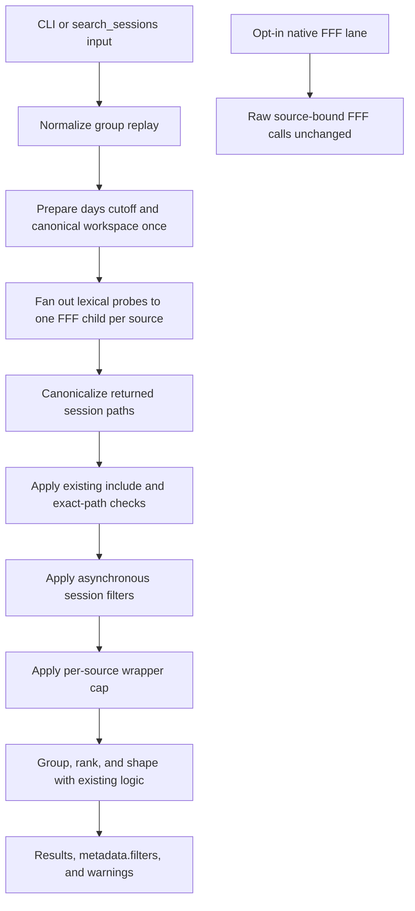
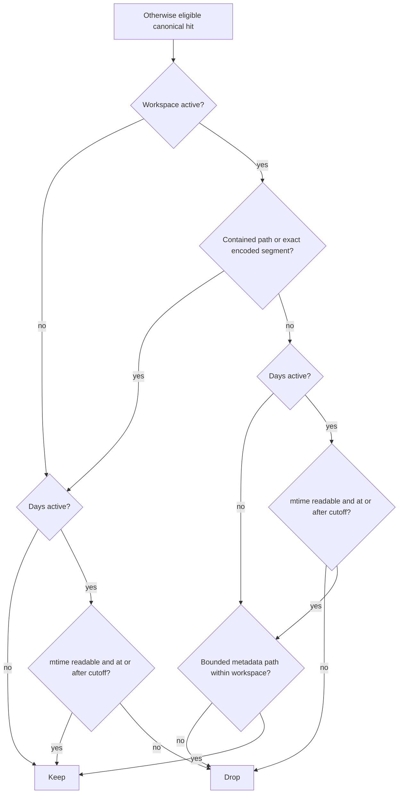

# Days and Workspace Deterministic Filters - Plan

## Goal Capsule

- **Objective:** Add optional `days` and `workspace` filters to the managed `search_sessions` contract and its CLI frontend so the cass-compat shim can query the raw FFF-backed corpus without depending on cass's index.
- **Authority:** The origin concept defines filter behavior; `DESIGN.md`, `CONTEXT.md`, and `docs/adr/0001-fff-core-and-native-policy-strictness.md` define the managed/native lane boundary; current source and tests define continuation, cap, warning, and output compatibility.
- **Execution profile:** Standard, cross-surface TypeScript work spanning the managed input contract, asynchronous post-FFF filtering, continuation fingerprints, CLI parsing, agent discovery, tests, and documentation.
- **Stop conditions:** Stop and revise the plan if correct filtering would require changing FFF search behavior, adding a durable index, exposing the filters through the native lane, or weakening canonical-path and continuation-fingerprint guarantees.
- **Tail ownership:** The implementing change owns code, focused and full regression coverage, documentation, live-corpus validation, and a clean build. The companion cass-compat shim lands only after this contract is available.

---

## Concept Intent

The feature supplies the two deterministic restrictions that cass-memory sends to its session-search dependency: a rolling file-modification window (`days`) and a canonical project restriction (`workspace`). Both are managed-lane inclusion predicates applied to canonical session hits before wrapper result caps and before candidate ranking. They are not FFF ranking signals, source selectors, or native-lane parameters.

---

## Product Contract

### Problem Frame

FFF already searches the authoritative raw session corpus, but `search_sessions` cannot currently express cass-compatible age or workspace restrictions. Implementing those restrictions after result caps would produce false empty responses when stale or unrelated hits consume the cap. Treating workspace as a ranking hint would also fail the compatibility requirement because unrelated sessions could still be returned.

The managed wrapper therefore needs deterministic, asynchronous hit filtering after path canonicalization while preserving its one-tool MCP boundary, progressive-evidence continuations, partial-source warnings, and native-lane isolation.

### Requirements

**Public managed contract**

- R1. `SearchSessionsInput` and the CLI must accept optional `days` and `workspace` fields with 1:1 names and behavior; `days` is a positive integer and `workspace` is a non-empty path string.
- R2. The managed MCP server must continue to advertise exactly one tool, `search_sessions`; the opt-in native MCP server and raw FFF tool schemas must remain unchanged.
- R3. When both filters are supplied, a hit must satisfy both predicates. Neither filter changes query rewriting, match groups, candidate ranking weights, evidence truncation, or source selection.

**Days semantics**

- R4. `days` must use a fixed 24-hour window from a clock sampled once per search invocation, accept files whose `mtime` is equal to or newer than the cutoff, and drop files whose `mtime` cannot be read.
- R5. The filter must memoize filesystem checks by canonical session path so multiple FFF hits from one session do not repeat `stat` work.

**Workspace semantics**

- R6. `workspace` must expand `~`, resolve relative paths against the process working directory, use `realpath` when the target exists, and retain a normalized absolute fallback when it does not. A missing workspace is a valid filter value, not a parse or root-resolution failure.
- R7. A hit matches the canonical workspace when at least one deterministic lane succeeds: its canonical session path is contained by the workspace; one leading-dash source-path segment exactly equals the dash-encoded workspace after trimming boundary dashes; or an early session-metadata project path is contained by the workspace.
- R8. Encoded matching must compare exact segments and must not decode source directory names, use prefix matching, or reuse project-token ranking heuristics.

**Pipeline, replay, and response semantics**

- R9. Active filters must force backend-cap deferral for every result mode, then run after canonicalization and the existing managed `include`/exact-`paths` checks, and finally apply `maxResultsPerSource`. This preserves eligible hits that appear after stale or off-workspace backend hits.
- R10. Server-prepared `more.groupCandidates` payloads must carry the normalized filter values through nested and top-level shorthand replay, include them in new fingerprints, and preserve the pinned fingerprint for payloads that omit both fields.
- R11. Responses with active filters must echo `metadata.filters`, using the normalized absolute workspace and the requested `days`, without exposing the computed cutoff or a response timestamp.
- R12. When at least one otherwise eligible hit was removed by `days` or `workspace` and no filtered hit remains, the response must add `filters_removed_all_results` with a recovery action. A query that produced no otherwise eligible hits must not receive this warning.

### Acceptance Examples

- AE1. Given evidence mode with `maxResultsPerSource: 1`, when FFF orders a stale hit before a fresh hit and `days: 30` is active, the wrapper requests an uncapped backend result set and returns the fresh hit after filtering and applying the cap.
- AE2. Given workspace `/data/projects/agent-session-search`, a source segment encoding that exact path matches, while a sibling segment for `/data/projects/agent-session-search-extra` does not.
- AE3. Given a Codex session stored outside the workspace whose early metadata contains `cwd: "/data/projects/agent-session-search"`, the metadata lane includes it; a session whose metadata names another workspace is excluded.
- AE4. Given `days: 7` and a matching workspace, a recent in-workspace session is included, a stale in-workspace session is excluded, and a recent session from another workspace is excluded.
- AE5. Given active filters that remove every otherwise eligible hit, the result is empty, `metadata.filters` contains the normalized request, and `filters_removed_all_results` is present. Given no lexical hits before these filters, the same metadata is present without that warning.
- AE6. Given a candidate group continuation prepared from a filtered search, replaying it through either supported MCP shape preserves both filters and validates its fingerprint. A legacy filterless fingerprint literal remains byte-for-byte unchanged.
- AE7. A managed `tools/list` response still contains only `search_sessions`, while a native `tools/list` response contains no `days` or `workspace` additions to mirrored FFF tools.

### Scope Boundaries

**In scope**

- Managed-library, MCP, and CLI parity for `days` and `workspace`.
- Canonical-path, exact encoded-segment, and bounded early-metadata workspace lanes.
- Pre-cap correctness, continuation replay, filter metadata, warning recovery, tests, and user/agent documentation.

**Deferred to follow-up work**

- Full format-specific parsers for Pool or other transcript formats whose workspace metadata is not present in the existing bounded prefix reader.
- Config-file defaults for either filter.
- Snapshot-stable absolute cutoffs across group continuation calls; `days` remains a rolling window evaluated once per invocation.

**Outside this product's identity**

- Native FFF filter arguments, FFF engine changes, custom indexes, SQLite stores, embeddings, fuzzy workspace token matching, ranking changes, and automatic session export.
- Changes to `more.evidence`: focused evidence remains pinned by canonical `paths` and does not inherit the original rolling filter.

---

## Planning Contract

### Recommended Implementation Shape

Create a small `src/session-filters.ts` module for filter preparation and per-session evaluation instead of adding another cluster of filesystem and path-format helpers to `src/search.ts`. The module owns workspace normalization, dash encoding, exact-segment checks, the fixed cutoff, predicate composition, and per-session memoization. It accepts bounded callbacks for `mtime` and metadata project paths so `src/search.ts` can reuse its current filesystem and early-metadata behavior without introducing a second transcript parser.

`src/search.ts` remains the orchestration owner. It normalizes a group replay first, prepares filters once, replaces the effective input's workspace with the canonical value, defers backend caps when filters are active, filters canonical hits asynchronously inside each source slot, counts only removals caused by the new predicates, and then runs existing caps and result shaping. Because group payloads are built from the normalized effective input, new continuations carry an absolute workspace while legacy filterless payloads retain their fingerprint.

### Deliberate Convergences and Deviations

- **Converge on managed post-FFF filtering.** FFF remains the lexical engine and neither lane gains a second search implementation.
- **Strengthen the origin's pre-cap requirement.** Filtering before the wrapper's `slice` is insufficient unless `shouldDeferBackendCap` also treats active filters as restrictive. The implementation must do both, especially for evidence and debug modes.
- **Extract a focused module.** The origin locates new helpers near private ranking code in `src/search.ts`; this draft instead isolates filter semantics so exact encoded matching and fixed-clock behavior have direct unit tests and the 1,900-line coordinator does not absorb another subsystem.
- **Keep evidence follow-ups stable.** Group pagination must replay filters because it re-runs candidate selection. Focused `more.evidence` already pins a canonical path and stays unchanged, avoiding a rolling-age predicate that can make previously selected evidence disappear.
- **Name the new domain concept.** `UBIQUITOUS_LANGUAGE.md` currently distinguishes ranking `Project Match` from a project filter. It should add `Session Filter`, `Days Filter`, and `Workspace Filter` so documentation cannot conflate deterministic drops with ranking boosts.

### Key Technical Decisions

| ID    | Decision and rationale                                                                                                                                                                                                                                                                          |
| ----- | ----------------------------------------------------------------------------------------------------------------------------------------------------------------------------------------------------------------------------------------------------------------------------------------------- |
| KTD1  | **Managed lane only.** The CLI and `search_sessions` share the filter implementation; `agent-session-search-native-mcp` continues exposing audited source-bound FFF capabilities without wrapper-owned filters.                                                                                 |
| KTD2  | **One prepared filter context per invocation.** Sample the clock once and canonicalize workspace once so every source slot evaluates the same request state.                                                                                                                                    |
| KTD3  | **Logical AND across fields, ordered work within workspace evaluation.** Try cheap containment and exact encoded-segment lanes first, evaluate `days`, and read metadata only when workspace still needs a fallback and the day predicate has passed.                                           |
| KTD4  | **Exact encoded segment, never decode.** Encoding the requested canonical workspace and comparing a whole leading-dash segment avoids known prefix collisions and does not pretend the lossy source-directory format is reversible. True punctuation collisions remain a documented limitation. |
| KTD5  | **Correctness before cap efficiency.** Active filters join restrictive `include` and exact-path requests in forcing backend-cap deferral. The wrapper restores the requested cap after filtering.                                                                                               |
| KTD6  | **Canonical workspace in server-prepared state.** Metadata and group continuations use the normalized absolute workspace so replay does not reinterpret `.` or a symlink under a different CLI working directory.                                                                               |
| KTD7  | **Rolling continuation window.** A replay carries `days`, not a hidden absolute timestamp; the cutoff is recomputed once for each call. This preserves the public cass-compatible shape at the cost of possible boundary drift in long-lived pagination.                                        |
| KTD8  | **Provable-empty warning only.** Emit `filters_removed_all_results` only when the new filters removed at least one otherwise eligible canonical hit and none survived. Do not diagnose ordinary no-match searches as over-filtering.                                                            |
| KTD9  | **Additive contract, no result-contract version bump.** Optional inputs and optional `metadata.filters` extend `progressive-evidence-groups.v2` without changing existing result shapes or count semantics.                                                                                     |
| KTD10 | **Bounded metadata reuse.** Reuse the existing early-record project-path extraction. Do not add a general transcript parser solely for workspace filtering.                                                                                                                                     |

### High-Level Technical Design

#### Managed pipeline placement

#### Per-session predicate flow

The evaluator memoizes the final verdict by source plus canonical path. Metadata source eligibility can differ even when two source names report the same path, so path alone is not a sufficient final-verdict key.

### Ordered Implementation Steps

1. Build and unit-test the filter kernel, including fixed-clock boundaries, workspace normalization, exact encoded-segment behavior, metadata fallback composition, and memoization.
2. Extend shared input/output types and both MCP continuation shapes; pin validation errors, shorthand normalization, canonical replay fields, and legacy/new fingerprint behavior.
3. Integrate the prepared filters into source slots, defer backend caps for filtered requests, collect removal counts, echo filter metadata, and add the empty-after-filter warning.
4. Add CLI flags and discovery/help parity, including mixed-continuation rejection and close-spelling suggestions.
5. Update durable design, glossary, CLI/MCP/troubleshooting docs, then run focused, full, packaging, and live-corpus validation before the cass-compat shim consumes the fields.

### Files and Modules Likely to Change

| Area                 | Files                                                                                                                               | Change                                                                                                                                                          |
| -------------------- | ----------------------------------------------------------------------------------------------------------------------------------- | --------------------------------------------------------------------------------------------------------------------------------------------------------------- |
| Filter kernel        | `src/session-filters.ts`, `test/session-filters.test.ts`                                                                            | New prepared-filter and memoized-evaluator module with pure path/encoding tests and injected I/O seams.                                                         |
| Shared contract      | `src/types.ts`, `src/tool.ts`, `test/tool.test.ts`                                                                                  | Add optional fields, metadata echo type, strict continuation schema, mismatch teaching errors, shorthand normalization, and fingerprint compatibility coverage. |
| Search orchestration | `src/search.ts`, `test/search.test.ts`                                                                                              | Prepare once, canonicalize replay state, defer backend caps, filter inside source slots, count removals, emit metadata/warning, and expose a fixed test clock.  |
| CLI and discovery    | `src/cli.ts`, `src/help.ts`, `test/cli.test.ts`, `test/mcp-smoke.test.ts`                                                           | Parse/map flags, reject replay mixing, document schema/help/capabilities, and pin the managed one-tool MCP surface.                                             |
| Durable docs         | `DESIGN.md`, `CONTEXT.md`, `UBIQUITOUS_LANGUAGE.md`, `docs/cli.md`, `docs/mcp.md`, `docs/troubleshooting.md`, `test/readme.test.ts` | Record deterministic filter placement, lane ownership, warning recovery, replay behavior, and ranking/filter vocabulary.                                        |

---

## Implementation Units

### U1. Implement the prepared session-filter kernel

- **Goal:** Provide deterministic, independently testable `days` and `workspace` predicates with bounded filesystem work.
- **Requirements:** R3-R8; AE2-AE4; KTD2-KTD4, KTD10.
- **Dependencies:** None.
- **Files:** Create `src/session-filters.ts` and `test/session-filters.test.ts`.
- **Approach:** Prepare a normalized optional workspace and fixed cutoff from the request. Evaluate one source/path identity through direct containment, leading-dash exact encoded-segment matching, `mtime`, and a metadata-path callback. Compose both active filters with AND semantics and memoize the in-flight/final verdict by source plus canonical path. Keep the module unaware of candidates, match groups, FFF, ranking, and warning output.
- **Patterns to follow:** `canonicalProjectPath`, `pathIsWithin`, and `candidateMtimeMs` in `src/search.ts`; filesystem dependency injection through `CreateSessionSearchOptions`; deterministic helper tests in `test/root-resolver.test.ts` and ranking clock/file tests in `test/search.test.ts`.
- **Test scenarios:**
  - A file exactly on the fixed cutoff passes; one millisecond older fails; a future `mtime` passes; an unreadable/missing file fails only when `days` is active.
  - `~`, `.`, an existing symlinked workspace, and a nonexistent absolute workspace normalize to the documented absolute values.
  - Claude-style `-data-projects-agent-session-search` and OMP-style `--data-projects-agent-session-search--` segments match the encoded target; an `-extra` sibling and a non-leading-dash lookalike do not.
  - Direct containment keeps a raw session file under the workspace without consulting metadata.
  - A metadata descendant of the workspace matches; a parent, sibling, token-only similarity, or empty metadata set does not.
  - With both filters active, metadata is not read after a failed day predicate, and a direct workspace match still fails when stale.
  - Repeated hits for the same source/path invoke `stat` and metadata callbacks at most once; two source identities sharing a path do not share the final metadata-sensitive verdict.
- **Verification:** Unit tests prove the complete predicate truth table without running FFF or constructing result groups.

### U2. Extend the managed input and continuation contract

- **Goal:** Make the new fields valid and replay-safe across library, MCP, and server-prepared group-continuation shapes.
- **Requirements:** R1-R3, R10-R11; AE6; KTD1, KTD6, KTD7, KTD9.
- **Dependencies:** U1.
- **Files:** Modify `src/types.ts`, `src/tool.ts`, and `test/tool.test.ts`.
- **Approach:** Add `days` and `workspace` to `SearchSessionsInput` and `GroupCandidatesFollowupInput`, plus optional normalized filter metadata and the named warning code. Extend both Zod shapes, teaching-error corrected shape, nested/top-level mismatch checks, shorthand construction, and continuation stripping. Keep the stable JSON implementation unchanged; conditionally present fields alter new payload fingerprints while absent fields preserve the pinned literal.
- **Patterns to follow:** Existing `maxResultsPerSource` validation/replay checks in `src/tool.ts`; `groupCandidatesFingerprint` and its literal assertion in `test/tool.test.ts`.
- **Test scenarios:**
  - Top-level and nested schemas accept positive integer `days` and non-empty `workspace` and reject zero, negative, fractional, missing-value, and empty-string forms.
  - A nested continuation with matching top-level filters validates; editing either top-level value produces `invalid_group_followup` with the exact `invalidField` and filter-aware corrected shape.
  - Top-level continuation shorthand copies both fields into `groupCandidates` and strips only shorthand-only continuation fields from the effective search input.
  - The existing filterless fingerprint remains `gcf1:52e25b6aeccbeaff`; adding or changing either filter changes the fingerprint and tampering fails validation.
  - An old request that omits both fields produces the same parsed object as before.
- **Verification:** Public tool-boundary tests show additive acceptance without weakening strict group replay.

### U3. Integrate filters before every effective result cap

- **Goal:** Apply the predicates to canonical hits without cap starvation, ranking coupling, or misleading warnings.
- **Requirements:** R3-R12; AE1-AE6; KTD2-KTD10.
- **Dependencies:** U1, U2.
- **Files:** Modify `src/search.ts` and `test/search.test.ts`.
- **Approach:** Normalize replay, prepare filters using an optional injected clock, and replace the effective input's workspace with the canonical value before planning continuations. Extend `shouldDeferBackendCap` for active filters. Inside `searchSourceSlot`, preserve output order while asynchronously filtering canonical hits that already passed `include` and exact-path checks; return a new removal count and apply `maybeCapResults` afterward. Aggregate counts to emit `filters_removed_all_results` only for proven filter-caused emptiness. Pass normalized values into `searchMetadata` and `groupFollowup`. Loosen the existing metadata project-signal helper to the minimal source/path shape required by both ranking and filtering, without changing token-ranking behavior.
- **Execution note:** Start with the cap-starvation characterization test because a filter that only sits before `maybeCapResults` still fails when evidence-mode FFF calls receive `maxResults`.
- **Patterns to follow:** Source-indexed fanout aggregation in `searchSourceSlot`; existing restrictive-include cap deferral; `projectSignalsFromCandidateMetadata`; source-warning ordering and `recommendedAction` conventions.
- **Test scenarios:**
  - Candidate, unscoped evidence, focused evidence, and debug modes all apply both filters and preserve their existing result shapes.
  - With an explicit cap of one and an ineligible first backend hit, the backend receives no cap, the later eligible hit survives, and the wrapper returns at most one hit.
  - No-filter control calls retain current backend-cap behavior and byte-compatible result metadata.
  - A fixed injected clock is sampled once for a multi-source request and enforces cutoff equality, old-file exclusion, and unstatable-file exclusion.
  - Canonical containment, exact Claude/OMP encoded directories, prefix-collision rejection, and Codex early-metadata inclusion/exclusion work through the real search coordinator.
  - Active `days` and `workspace` are ANDed, but neither changes candidate order among the surviving hits or adds filter data to ranking debug components.
  - Filter-to-empty produces one actionable warning and normalized metadata; no lexical hits, source failure, or existing `include`/`paths` removal alone does not produce that warning.
  - A prepared group page contains canonical filter values and replay returns only filtered candidates with a valid fingerprint.
  - Partial source success remains partial: one failed source warning coexists with filtered results from another source.
- **Verification:** Search integration tests prove the async attach point, cap deferral, warning causality, and continuation behavior end to end with fake backends and temporary session files.

### U4. Add CLI and agent-discovery parity

- **Goal:** Expose the managed fields consistently to humans, agents, and the companion shim without widening the MCP tool count.
- **Requirements:** R1-R3, R10-R12; AE5-AE7; KTD1, KTD6, KTD9.
- **Dependencies:** U2, U3.
- **Files:** Modify `src/cli.ts`, `src/help.ts`, `test/cli.test.ts`, and `test/mcp-smoke.test.ts`.
- **Approach:** Add parsed values and known options, parse `--days` with the existing positive-integer helper, parse `--workspace` as a required string value, map both to `SearchSessionsInput`, and reject mixing either with `--group-candidates`. Extend help, capabilities JSON, robot docs, triage, and the managed MCP description with deterministic-filter and replay guidance. Preserve exit codes and the managed one-tool list.
- **Test scenarios:**
  - CLI mapping includes both fields and updates exact object assertions without adding undefined keys unexpectedly.
  - `--days 0`, negative, fractional, nonnumeric, or missing values fail before preflight with exit `1`; `--workspace` without a value does the same.
  - `--dsys` suggests `--days`, `--workspce` suggests `--workspace`, and each JSON parse error carries a copy-pasteable corrected command.
  - Combining either flag with `--group-candidates` names the offending flag and instructs the caller to replay the server-prepared payload alone.
  - Help, capabilities, robot docs, and robot triage include both options, AND semantics, rolling-day behavior, and the filter-empty recovery action.
  - MCP introspection exposes the new optional fields on `search_sessions` while still listing exactly one managed tool; native smoke fixtures remain unchanged.
- **Verification:** CLI and MCP smoke tests prove frontend parity and two-lane isolation.

### U5. Record the contract and validate the consumer path

- **Goal:** Make the new semantics durable and prove the exact CLI/MCP shapes the cass-compat shim will consume.
- **Requirements:** All requirements and acceptance examples.
- **Dependencies:** U4.
- **Files:** Modify `DESIGN.md`, `CONTEXT.md`, `UBIQUITOUS_LANGUAGE.md`, `docs/cli.md`, `docs/mcp.md`, `docs/troubleshooting.md`, and `test/readme.test.ts`.
- **Approach:** Update the inlined managed input type and search flow in `DESIGN.md`; add the filter module and deterministic-drop guardrail to `CONTEXT.md`; distinguish Session/Days/Workspace Filters from ranking Project Match in the glossary; document CLI/MCP inputs, metadata, continuation behavior, cap placement, missing/unstatable semantics, warning recovery, and native-lane non-applicability. Add documentation assertions for the terms and warning rather than expanding the README front door.
- **Test scenarios:**
  - Documentation contract tests find both field names, positive-integer/fixed-24-hour behavior, canonical workspace echo, AND semantics, replay behavior, and `filters_removed_all_results` recovery.
  - Design and glossary text state that filters are deterministic drops before caps and ranking, while Project Match remains a ranking signal.
  - Managed/native documentation never claims that the raw native tools accept or enforce these wrapper filters.
  - The exact MCP request used by the shim (`query`, `days`, `workspace`, `maxResultsPerSource`) returns the same filtered result set as the equivalent CLI request.
- **Verification:** Focused docs tests and live-corpus checks make the contract reviewable before the shim switches dependencies.

---

## Risks, Constraints, and Order-Changing Questions

### Risks and Mitigations

| Risk                                                   | Impact                                                                    | Mitigation                                                                                                                                                                               |
| ------------------------------------------------------ | ------------------------------------------------------------------------- | ---------------------------------------------------------------------------------------------------------------------------------------------------------------------------------------- |
| Backend cap remains active in evidence/debug mode      | Eligible later hits disappear, making the filter incorrect                | Extend and directly test `shouldDeferBackendCap`; assert the fake backend receives `maxResults: undefined` when either filter is active.                                                 |
| Cap deferral increases I/O and memory on broad queries | Filtered evidence searches can process more FFF hits than before          | Reuse existing FFF timeouts, apply per-session memoization, preserve post-filter caps, and document that restrictive filters trade backend work for correctness.                         |
| Dash encoding is lossy                                 | Distinct punctuation-heavy workspace paths can encode to the same segment | Require a whole leading-dash segment, reject prefix/token matches, prefer containment or metadata when present, and document the residual collision rather than claiming identity proof. |
| Relative MCP workspace depends on server cwd           | A caller may filter a different directory than intended                   | Accept relative paths for CLI ergonomics, canonicalize and echo the result, and tell MCP callers and the shim to send absolute workspaces.                                               |
| Files disappear between FFF and filter evaluation      | `stat` or metadata reads can fail                                         | Drop unstatable files only under `days`; keep failures non-fatal and cover them with tests.                                                                                              |
| Group pages cross a day boundary                       | A later page can gain or lose borderline sessions                         | Recompute once per invocation, preserve the simple `days` contract, and document that continuation is rolling rather than snapshot-isolated.                                             |
| Filter and ranking metadata readers diverge            | Workspace inclusion and Project Match could disagree on the same record   | Reuse the bounded project-path extractor and change only its accepted input shape; keep token logic ranking-only.                                                                        |
| Warning causality is over-broad                        | Users may be told to loosen filters when the query simply had no matches  | Count removals only after existing include/path eligibility and require a positive removal count plus zero survivors.                                                                    |

### Open Questions That Change Implementation Order

1. **Is Pool ACP `.json` workspace matching a launch requirement for the shim?** Default: no; this change reuses the bounded early-record reader and guarantees the three lanes only where a path or readable early metadata supplies workspace identity. If yes, characterize real Pool JSON first and add a bounded format-specific extraction unit before U1; do not quietly turn U3 into a full transcript parser.
2. **Will the cass-compat shim call the library directly or shell out to the CLI in its first release?** The public fields stay identical either way. If CLI subprocess use is required, complete U4's parse/error contract before starting U3 integration with the shim; otherwise U3 can unblock an in-process shim before documentation polish.
3. **Does any downstream consumer require a response contract-version bump for optional `metadata.filters`?** Default: no, because existing shapes and semantics remain valid and the field is absent for legacy requests. If a strict consumer rejects additive metadata, decide and document a version migration before U2 so fingerprints, fixtures, and docs are updated once.

None of these questions changes the default implementation path above. Selecting a non-default answer must be recorded before the affected unit begins.

---

## Verification Contract

| Gate                     | Command                                                                                                                                      | Proves                                                                                                                                 |
| ------------------------ | -------------------------------------------------------------------------------------------------------------------------------------------- | -------------------------------------------------------------------------------------------------------------------------------------- |
| Filter and surface tests | `npm test -- test/session-filters.test.ts test/tool.test.ts test/search.test.ts test/cli.test.ts test/mcp-smoke.test.ts test/readme.test.ts` | Predicate semantics, cap placement, continuation compatibility, CLI/MCP parity, lane isolation, and docs contracts.                    |
| Type safety              | `npm run check`                                                                                                                              | New optional fields, metadata, async evaluator, and injected clock compile under strict TypeScript.                                    |
| Full regression          | `npm test`                                                                                                                                   | Existing roots, query rewriting, FFF adapter/router, candidates, evidence, native lane, doctor, packaging, and docs remain compatible. |
| Build                    | `npm run build`                                                                                                                              | Managed CLI/MCP entrypoints and the unchanged native entrypoint emit successfully.                                                     |
| Managed smoke            | `npm run smoke`                                                                                                                              | The packaged managed tool still completes its existing client-driven FFF smoke path.                                                   |
| Guardrails               | `npm run check:dcg`                                                                                                                          | Repository destructive-command protections remain active before implementation lands.                                                  |

### Live-Corpus Validation

Run these after automated gates pass, using the current repository as the workspace:

1. `npm run dev:cli -- "cass" --json --days 2` — independently inspect every returned canonical path's `mtime` and confirm each is at or after the single two-day cutoff used for the check.
2. `npm run dev:cli -- "cass" --json --workspace /data/projects/agent-session-search` — confirm matches from at least two source-layout lanes when present and confirm no known sibling workspace path is returned.
3. `npm run dev:cli -- "cass" --json --days 3650 --workspace /nonexistent/ws` — confirm exit `0`, empty results, normalized `metadata.filters`, and `filters_removed_all_results` only when lexical hits existed before filtering.
4. `npm run dev:cli -- "cass" --json --dsys 7` — confirm exit `1`, a `--days` suggestion, and a corrected command on stderr.
5. Start `npm run dev:mcp` and call `search_sessions` with `{"query":"cass","days":7,"workspace":"/data/projects/agent-session-search","maxResultsPerSource":5}` — confirm parity with the CLI and exact `more.groupCandidates` replay.
6. Run the native MCP smoke path and confirm its advertised FFF tool schemas have not acquired `days` or `workspace`.

---

## Definition of Done

- U1 is done when the fixed-clock, canonical-workspace, exact-encoding, metadata-fallback, AND-composition, and memoization truth tables pass without FFF.
- U2 is done when both public input shapes validate the fields, teaching errors identify edits, new fingerprints bind filters, and the legacy fingerprint literal is unchanged.
- U3 is done when every managed result mode filters canonical hits before effective caps, survivors retain existing ranking/shape behavior, metadata is canonical, and the warning proves filter-caused emptiness.
- U4 is done when CLI, help, capabilities, robot surfaces, and MCP introspection expose the same optional contract while the native lane remains unchanged.
- U5 is done when design, context, glossary, CLI, MCP, and troubleshooting docs agree on semantics and the exact shim-shaped request passes live CLI/MCP parity checks.
- `npm run check`, `npm test`, `npm run build`, `npm run smoke`, and `npm run check:dcg` pass in the supported Node environment.
- The implementation adds no index, ranking signal, native-lane filter, config default, full transcript parser, or `more.evidence` change.
- Dead-end helpers, duplicate path canonicalizers, temporary diagnostics, and abandoned test fixtures are removed before completion.

---

## Sources and Research

- `docs/plans/2026-07-20-001-feat-days-workspace-filters-plan.md` supplies the resolved behavior, verified source-layout constraints, shim dependency, and original file/test map.
- `DESIGN.md`, `CONTEXT.md`, and `docs/adr/0001-fff-core-and-native-policy-strictness.md` establish FFF as the engine, managed post-search ownership, the one-tool managed boundary, and native-lane isolation.
- `src/search.ts` provides the canonicalization attach point, source-slot cap placement, restrictive-include precedent, ranking metadata extraction, continuation construction, and output metadata builder.
- `src/tool.ts`, `src/types.ts`, and `src/followup.ts` define strict group replay, top-level shorthand, teaching errors, and restart-stable fingerprints.
- `src/cli.ts` and `src/help.ts` define positive-integer parsing, close-flag suggestions, machine-readable capabilities, and agent guide surfaces.
- `test/search.test.ts`, `test/tool.test.ts`, `test/cli.test.ts`, and `test/mcp-smoke.test.ts` provide fake-backend, temporary-file, exact-contract, replay, and MCP introspection patterns.
- `UBIQUITOUS_LANGUAGE.md` requires the new deterministic filters to remain distinct from ranking `Project Match` and `Recency Bucket` concepts.
