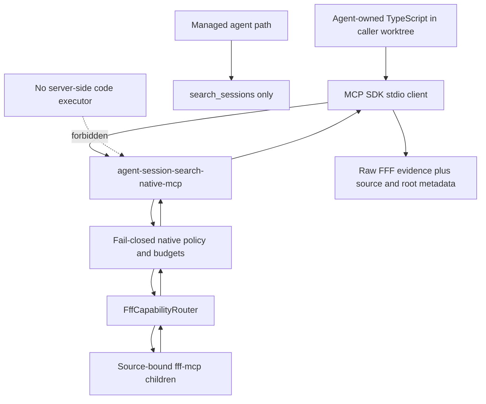
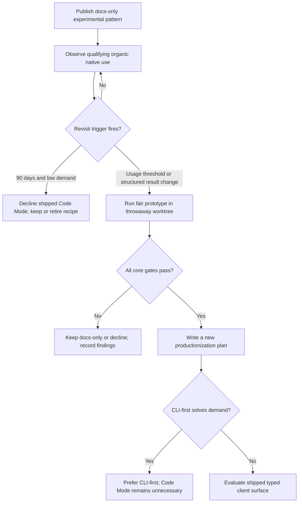

# Code Mode R12 Gate Evaluation - Plan

## Goal Capsule

- **Objective:** Close the current R12 evaluation with a split decision: do not ship a `session_search_code` frontend on the available evidence, but publish a narrowly scoped experimental client-side composition pattern over the existing opt-in native lane.
- **Authority:** `docs/investigations/code-mode/plan-council/input-concept.md` and its three indexed evidence artifacts define the gate; `docs/plans/2026-07-16-002-feat-fff-two-lane-architecture-plan.md`, `docs/adr/0001-fff-core-and-native-policy-strictness.md`, and `DESIGN.md` define the product boundaries.
- **Execution profile:** Small user-facing documentation and contract-test change, followed by evidence observation and a separately triggered prototype round. No production runtime or MCP surface change is authorized by this plan.
- **Stop conditions:** Stop if the documentation cannot avoid implying support for semantic parsing of raw FFF presentation text, if the example requires importing unpublished internals from the globally installed package, or if any implementation adds server-side code execution, a managed MCP tool, a new search engine, or a native-policy bypass.
- **Tail ownership:** The accepted implementation owns the documentation, documentation-contract tests, packaged-doc verification, and the evidence-revisit protocol. A shipped Code Mode frontend, CLI-native call command, importable SDK, or structured native result contract requires a later plan after its own gate passes.

---

## Product Contract

### Summary

R12 remains closed for a shipped `session_search_code` frontend. The current round proves that agent-owned TypeScript can connect to `agent-session-search-native-mcp` and compose approved FFF calls, but it does not prove that fanout, pagination, or filtering beats a fairly used managed lane. The product should capture the low-cost feasibility result as an explicitly experimental client-side pattern while keeping the managed server, native server, and CLI surfaces unchanged.

### Concept Intent

The concept asks whether programmable fanout, pagination, and filtering now justify Code Mode, not how to rationalize an implementation already chosen. It distinguishes client-side generated TypeScript from server-side code execution, requires a measured R12 verdict, and requires any surviving direction to amplify FFF through the existing router/native lane. It also requires the decision to remain revisitable as organic usage and better experiments accumulate.

### Problem Frame

The prototype established feasibility but not comparative product value. Its generated arm hid agent-visible orchestration inside an 88-line shared script and reduced serialized raw-envelope bytes by more than 90%, yet the experiment handicapped the managed arm, admitted contemporaneous-session contamination, used 10-result pages rather than realistic 50/200-result single-page arms, and never showed pagination changing an answer. The most reliable result is negative for automation over the present contract: 10 of 19 retained hits were not hand-decisive, so parsing and semantic filtering of raw FFF presentation text dominated the work.

Shipping a new frontend on that evidence would convert a promising composition technique into a supported surface before its advantage, result contract, packaging ergonomics, or demand is known. Declining all follow-up would also discard a clean result: an advanced agent can already use the installed MCP SDK against the audited native lane without any server-side executor. The plan therefore separates a documentation decision that can proceed now from a productization decision that stays gated.

### Requirements

**Gate and public surface**

- R1. The R12 verdict must state that no shipped `session_search_code` MCP tool, binary, runtime, CLI command, or importable SDK is authorized by this evidence round.
- R2. The repository may document an experimental client-side composition pattern that uses the existing `agent-session-search-native-mcp` binary without copying or promoting the prototype harness.
- R3. `agent-session-search-mcp` must continue to advertise exactly `search_sessions`, and the native server must continue to expose only `fff_native_capabilities` plus policy-approved source-bound FFF tools.

**Execution and trust**

- R4. Any example code must execute in the caller's own worktree or process and connect over stdio; the Agent Session Search server must never execute submitted code.
- R5. The pattern must call `fff_native_capabilities` first, select only advertised healthy sources and approved tools, respect process-local budgets, and preserve native source/root provenance.
- R6. The pattern must treat raw FFF presentation text as opaque evidence for human or agent review; it must not present a presentation-text parser, semantic filter, or cursor extractor as a supported contract.
- R7. All searches must continue to run in FFF through the native policy and `FffCapabilityRouter`; no custom search, index, embedding, transcript store, or inferred structured result layer may be added.

**Packaging and fallback**

- R8. The documentation must state that `@modelcontextprotocol/sdk` is a client-worktree dependency and is not exported by the globally installed Agent Session Search package.
- R9. If global module resolution or repeatable-call ergonomics becomes the dominant barrier, the next frontend prototype must evaluate a CLI-first `agent-session-search native call ...` transport before an importable SDK or shipped Code Mode surface.

**Evidence lifecycle**

- R10. Evidence collection must use existing local session transcripts and native provenance rather than adding telemetry, a durable usage database, or session-content logging.
- R11. A fair rerun must compare a fully armed managed lane, realistic manual-native arms, generated client code, and the CLI-first fallback when triggered, using a frozen corpus, recorded ground truth, contamination controls, and end-to-end token accounting.
- R12. A later productization decision may reopen only when all core fanout, context-cost, answer-changing pagination, precision/recall, ergonomics, and bounded-failure thresholds in this plan pass.

### Acceptance Examples

- AE1. An MCP client lists the managed server after this work and still sees only `search_sessions`; no `session_search_code` symbol or code-execution input exists in production schemas.
- AE2. An advanced user follows the experimental pattern from a separate TypeScript worktree, starts the installed native binary, calls `fff_native_capabilities`, and then calls an approved `fff_grep` against an advertised source.
- AE3. A native call returns raw presentation text plus the existing namespaced source/root metadata; the documentation tells the caller to inspect the evidence and does not promise typed hits or safe semantic post-filtering.
- AE4. A globally installed consumer cannot import Agent Session Search internals, so the documentation requires a project-local MCP SDK dependency rather than implying a hidden library export; recurring friction becomes evidence for the CLI-first prototype.
- AE5. A future fair battery finds extra matches only after stacked 10-result pages but changes no answer; pagination remains failed and the shipped frontend stays deferred.
- AE6. A future fair battery passes every threshold; the result opens a new productionization plan, not an automatic merge of the prototype harness.

### Scope Boundaries

**In scope now**

- A durable R12 verdict in the design record and native-lane documentation.
- A fresh, minimal, explicitly experimental client-side connection/call recipe.
- Documentation and integration tests that pin the recipe's safe protocol and packaging assumptions.
- A repeatable evidence ledger and fair-rerun protocol with time- and usage-based decision triggers.

**Deferred to follow-up work**

- A typed or structured result contract, preferably supplied by FFF through upstream schemas or `structuredContent` rather than inferred from presentation text.
- A CLI-first native-call frontend if module-resolution or repeatability evidence triggers it.
- A second client-side prototype round after demand or contract-quality triggers fire.
- A new production plan for any shipped `session_search_code` surface if the reopened gate passes.

**Outside this product's identity**

- Server-side arbitrary code execution or a sandbox runtime inside either MCP server.
- A code-taking mode on `search_sessions`, a third server binary, or automatic exposure of FFF tools.
- Custom search, embeddings, derived databases, durable telemetry, or session aggregation.
- Promotion or copying of the prototype worktree's scripts into `src/`, `examples/`, or packaged documentation.
- Fixing the separately tracked bin-mode, `shownLeadCount`, or doctor `multi_grep` issues inside this work.

---

## Planning Contract

### R12 Gate Verdict

**Verdict: proceed as a documented experimental client-side pattern only; defer a shipped `session_search_code`.** The evidence for current productization is weak and the evidence against productizing the current raw-text shape is moderate. This is not a conclusion that Code Mode has no intrinsic value. It is a conclusion that the experiment did not fairly establish comparative value and did establish a parsing burden that a supported unattended surface should not inherit.

| Gate criterion | Measured evidence | Council-adjusted assessment | Decision |
| --- | --- | --- | --- |
| Fanout replacement | The generated arm made 13 native calls per task while the manual first-page arm made 7; one shared script hid orchestration from the agent. | Mechanical composition is proven, but backend work increased, no concurrency benefit was exercised, and the manual arm already answered the clean SDK, packaging, and root-wide tasks from page one. | Does not pass product-value gate. |
| Context reduction | Generated serialized bytes fell 91.95%–98.24% across five tasks. | Clean evidence preservation is supported only for root-wide/privacy at 623 bytes and 2/2 decisive hits. SDK included two self-contaminated hits; packaging retained only 3/8 decisive hits and used more bytes than the manual decisive result. Discarded-hit recall and token costs were not audited. | One clean task is below the two-task threshold. |
| Pagination value | Pagination added retained lexical hits on all five tasks. | Both native arms used 10-result pages, no 50- or 200-result single-page arm existed, no answer changed, and decontaminated incremental value was at most one decisive hit on an already answered task. | Fails. |
| Filtering precision | The automated metric reported 1.0; hand scoring found 9/19 retained hits decisive. | The automated score was circular, the raw baseline was never hand-scored, the rubric was not recorded, and the strongest tasks contained self-contamination. Raw presentation-text parsing generated plausible false positives. | Fails and blocks unattended productization over the current contract. |
| Ergonomics | One shared harness was 88 lines, below the approximately 150-line ceiling. | The result is real but amortized across five known-answer tasks, uses dense lines and broad `any`, and excludes probes, setup iterations, and hand-scoring labor. | Narrow pass for feasibility, not product value. |
| Failure dominance | 65 generated calls plus capabilities, and at most 101 calls to the process, produced no budget, timeout, concurrency, or 4 MiB failures. | Light-load native infrastructure held. Parsing dominated interpretation. Mode 664/EACCES was reproduced only in the worktree build, while installed-artifact evidence may differ. | Infrastructure is not the blocker; result semantics are. |
| Organic demand | No decisive post-ship native usage was found. | The observation window was approximately one day with three retained candidates and contamination risk. | Gate remains open, not failed for lack of demand. |

### Key Technical Decisions

| ID | Decision and rationale |
| --- | --- |
| KTD1 | **Split the gate.** Close R12 for a shipped frontend while allowing a docs-only experimental pattern. Feasibility is sufficient to teach advanced users; it is not sufficient to create a supported runtime or API. |
| KTD2 | **Keep execution client-side.** Agent-authored TypeScript runs with the caller's own worktree permissions and communicates with the existing native server over stdio. No code crosses into the server for evaluation. |
| KTD3 | **Use the native lane as the only low-level authority.** Every call remains source-bound, policy-approved, fingerprint-checked, validated, budgeted, and routed to FFF. Client code cannot widen the server's tool catalog or root binding. |
| KTD4 | **Document transport, not raw-text interpretation.** The supported recipe covers connection, capabilities discovery, bounded fanout, and provenance preservation. Cursor extraction and semantic filtering over presentation text remain experimental findings, not a contract. |
| KTD5 | **Do not create a helper from the prototype.** Author a new minimal example against the public MCP surface and validate the behavior through existing native smoke-test patterns. The 88-line battery remains throwaway evidence. |
| KTD6 | **Keep CLI-first as the next fallback.** If project-local SDK installation or generated-client repetition becomes the main cost, prototype a JSON native-call CLI before adding package exports or a code-taking frontend. The CLI would transport audited native calls, not implement search or execute arbitrary code. |
| KTD7 | **Use local evidence instead of telemetry.** Exact tool-call names and session identities already appear in the raw local corpus, while native source/root metadata can be audited when the client preserves tool results. Adding a durable analytics store would violate the product's small local-search identity and create more self-observation contamination. |
| KTD8 | **Use separate worktrees for implementation and experimentation.** Land the accepted docs/test change in a fresh normal git worktree. Run every future battery in a new throwaway prototype worktree and merge only findings. Never reuse or promote the first prototype worktree. |

### Recommended Shape

The shipped package gains no frontend. `docs/code-mode.md` becomes the explicit boundary page, titled and introduced as an experimental client-side native-composition pattern rather than a `session_search_code` feature. It contains a fresh minimal TypeScript example that:

1. uses a project-local `@modelcontextprotocol/sdk` client and `StdioClientTransport`;
2. starts `agent-session-search-native-mcp` by its installed command rather than a repository `dist/` path;
3. calls `fff_native_capabilities` before any mirrored tool;
4. chooses advertised healthy sources and stays within the returned budgets;
5. performs a small bounded fanout of approved calls; and
6. returns raw results with native `_meta` provenance intact for downstream inspection.

The page must not include a generic raw-text parser, known-answer lexical scorer, cursor scraping helper, automatic answer synthesis, or a promise that output is typed. `docs/native-mcp.md` links to the page and retains the root-wide privacy warning. `README.md` and `docs/README.md` list the page as an advanced experiment, while `DESIGN.md` records the closed shipped-feature gate and the exact reopen conditions.

The executable contract stays in tests, not in a promoted helper. `test/native-mcp-smoke.test.ts` extends its current SDK-over-stdio fixture to cover capabilities-first bounded fanout across two sources and source/root metadata preservation. `test/readme.test.ts` pins the user-facing disclaimers and links. `test/packaging.test.ts` proves the new top-level documentation ships in the npm tarball and that the installed native command remains the example's launch surface.

### Implementation Venue

Use a fresh git worktree created from the commit that accepts the synthesized Code Mode decision. This keeps the docs/test implementation atomic, prevents prototype scaffolding from entering the production diff, and gives the docs-only surface a clean rollback boundary. Do not implement from the throwaway prototype worktree and do not copy files from it.

Use a different throwaway worktree for every future evaluation round. Each round should preserve raw artifacts long enough for council review, merge only its findings document and evidence summary, and discard the harness unless a later plan independently justifies a maintained tool.

### High-Level Technical Design

#### Client/server topology



#### Documented client protocol

```mermaid
sequenceDiagram
  participant C as Client-owned code
  participant N as Native MCP server
  participant F as FFF through router
  C->>N: tools/list
  N-->>C: capabilities plus approved namespaced tools
  C->>N: fff_native_capabilities
  N-->>C: healthy sources, coverage, budgets, warnings
  C->>N: bounded approved calls with source
  N->>F: validated source-bound calls
  F-->>N: raw CallToolResult envelopes
  N-->>C: raw results plus native provenance
  C->>C: inspect evidence; no supported raw-text parser
```

#### R12 evidence lifecycle



### Evidence Maintenance and Revisit Triggers

Create `docs/investigations/code-mode/revisit-protocol.md` as the durable evidence contract. It should define one row per qualifying task: observation date, source/session id, project, non-eval task description, native tools called, agent-visible round trips, pages and result caps, returned and retained tokens, decisive-evidence rubric, answer outcome, failure mode, and contamination exclusions. Store no copied session content in the ledger; canonical session paths or ids are sufficient breadcrumbs to raw evidence.

**Organic observation cadence**

- Review exact `fff_grep`, `fff_multi_grep`, and `fff_native_capabilities` tool-call records monthly.
- Exclude sessions whose purpose is Code Mode planning, prototype execution, findings review, documentation, or workflow orchestration; exclude by exact session id and predeclared observation cutoff rather than preview tokens.
- Count a qualifying task only when native calls contributed to a non-eval work outcome and the evidence can be audited from the raw session.
- Do not add product telemetry. If transcripts prove unable to preserve tool-call identities, require a separate design pass for opt-in process-local counters exposed through `fff_native_capabilities`; do not add persistent logging by default.

**Decision triggers**

- Run the next fair battery after both 30 days and at least 10 qualifying tasks across at least 3 sessions and 2 projects.
- Run earlier if FFF ships a stable structured hit contract or if three independently observed tasks show manual fanout/pagination burden with auditable outcomes.
- Prototype the CLI-first fallback first if two qualifying tasks are blocked or materially complicated by SDK/module-resolution setup.
- At 90 days, if fewer than 10 qualifying tasks exist and no contract-change trigger fired, stop deferring: record insufficient demand, decline a shipped Code Mode frontend, and decide whether the experimental page still earns maintenance.

**Fair-rerun method**

- Freeze the corpus with a pre-experiment cutoff and content/stability fingerprint; randomize arm order.
- Use blind tasks with ground-truth evidence sets not encoded into filters.
- Arm the managed lane with concise `query`, explicit literal `queries`, `operationalContext`, reliable `callerSession`, candidate-group continuation, and focused `more.evidence` follow-ups.
- Compare realistic native arms: one page at default 50, one page at ceiling 200, manual cursor pagination, generated client composition, and CLI-first transport when triggered.
- Score retained and discarded hits with a recorded rubric and independent adjudication; score raw/manual precision as the baseline.
- Count end-to-end tokens for prompts, generated code, protocol/tool output, retained evidence, and final synthesis. Keep serialized bytes as a secondary diagnostic only.
- Record whether pagination changed the answer, not merely whether it returned another lexical hit.

**R12 reopen thresholds**

- Fanout: one generated program replaces at least 5 agent-visible sequential tool round trips on at least 2 blind tasks while matching or improving answer correctness.
- Context cost: at least 2 tasks reduce end-to-end context tokens by at least 50% while preserving every ground-truth decisive item.
- Pagination: at least 1 task changes from unanswered or wrong to correct compared with both fair single-page 50- and 200-result arms.
- Filtering: at least 2 tasks improve decisive-hit precision by at least 20 percentage points over the scored raw/manual baseline without lowering decisive-evidence recall.
- Ergonomics: shared client infrastructure stays under 200 readable lines and task-specific logic under 50 lines, without a presentation-text parser or known-answer filter.
- Reliability: the battery has no unhandled call, provenance, timeout, budget, or result-size failure; every induced limit failure is bounded and recoverable.
- Productization opens only if every threshold passes. Passing feasibility or byte reduction alone is insufficient.

### Sequencing

1. Complete U1 to encode the split verdict and public boundary before publishing any recipe.
2. Complete U2 after U1 so the example can inherit the final naming, warnings, and non-contract claims.
3. Complete U3 before landing the docs-only change so the decision has a review clock, qualifying-evidence definition, and terminal low-demand outcome.
4. Land U1–U3 together from the fresh implementation worktree after targeted and full validation.
5. Observe use; do not start another implementation or prototype merely because this plan landed.
6. When a revisit trigger fires, open a new throwaway prototype worktree, run the fair battery, merge findings, and convene a new gate review before creating production Beads.

### Risks and Mitigations

| Risk | Impact | Mitigation |
| --- | --- | --- |
| Experimental docs become a de facto supported SDK | Users depend on a snippet whose imports or MCP behavior later change. | Label the page experimental, use only public MCP surfaces, state the project-local SDK dependency, and keep no exported helper or semver promise. |
| Raw-text parsing leaks back into the recipe | The product teaches the brittle behavior that blocked productization. | Treat result text as opaque, omit cursor/semantic parsers, and pin the prohibition in documentation-contract tests. |
| Root-wide native access is understated | Client-side fanout can inspect sibling files outside managed includes. | Require capabilities-first discovery, retain the native root-wide warning beside the example, and preserve source/root metadata in tests. |
| Module-resolution friction hides behind repo-local success | The prototype worked only because the repository already installed the MCP SDK. | Require an explicit client-worktree dependency and use the installed native command; trigger CLI-first evaluation after two qualifying friction cases. |
| Self-observation contaminates adoption evidence | Planning and prototype sessions appear to prove organic use. | Use cutoff timestamps and exact session-id exclusions, and count only auditable non-eval outcomes. |
| The fair managed arm is again handicapped | A rerun falsely credits Code Mode for capabilities already present in `search_sessions`. | Specify the full managed follow-up protocol as a required arm and reject the round if it is not executed or diagnosed. |
| A docs-only verdict freezes indefinitely | The project repeatedly says "more evidence" without a decision date. | Use both a positive trigger and a 90-day low-demand terminal decision. |
| CLI-first and Code Mode become duplicate frontends | Two advanced surfaces split testing and documentation. | Prototype CLI-first as a competing arm; prefer it if it meets the need without a supported code surface. |
| Worktree or prototype scaffolding leaks into the release | Throwaway scripts become accidental package surface. | Use separate implementation and prototype worktrees, inspect the packed file list, and assert only the new markdown page is added to the package. |

### Rollback

Land the user-facing documentation and its tests as one reversible change after the internal revisit protocol is present. If the recipe proves misleading, remove the `README.md`, `docs/README.md`, and `docs/native-mcp.md` links plus `docs/code-mode.md`, then update the documentation-contract assertions. Keep the dated concept, prototype findings, council report, and revisit findings as historical evidence.

No runtime code, config format, persistent state, or server registration changes are introduced, so rollback requires no migration. A later failed prototype rolls back by discarding its worktree and merging only the findings that explain the failed gate.

### Order-Changing Open Questions

- **Upstream structured results:** If FFF publishes a stable structured `grep`/`multi_grep` result contract before U2 lands, revise the example and test plan around that upstream contract, then run the fair battery before deciding whether the docs-only scope is still the right landing unit. Do not invent a wrapper-owned parser meanwhile.
- **Installed-command verification:** If the installed tarball cannot launch `agent-session-search-native-mcp`, stop U2 and route the failure to the separately tracked packaging issue. Do not document a repository `node dist/native-server.js` workaround as the product path.
- **SDK import burden:** If an independent clean-worktree smoke cannot use a project-local MCP SDK with the installed native command, narrow U2 to conceptual documentation and prioritize the CLI-first prototype; do not export internal Agent Session Search modules from this plan.
- **Managed-lane dominance:** If the correctly armed managed arm already solves the first revisit tasks with comparable correctness and context cost, cancel the Code Mode rerun and record a decline or managed-lane improvement opportunity instead.

---

## Implementation Units

### U1. Record the split R12 verdict and documentation boundary

- **Goal:** Make the do-not-ship/docs-only decision durable and impossible to mistake for a new product surface.
- **Requirements:** R1–R3, R7; AE1; KTD1, KTD3.
- **Dependencies:** None.
- **Files:** Create `docs/code-mode.md`; modify `DESIGN.md`, `docs/native-mcp.md`, `docs/README.md`, `README.md`, and `test/readme.test.ts`.
- **Approach:** Add a short gate-verdict section to `DESIGN.md` and make `docs/code-mode.md` the canonical user-facing explanation. State that no `session_search_code` tool or server-side executor ships, the managed lane remains the default, the native lane remains the only low-level authority, and the first prototype's harness is not promoted. Add README/index links labeled experimental. Extend the existing documentation test with positive assertions for the page/link and negative assertions against language that implies a shipped code tool, typed raw hits, or server-executed code.
- **Patterns to follow:** `docs/native-mcp.md` for concise opt-in and root-wide warnings; `README.md` for front-door links; `test/readme.test.ts` for pinned documentation contracts.
- **Test scenarios:**
  - The README and docs index link to the experimental page and still identify `search_sessions` as the only managed tool.
  - The new page states that `session_search_code` is not shipped, server-side arbitrary code execution is out of scope, and the native lane remains fail-closed.
  - The native documentation continues to warn that managed includes are not a native security boundary and that raw results are presentation text.
  - Documentation-contract tests fail if the page claims a typed result schema, an Agent Session Search library export, or promotion of the prototype harness.
- **Verification:** A reviewer can identify the current verdict, the only supported low-level server, and the exact non-goals without consulting the investigation artifacts.

### U2. Publish and behaviorally verify the minimal client-side pattern

- **Goal:** Give advanced agents a small reproducible transport/composition recipe without creating an SDK or supporting raw-text interpretation.
- **Requirements:** R2, R4–R9; AE2–AE4; KTD2–KTD6.
- **Dependencies:** U1.
- **Files:** Modify `docs/code-mode.md`, `docs/native-mcp.md`, `test/native-mcp-smoke.test.ts`, `test/packaging.test.ts`, and `test/readme.test.ts`.
- **Approach:** Author a fresh inline TypeScript example from the native MCP public contract. Use a project-local MCP SDK and the installed native command, call capabilities first, derive a small source set, issue bounded approved calls, and surface raw results with native metadata. Do not include code from the prototype worktree. Extend the native stdio smoke test with two temporary configured roots so the same protocol is executable and source/root provenance is asserted. Extend packaging coverage to assert `docs/code-mode.md` ships and the installed native command remains launchable.
- **Execution note:** Prove the installed-command and two-source capabilities-first path before polishing the example text; documentation must describe behavior the smoke path actually exercises.
- **Patterns to follow:** `test/native-mcp-smoke.test.ts` for SDK client/stdio setup and fixture roots; `test/packaging.test.ts` for packed-install behavior; `src/native-server.ts` only as the source of the existing capabilities/result contract, not as a file to modify.
- **Test scenarios:**
  - A clean fixture client calls capabilities before mirrored tools, discovers two healthy source enums, and performs bounded calls against both.
  - Each returned result retains the correct namespaced `source`, canonical `root`, and upstream `tool`; no result is attributed to the other source.
  - Unknown or unadvertised tools remain unavailable and the example has no route around native policy validation.
  - The documentation uses the installed binary name and a project-local SDK dependency, never a direct worktree `dist/` path or unpublished package import.
  - The packed artifact includes `docs/code-mode.md`, and its installed native binary still lists capabilities and an approved tool.
  - The example returns or prints opaque result envelopes; no test or documentation depends on parsing cursor or decisive-hit meaning from presentation text.
- **Verification:** Targeted smoke, packaging, and docs tests prove the documented protocol without adding a production helper or public API.

### U3. Establish the evidence ledger, fair-rerun contract, and terminal triggers

- **Goal:** Keep R12 evidence accumulating without turning one inconclusive round into permanent limbo.
- **Requirements:** R10–R12; AE5–AE6; KTD7–KTD8.
- **Dependencies:** U1; may be authored in parallel with U2.
- **Files:** Create `docs/investigations/code-mode/revisit-protocol.md`; modify `DESIGN.md` and `docs/code-mode.md`.
- **Approach:** Record the qualifying-task schema, monthly observation method, exact contamination exclusions, 30-day/10-task positive trigger, contract-change and CLI-friction triggers, 90-day low-demand terminal decision, fair managed/native/generated/CLI arm definitions, end-to-end token accounting, independent scoring requirements, and all-pass reopen thresholds. Keep raw content in the canonical session files; the ledger stores only auditable identifiers and measurements. State that future prototype code belongs in a new throwaway worktree and only findings merge.
- **Patterns to follow:** `docs/agents/prototyping.md` for evidence-over-scaffolding promotion; `docs/investigations/code-mode/2026-07-18-digest-brief.md` for falsifiable criteria; `docs/investigations/code-mode/2026-07-18-prototype-findings-council.md` for the methodology corrections.
- **Test scenarios:**
  - Test expectation: none — this is an internal evidence protocol with no runtime behavior. Review it against each council methodology issue and each R12 reopen threshold.
- **Verification:** A future investigator can classify organic use, build a fair battery, reject a contaminated round, and reach either a new production plan or a terminal decline without inventing methodology.

---

## Verification Contract

| Gate | Command | Proves |
| --- | --- | --- |
| Type safety | `npm run check` | The extended smoke and documentation tests compile under the repository's TypeScript contract. |
| Focused docs/native contract | `npm test -- test/readme.test.ts test/native-mcp-smoke.test.ts test/packaging.test.ts` | Links, disclaimers, capabilities-first fanout, provenance, installed command behavior, and packaged documentation match the plan. |
| Full regression | `npm test` | The managed lane, native policy, CLI, doctor, packaging, and docs remain compatible. |
| Build | `npm run build` | No documentation-test change breaks the production ESM build or native binary output. |
| Destructive-command guard | `npm run check:dcg` | Repository command guardrails remain active before landing. |
| Manual documentation review | Read `README.md`, `docs/native-mcp.md`, and `docs/code-mode.md` as a new user | The experimental label, local trust boundary, module-resolution requirement, root-wide warning, and no-server-execution boundary are unambiguous. |

No test run is required merely to accept this planning draft. These commands are the verification contract for the later docs/test implementation.

---

## Definition of Done

- The repository records that R12 is closed for a shipped `session_search_code` on the 2026-07-18 evidence but remains revisitable.
- `docs/code-mode.md` documents only an experimental client-side composition pattern over the installed opt-in native server.
- The managed MCP tool list, native MCP tool list, CLI commands, package exports, and production `src/` behavior are unchanged.
- The client recipe is fresh, capabilities-first, source-bound, budget-aware, root-wide-aware, and explicit about its project-local SDK dependency.
- Neither documentation nor tests promote the prototype harness or parse raw presentation text as a stable contract.
- The packaged artifact contains the new documentation and the installed native command passes the behavior smoke used by the recipe.
- The revisit protocol defines qualifying organic evidence, contamination exclusions, a fair managed baseline, end-to-end token accounting, all-pass thresholds, and a 90-day terminal low-demand outcome.
- Future CLI-first or structured-result work is deferred with explicit triggers and cannot silently enter this docs-only implementation.
- The accepted implementation is made in a fresh normal worktree; future batteries use separate throwaway worktrees and merge findings only.
- `npm run check`, the focused test command, `npm test`, `npm run build`, and `npm run check:dcg` pass.
- Abandoned snippets, test fixtures, copied prototype code, and unrelated worktree changes are absent from the final diff.

---

## Sources and Research

- `docs/investigations/code-mode/plan-council/input-concept.md` defines the gate-evaluation task, hard constraints, and required decision surfaces.
- `docs/investigations/code-mode/2026-07-18-digest-brief.md` defines the original falsifiable R12 thresholds and client-side-first experiment shape.
- `docs/prototypes/findings/2026-07-18-code-mode-client-side-prototype.md` supplies the measurements and the initial do-not-productize recommendation.
- `docs/investigations/code-mode/2026-07-18-prototype-findings-council.md` narrows the claims, identifies contamination and baseline defects, and supports a documented experimental pattern while rejecting current productization.
- `docs/plans/2026-07-16-002-feat-fff-two-lane-architecture-plan.md` supplies origin R12, the router/native-lane sequence, the CLI-first fallback, and the no-typed-wrapper constraint.
- `docs/adr/0001-fff-core-and-native-policy-strictness.md` makes FFF-as-core and native fail-closed policy non-negotiable.
- `DESIGN.md`, `CONTEXT.md`, and `docs/agents/prototyping.md` define the current public surfaces, arbitrary-code non-goal, evidence promotion rules, and worktree lifecycle.
- `src/native-server.ts`, `src/fff-native-policy.ts`, `test/native-mcp-smoke.test.ts`, `test/packaging.test.ts`, and `test/readme.test.ts` provide the existing capabilities, policy, stdio, package, and documentation patterns this plan extends without changing production code.
