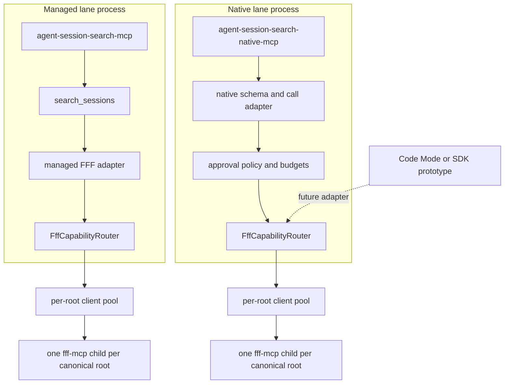
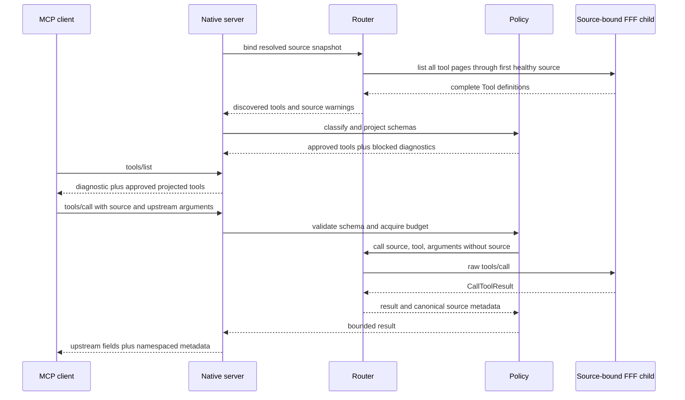
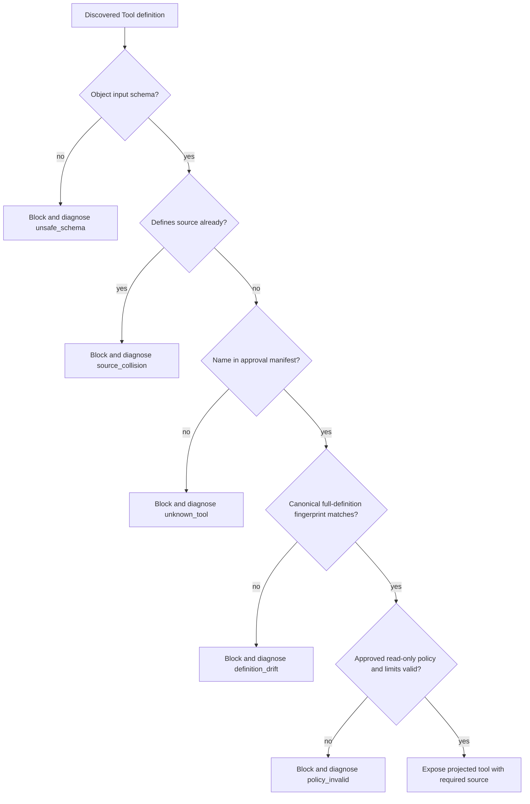

# FFF Two-Lane Architecture - Plan

## Goal Capsule

- **Objective:** Preserve `search_sessions` as the dependable managed recall lane while adding a separate opt-in MCP entrypoint that exposes audited native FFF tools through a source-bound capability router.
- **Authority:** The resolved synthesis defines the two-lane product intent; `DESIGN.md` and `CONTEXT.md` define current managed-search invariants; the installed MCP SDK and existing tests define executable integration constraints.
- **Execution profile:** Deep, cross-cutting TypeScript work across the FFF client/pool, a new policy boundary, a second stdio MCP server, packaging, and agent-facing documentation.
- **Scope:** Build the generic router, fail-closed native policy, managed-lane integration, native MCP entrypoint, tests, package wiring, and design documentation. Do not implement Code Mode, a published SDK, arbitrary code execution, or the separately identified managed-search correctness fixes.
- **Stop conditions:** Stop and revise the design if approved FFF schemas cannot be projected without changing their meaning, if schema drift can make an unreviewed capability executable, or if the managed server's one-tool contract cannot remain observably compatible.
- **Tail ownership:** The implementer owns code, tests, documentation, and package validation through the Definition of Done. Code Mode and SDK evaluation require later prototype findings and a new productionization decision.

---

## Product Contract

### Summary

Agent Session Search will have two explicit MCP lanes. The existing `agent-session-search-mcp` remains the managed, session-native product and continues to expose only `search_sessions`. A new `agent-session-search-native-mcp` binary exposes a small audited subset of FFF's own tools for advanced agents that need upstream parameters and raw results. Both lanes depend on a generic source-bound `FffCapabilityRouter`; neither lane executes unknown or write-capable tools.

### Problem Frame

The managed lane adds valuable semantics that FFF does not provide: configured-source fanout, canonical path handling, query planning, candidate ranking, progressive evidence, and partial-failure reporting. Its current FFF adapter is also lossy: `FffMcpClient.listTools()` retains only names, and the wrapper can call only hand-modeled `grep` and `multi_grep` inputs. Expanding `search_sessions` with every upstream option would erode the managed contract, while making Code Mode the foundation would force sandboxed execution into a local stdio package that currently treats arbitrary code execution as a non-goal.

The missing layer is a capability-aware router that preserves complete MCP tool definitions and raw call results while binding every call to one configured source root. The advanced lane can then be generated from that router without weakening the default lane.

### Requirements

**Lane boundaries**

- R1. `agent-session-search-mcp` must continue to advertise exactly one tool, `search_sessions`, with its existing input, output, error, source-warning, and cleanup behavior.
- R2. Native FFF access must be opt-in through a separate `agent-session-search-native-mcp` stdio binary shipped in the same npm package.
- R3. The native server must advertise only locally approved read-only FFF tools plus one wrapper-owned capability diagnostic; it must never add raw/native modes to `search_sessions`.

**Router and source semantics**

- R4. `FffCapabilityRouter` must provide complete source snapshots, paginated full-schema tool discovery, and generic source-bound calls that return the upstream `CallToolResult` envelope.
- R5. Router calls must reuse one lazily created FFF child per canonical root, preserve the existing temporary-database and child-process cleanup model, and reject unknown or unhealthy sources before invoking FFF. Native source binding is root-wide; managed `include` patterns remain a managed-lane filter and are not silently represented as native FFF enforcement.
- R6. Native tool schemas must preserve the approved upstream schema and add one required `source` enum derived from healthy enabled roots; schemas that cannot be safely composed or already define `source` must remain unexposed.

**Policy and result contract**

- R7. Exposure must fail closed by matching each discovered tool against a checked-in policy entry containing its name, canonical full-definition fingerprint, read-only classification, local annotations, and argument limits.
- R8. The first release must approve only audited `grep` and `multi_grep` definitions whose inputs and observed behavior remain confined to their source root; new names, changed definitions, path-escaping behavior, and write-capable tools require a reviewed policy update and package release.
- R9. Native calls must enforce a process-lifetime budget of 256 attempted upstream calls, at most four concurrent calls, the existing 15-second FFF timeout, a 50-result default and 200-result ceiling for approved search tools, and a 4 MiB serialized-result ceiling. Restarting the explicitly registered native server resets the lifetime budget.
- R10. Successful and upstream-error responses must preserve upstream `content`, `structuredContent`, `isError`, existing `_meta`, and other valid result fields, adding only a collision-checked `_meta["dev.benvenker.agent-session-search/native"]` entry for `source`, canonical `root`, and upstream tool name.

**Packaging and discoverability**

- R11. Package, CLI capability output, design records, MCP documentation, configuration documentation, and troubleshooting guidance must distinguish the managed default from the native opt-in lane, document restart-based source/schema refresh, and state that native calls can inspect the entire selected root even when managed search has narrower `include` patterns.
- R12. Code Mode and a CLI/importable SDK must remain deferred frontends until prototypes demonstrate enough value and solve sandboxing or global-install module-resolution constraints.

### Acceptance Examples

- AE1. A client connected to `agent-session-search-mcp` lists tools and sees only `search_sessions`; the new native binary does not alter that list or its schema.
- AE2. A client connected to `agent-session-search-native-mcp` with healthy `codex` and `claude` roots sees `fff_native_capabilities` plus policy-approved FFF tools whose schemas require `source` with enum values `codex` and `claude`.
- AE3. When an approved tool's discovered definition differs from its checked-in fingerprint, `fff_native_capabilities` reports it as `definition_drift`, the tool is absent from `tools/list`, and `tools/call` cannot execute it.
- AE4. When a client calls an approved tool with `source: "codex"`, the router sends the remaining arguments to the FFF child for the canonical Codex root and returns the upstream result fields unchanged with namespaced source metadata.
- AE5. When a call omits `source`, violates the projected upstream schema, exceeds policy argument limits, exhausts the process call budget, or arrives while four calls are active, the native server returns a typed MCP error or tool error without invoking FFF.
- AE6. When no configured root is healthy, the native server still starts with `fff_native_capabilities`, reports the root warnings, and exposes no mirrored FFF tools.
- AE7. When a source has a narrow managed `include` pattern, `fff_native_capabilities` reports root-wide native coverage and the documentation warns that the native lane does not promise managed include filtering.

### Success Criteria

- The main MCP server and managed search regression suite are unchanged in observable behavior.
- Native tool discovery preserves complete FFF schemas across `tools/list` pagination and exposes no unapproved capability.
- Every native call is attributable to one configured source and one pooled FFF child.
- Native root-wide visibility is explicit in diagnostics and documentation rather than being mistaken for managed include-filtered coverage.
- Schema drift, unsafe schema composition, unhealthy sources, budget exhaustion, and upstream failures have deterministic tested outcomes.
- The installed tarball contains and can launch both MCP binaries, while the README continues to present the managed lane as the default.

### Scope Boundaries

**In scope**

- Generic full-schema FFF discovery and raw call routing.
- Shared per-root client pooling and cleanup primitives.
- Fail-closed native capability policy and bounded execution.
- A separate raw-SDK stdio MCP server with dynamic tool listing and calling.
- Package, design, CLI capability, configuration, MCP, and troubleshooting documentation.

#### Deferred to Follow-Up Work

- Managed-lane strictness, pagination, completeness reporting, parser fidelity, coverage exclusions, and `context` semantics remain a separate correctness work stream. If that work is active, U3 waits for it to land before modifying the same adapter seams.
- A `session_search_code` frontend is evaluated only after native-lane usage shows that programmable fanout, pagination, and result filtering justify sandboxed execution.
- A CLI/code SDK is evaluated only after a prototype proves import ergonomics from global and project-local installations.
- Additional read-only FFF tools require an audited policy entry; write-capable tools require a new design pass.
- Typed result schemas remain upstream-owned. The wrapper does not infer structured outputs from FFF's presentation-oriented text.

**Outside this product's identity**

- Arbitrary server-side code execution, custom indexing, embeddings, durable derived stores, and automatic exposure of newly discovered tools.

---

## Planning Contract

### Recommended Implementation Shape

The package should add one policy-free internal router and one policy-enforcing native transport adapter. A generic `FffClientPool` owns lazy clients and closure by canonical root. Each `FffCapabilityRouter` is a lightweight immutable view over one resolved-source snapshot and that pool; it discovers complete MCP `Tool` objects, follows list pagination, and routes raw calls. Managed search creates a fresh router view after resolving roots for each request so existing config-reload behavior survives, while the native server keeps one startup snapshot for a stable MCP process lifetime. The native server projects approved upstream schemas, validates calls with the MCP SDK's JSON Schema validator, applies budgets, and delegates to the router in its own process.

### Key Technical Decisions

| ID    | Decision and rationale                                                                                                                                                                                                                                                                                                                                                                                                          |
| ----- | ------------------------------------------------------------------------------------------------------------------------------------------------------------------------------------------------------------------------------------------------------------------------------------------------------------------------------------------------------------------------------------------------------------------------------- |
| KTD1  | **Router before frontend.** Make `FffCapabilityRouter` the durable abstraction and keep Code Mode, native MCP, and any future SDK as adapters. This avoids coupling upstream parity to a sandboxing strategy.                                                                                                                                                                                                                   |
| KTD2  | **Separate binary in the existing package.** Ship `agent-session-search-native-mcp` beside the managed server rather than adding tools or a raw mode to `search_sessions`. Installation stays simple while opt-in remains explicit.                                                                                                                                                                                             |
| KTD3  | **Low-level MCP SDK for the native adapter.** Implement `tools/list` and `tools/call` handlers with the installed `Server`, request schemas, stdio transport, and JSON Schema validator. FastMCP remains appropriate for the static managed tool but does not fit runtime-discovered JSON Schemas.                                                                                                                              |
| KTD4  | **Native startup snapshot with restart refresh.** The native lane resolves sources and discovers definitions once before accepting calls, keeping its advertised catalog stable for the MCP process lifetime and applying config or FFF upgrades on restart. The managed lane retains per-request root resolution.                                                                                                              |
| KTD5  | **Fail-closed manifest by name and full-definition fingerprint.** Trust neither upstream annotations, descriptions, nor tool names alone. Unknown, drifted, non-object, reserved-name, or `source`-colliding definitions are diagnostic-only until a reviewed package change approves them.                                                                                                                                     |
| KTD6  | **Approved launch set is `grep` and `multi_grep`.** These are already used and characterized by the managed lane. The native lane adds upstream argument access and raw results without claiming every discovered tool is safe.                                                                                                                                                                                                 |
| KTD7  | **Required source projection.** Add `source` to a copy of the upstream input schema, validate the projected shape locally, remove `source`, and forward the remaining arguments unchanged. The upstream schema remains the semantic authority for every other field.                                                                                                                                                            |
| KTD8  | **Bounded raw pass-through.** Preserve upstream result fields and add only namespaced `_meta`; enforce fixed call, concurrency, timeout, result-count, and serialized-size limits before returning data to an agent context.                                                                                                                                                                                                    |
| KTD9  | **Behavior-preserving managed integration.** Route managed `grep` and `multi_grep` calls through the generic router while leaving parsing, recall-equivalence gating, canonicalization, ranking, response shaping, and managed limits in their existing modules.                                                                                                                                                                |
| KTD10 | **Correctness coordination, not scope fusion.** Do not fold the separately identified managed-search correctness backlog into this architecture change. Sequence U3 after any active correctness patch to avoid two concurrent rewrites of `src/fff-backend.ts`, `src/client-pool.ts`, and `src/search.ts`.                                                                                                                     |
| KTD11 | **Native scope is the selected canonical root.** Do not claim that raw pass-through honors managed `include` patterns, because those filters are currently enforced after FFF returns presentation-oriented text. Registration remains opt-in, the diagnostic reports root-wide coverage, and the docs call out sensitive sibling files; true include-confined native results require a later tool-specific translation design. |

### High-Level Technical Design

#### Component topology

Each server process owns its own router and child pool. The shared abstraction is code, not cross-process state.

#### Native startup and call protocol

#### Exposure decision flow

### Sequencing

1. Complete U1 to make full-schema discovery and generic source-bound calls possible without changing public behavior.
2. Implement U2 and U3 after U1. U2 establishes the security boundary; U3 proves the router under the managed regression suite. They may proceed in parallel unless an active managed-correctness patch overlaps U3.
3. Implement U4 only after U2 can reject every unapproved capability and validate projected schemas.
4. Complete U5 after both lanes pass their focused tests so public docs and the tarball describe behavior that is already executable.

### Order-Changing Open Questions

- **Deferred coordination question:** Is a managed-search correctness patch active when implementation starts? If yes, complete U1 and U2 first, land or rebase the correctness patch, then execute U3 before U5. If no, use the normal dependency order above.
- **Conditional compatibility question:** Do the audited FFF `grep` or `multi_grep` schemas contain a top-level `source`, a non-object root, unsupported references, no numeric `maxResults` bound, or another shape the SDK validator cannot compile and safely cap? If yes, stop after U1 and revise the policy/projection contract before writing approval fingerprints or starting U4. Do not special-case the schema in the transport; approve a tool only after identifying a schema-native bounded equivalent.
- **Conditional packaging question:** Does the installed MCP SDK's low-level server surface change before implementation? If its request-handler path no longer validates `CallToolResult` or supports dynamic `tools/list`, isolate the compatibility adapter in U4 and keep U1-U3 unchanged rather than switching the managed server to a different framework.

### System-Wide Impact

- **Public interfaces:** The managed MCP and CLI search contracts remain stable. The package gains a second executable and new capability/configuration documentation.
- **Process lifecycle:** Native and managed servers each lazily spawn their own per-root FFF children. Both must reuse the same tracking, process-group termination, temporary database cleanup, and stdio EOF handling.
- **Agent parity:** Advanced agents gain raw approved FFF actions without forcing human CLI users or managed agents to understand upstream schemas. `fff_native_capabilities` explains blocked capabilities and current budgets.
- **Privacy and context size:** Native results bypass managed truncation, grouping, and ranking. Opt-in registration, source binding, result-count limits, a serialized-size ceiling, and explicit docs are the safety boundary.
- **Source coverage:** Managed search continues to apply configured `include` patterns after FFF search. Native tools operate over the selected canonical root and must expose that distinction in diagnostics so users do not infer file-level confinement that the raw protocol cannot guarantee.
- **Configuration lifecycle:** Source and schema snapshots are stable for one server process. Config edits and FFF upgrades require an MCP server restart; no live reload or tool-list-changed notification is required in the first release.
- **Maintenance:** A supported FFF schema change becomes a visible, reviewable policy update rather than silently altering an agent-facing tool.

### Threat Model

- A compromised or upgraded FFF process may advertise a familiar name with write semantics, agent-steering descriptions, or a widened schema. Full-definition fingerprints, audited local annotations, and fail-closed classification prevent exposure until review.
- A caller may try to cross source boundaries through `source`, paths, or upstream arguments. Required source enums, canonical root binding, local schema validation, and observed root-confinement tests keep every call attached to one approved root. The boundary is the root itself, not the managed lane's post-search `include` filter.
- A caller may exhaust processes, transport capacity, or context through loops, concurrency, or oversized results. Per-process call and concurrency budgets, the existing timeout, result-count limits, and the serialized-size ceiling bound the native lane; opt-in registration contains the remaining privacy risk.

### Risks and Mitigations

| Risk                                      | Impact                                                                                               | Mitigation                                                                                                                                                                                                                                                    |
| ----------------------------------------- | ---------------------------------------------------------------------------------------------------- | ------------------------------------------------------------------------------------------------------------------------------------------------------------------------------------------------------------------------------------------------------------- |
| Upstream definition drift                 | A familiar tool name could acquire unsafe, incompatible, or agent-steering semantics.                | Canonical full-definition fingerprints fail closed; diagnostics name the drift; policy updates require tests and release review.                                                                                                                              |
| Fingerprint brittleness                   | Semantically harmless array reordering could disable a tool.                                         | Canonicalize object keys only, preserve arrays exactly, keep fixtures proving both behaviors, and prefer a false block over incorrectly normalizing a meaningful order change.                                                                                |
| Dynamic-schema validation gaps            | Low-level MCP handlers do not automatically validate tool arguments against advertised schemas.      | Compile every projected schema with the SDK's JSON Schema validator at startup and validate before budget acquisition or routing.                                                                                                                             |
| Raw result volume or sensitive content    | An agent can request more session evidence than the managed lane would return.                       | Make the lane opt-in, require a source, cap search results and serialized output, and document that managed redaction/truncation does not apply.                                                                                                              |
| Root-wide native visibility               | Built-in roots such as `~/.codex` contain files outside the managed session `include` patterns.      | Report effective root-wide coverage in `fff_native_capabilities`, warn during setup/docs, keep native registration explicit, and defer any claim of include confinement until a tool-specific enforcement prototype proves it without corrupting raw results. |
| Agent-visible upstream definition changes | A changed description or annotation could steer an agent even when the input schema is unchanged.    | Fingerprint the complete advertised definition and replace upstream annotations with audited local annotations before exposure.                                                                                                                               |
| Child-process growth                      | Native calls across many sources can spawn many FFF children.                                        | Create clients lazily, key by canonical root, reuse them, cap concurrency, and reuse existing cleanup/orphan diagnostics.                                                                                                                                     |
| Main-lane regression                      | Router refactoring could alter parsing, multi-grep fallback, or result shaping.                      | Keep those behaviors in their current modules; require before/after managed contract tests and MCP introspection tests in U3.                                                                                                                                 |
| Low-level SDK churn                       | `Server` is an advanced/deprecated surface relative to `McpServer`.                                  | Confine it to `src/native-server.ts`, pin behavior with client-driven tests, and avoid leaking SDK-specific types into policy or router modules.                                                                                                              |
| Dirty-worktree overlap                    | Current doctor/docs work and future correctness work touch adjacent package and documentation files. | Land units in dependency order, preserve unrelated edits, and re-read diffs before U3 and U5 rather than performing broad rewrites.                                                                                                                           |

### Alternatives Considered

| Alternative                                                           | Decision                                                                                                                                                                                  |
| --------------------------------------------------------------------- | ----------------------------------------------------------------------------------------------------------------------------------------------------------------------------------------- |
| Add `raw` mode and upstream flags to `search_sessions`                | Rejected because it couples the managed product contract to every FFF schema change and recreates hand-maintained parameter plumbing.                                                     |
| Expose every discovered tool whose upstream annotation says read-only | Rejected because discovery metadata is not local policy approval and annotations can be missing, stale, or wrong.                                                                         |
| Hand-write a static native `grep`/`multi_grep` proxy                  | Rejected because it does not preserve complete upstream schemas and requires wrapper code for each new parameter.                                                                         |
| Build server-side Code Mode first                                     | Deferred because sandboxing and arbitrary execution would become prerequisites for native access and conflict with the current non-goals.                                                 |
| Publish an importable SDK first                                       | Deferred because the package is normally installed globally and currently publishes neither library exports nor declarations for workspace imports.                                       |
| Publish the native lane as a separate npm package                     | Rejected for the first release because it duplicates versioning, installation, FFF compatibility, and lifecycle code; a separate executable already provides an explicit opt-in boundary. |

---

## Implementation Units

### U1. Generalize the FFF client pool and add the capability router

- **Goal:** Preserve complete FFF MCP definitions and support generic calls bound to resolved source roots.
- **Requirements:** R4, R5, R10; KTD1, KTD4.
- **Dependencies:** None.
- **Files:** Create `src/fff-capability-router.ts` and `test/fff-capability-router.test.ts`; modify `src/fff-backend.ts`, `src/client-pool.ts`, `test/fff-backend.test.ts`, and `test/client-pool.test.ts`.
- **Approach:** Change the low-level MCP client seam so `listTools` returns complete SDK `Tool` definitions across every cursor page and generic `callTool` returns the SDK `CallToolResult`. Keep `grep` and `multi_grep` convenience behavior only as managed adapters. Generalize `src/client-pool.ts` into the lifecycle owner that returns one client per canonical root and can create router views without duplicating pools. Keep the dependency direction entrypoint/search adapter → managed or native adapter → `FffCapabilityRouter` → root-keyed client pool → low-level `FffMcpClient`; the router must not import `search.ts` or server modules. Each router binds an immutable resolved-source snapshot, selects the first healthy source for homogeneous capability discovery, routes calls by source name, and returns canonical source metadata beside the raw result. A failed representative source must fall through to the next healthy source; a call never falls through to a different source.
- **Patterns to follow:** `src/roots.ts` resolved-source statuses and warnings; `src/client-pool.ts` root-keyed promise cache and failed-creation eviction; `src/child-process-cleanup.ts` lifecycle tracking; `test/client-pool.test.ts` fake-client call capture.
- **Test scenarios:**
  - Full discovery: two paginated `tools/list` pages containing descriptions, input/output schemas, annotations, and execution metadata return one ordered complete tool set without name-only loss.
  - Discovery fallback: the first healthy source's child fails during listing, the next healthy source succeeds, and the router records the failed-source warning without merging heterogeneous tool sets.
  - Source routing: two source names with different canonical roots receive calls on their own pooled clients and return their own `source` and `root` metadata.
  - Pool reuse: repeated discovery and calls for one root create one client; concurrent first calls coalesce; closing the owning pool closes every fulfilled client exactly once while discarding a router view does not tear down shared clients.
  - Error paths: unknown, missing, or unreadable sources fail before client creation; an upstream `isError` result is returned rather than thrown or rewritten.
- **Verification:** A fake MCP client proves full-schema pagination and raw-result preservation, while existing backend/pool tests continue to prove warm reuse and cleanup.

### U2. Add fail-closed capability projection and call budgets

- **Goal:** Turn automatic FFF discovery into a locally approved, validated, and bounded native exposure set.
- **Requirements:** R6-R9; AE3, AE5; KTD5-KTD8.
- **Dependencies:** U1.
- **Files:** Create `src/fff-native-policy.ts` and `test/fff-native-policy.test.ts`.
- **Approach:** Audit the supported FFF release's `grep` and `multi_grep` definitions and check in canonical full-definition fingerprints plus local read-only annotations and search-result limits. The fingerprint covers the complete discovered `Tool` object so a schema-stable description, annotation, execution, icon, or metadata change also fails closed. Canonicalization recursively sorts object keys and preserves every array in advertised order; semantically harmless array reordering may block a tool, which is preferable to normalizing an order-sensitive field incorrectly. Classification returns approved, unknown, drifted, unsafe-schema, reserved-name collision, source-collision, and invalid-policy states. Projection copies the upstream schema, adds required `source`, tightens `maxResults` to the local default/ceiling, and compiles the result with the SDK's bundled AJV validator. A process-lifetime budget counts every validated upstream attempt, rejects a fifth concurrent call, applies the existing FFF timeout, and rejects results over the serialized-size ceiling.
- **Patterns to follow:** `src/fff-runtime.ts` pinned FFF compatibility constants; `src/tool.ts` teaching input errors; SDK `AjvJsonSchemaValidator` already available through `@modelcontextprotocol/sdk/validation/ajv`.
- **Test scenarios:**
  - Approved schema: exact audited `grep` and `multi_grep` definitions project with required source enums, preserved upstream fields, local annotations, and enforceable result limits.
  - Drift and unknowns: a changed description, annotation, output schema, optional input property, required list, or new tool name remains diagnostic-only and cannot acquire a validator or executor.
  - Fingerprint canonicalization: object key reordering retains the approved fingerprint, while any array reordering changes it and blocks exposure pending review.
  - Unsafe composition: boolean/non-object roots, unresolvable schemas, an upstream `source` property, or a collision with `fff_native_capabilities` fails closed with stable reason codes.
  - Input validation: missing source, invalid source, invalid upstream arguments, and `maxResults` above 200 fail before the router call; omitted `maxResults` forwards the local default of 50.
  - Budget boundaries: call 256 is permitted, call 257 is rejected, no more than four upstream promises run concurrently, timeout returns an error, and a result above 4 MiB is replaced with a bounded error result.
- **Verification:** Policy fixtures make every exposure decision deterministic and show that an FFF upgrade cannot silently expand the native tool surface.

### U3. Re-home managed FFF calls without changing managed search behavior

- **Goal:** Prove the router under the existing managed lane while preserving `search_sessions` semantics.
- **Requirements:** R1, R4, R5; AE1; KTD9, KTD10.
- **Dependencies:** U1. Wait for any active managed-search correctness patch before modifying overlapping adapter files.
- **Files:** Modify `src/client-pool.ts`, `src/fff-backend.ts`, `src/search.ts`, `test/client-pool.test.ts`, `test/fff-backend.test.ts`, `test/search.test.ts`, `test/server-pool.test.ts`, and `test/mcp-smoke.test.ts`.
- **Approach:** After `CoordinatedSessionSearch` resolves roots for a request, create a router view over that snapshot and the long-lived default client pool, then create each per-source managed adapter through `FffCapabilityRouter.call`. This preserves per-request config resolution while keeping clients warm by canonical root. Keep sequential grep, multi-grep recall-equivalence promotion, response-text parsing, include/path filtering, canonicalization, candidate ranking, evidence grouping, warnings, and managed request limits in their existing modules. Managed calls do not consume native-server budgets because each lane has its own adapter and process policy.
- **Execution note:** Add characterization assertions before changing the adapter wiring, especially for MCP introspection, multi-grep fallback, partial-source failure, raw parser output, canonical paths, and pooled child reuse.
- **Patterns to follow:** `OneRootFffBackend` as the managed translation boundary; `CoordinatedSessionSearch` for source-level failure isolation; `test/mcp-smoke.test.ts` for client-visible contracts.
- **Test scenarios:**
  - Single-pattern and multi-pattern managed searches produce the same result shapes, warnings, backend metadata, and caps before and after router integration.
  - A multi-grep schema is discoverable but a recall-equivalence failure still demotes it to sequential fallback for the rest of the backend lifetime.
  - One source's router/client failure marks only that source failed while other source results and canonical paths remain available.
  - Repeated MCP searches reuse one FFF child per root and process shutdown removes temporary databases and tracked children.
  - Managed `tools/list` continues to contain only `search_sessions` with no native policy or source enum fields.
- **Verification:** The full existing managed tests pass without snapshot updates that alter public `search_sessions` behavior.

### U4. Implement the opt-in native MCP server

- **Goal:** Expose the approved source-bound FFF tools through a separate dynamic stdio MCP entrypoint.
- **Requirements:** R2, R3, R6-R10; AE2-AE7; KTD2-KTD8, KTD11.
- **Dependencies:** U1, U2.
- **Files:** Create `src/native-server.ts`, `src/server-lifecycle.ts`, `test/native-server.test.ts`, `test/native-mcp-smoke.test.ts`, and `test/server-lifecycle.test.ts`; modify `src/server.ts`, `test/mcp-smoke.test.ts`, and `test/server-pool.test.ts`.
- **Approach:** Extract transport-agnostic shutdown handling from `src/server.ts` so both entrypoints share EOF, signal, timeout, and child-reaping behavior. Build the native server with the MCP SDK's low-level `Server`, `ListToolsRequestSchema`, `CallToolRequestSchema`, and `StdioServerTransport`. Before connecting, resolve sources, discover definitions, classify them, compile projected validators, and prepare a stable tool catalog. `fff_native_capabilities` reports source statuses, effective root-wide native coverage, managed include patterns for contrast, approved/blocked tool names and reasons, supported FFF release, and remaining budgets. Approved calls validate, acquire a budget slot, strip `source`, route, enforce the result ceiling, preserve existing result metadata, add the reserved namespaced metadata entry only when collision-free, and preserve upstream errors. Unknown tool names use MCP method errors; invalid arguments use invalid-params errors; budget and upstream failures use bounded tool-error results. Stdout remains protocol-only; summaries and blocked-capability diagnostics go through the diagnostic tool or bounded stderr logging that never includes result content.
- **Patterns to follow:** `src/server.ts` preflight and stdio entrypoint structure; `src/entrypoint.ts` main guard; `test/mcp-smoke.test.ts` SDK client/stdio testing; `src/child-process-cleanup.ts` process tracking.
- **Test scenarios:**
  - Introspection: server identity is distinct, `tools/list` includes the diagnostic plus approved projected tools, each approved schema requires a healthy source, and no blocked tool appears.
  - Valid call: upstream arguments other than `source` arrive unchanged at the correct fake client; content, structured content, error state, and existing metadata survive with the collision-free namespaced source metadata added.
  - Invalid call: missing/unknown source, schema-invalid arguments, unknown tool, drifted tool, exhausted budget, concurrency overflow, timeout, and oversize result each produce the documented error class without misrouting.
  - Root failures: a missing root appears in diagnostics but not source enums; zero healthy roots still permits initialization and diagnostic calls.
  - Coverage disclosure: a source with a narrow managed include reports that include alongside root-wide native coverage, and the server makes no include-confinement claim in its projected tool metadata.
  - Root confinement: a temporary sibling file outside the selected root cannot be returned, including when any approved upstream path-like argument is supplied with an absolute path or `..` traversal.
  - Lifecycle: stdin close, SIGINT, SIGTERM, and normal client close settle the router once and reap all tracked FFF children.
  - Live smoke: with a temporary configured root and installed FFF, an SDK client lists native tools, calls native `grep`, and receives the fixture hit with canonical source metadata.
- **Verification:** Client-driven tests prove the native server's advertised schema, validation, pass-through, diagnostics, and shutdown behavior independently of FastMCP.

### U5. Package, document, and release-gate both lanes

- **Goal:** Make the native lane installable and understandable without weakening the managed default or promising Code Mode/SDK support.
- **Requirements:** R1-R3, R11, R12; all success criteria.
- **Dependencies:** U3, U4.
- **Files:** Modify `package.json`, `package-lock.json`, `src/help.ts`, `test/cli.test.ts`, `test/packaging.test.ts`, `test/readme.test.ts`, `README.md`, `DESIGN.md`, `CONTEXT.md`, `AGENTS.md`, `docs/README.md`, `docs/mcp.md`, `docs/configuration.md`, `docs/troubleshooting.md`, and `docs/maintainers/release.md`; create `docs/native-mcp.md` if a dedicated guide is clearer than expanding `docs/mcp.md`.
- **Approach:** Add the `agent-session-search-native-mcp` bin target and assert that build, tarball, global-style install, and SDK connection work from the installed package. Keep `capabilities --json` explicit: managed MCP advertises one tool; native MCP is a separate opt-in entrypoint with dynamic approved tools. Update the design record so the one-tool guardrail is scoped to the managed server, document native budgets and restart semantics, distinguish root-wide native coverage from managed include filtering, explain raw-result/privacy tradeoffs, and record Code Mode/SDK evaluation criteria as deferred work. Preserve unrelated in-progress doctor and documentation edits when touching shared files.
- **Patterns to follow:** `test/packaging.test.ts` installed-tarball assertions; `src/help.ts` machine-readable capability contracts; `README.md` managed-first quick start; `DESIGN.md` concise durable decisions rather than backlog detail.
- **Test scenarios:**
  - Build output and packed tarball contain executable `dist/native-server.js` and the new bin symlink, with no test or local-agent artifacts added.
  - An installed managed server lists only `search_sessions`; an installed native server lists the diagnostic and approved source-bound tools.
  - `capabilities --json` identifies both entrypoints without placing native tools in the managed `mcp.tools` array.
  - Documentation contract tests find the opt-in warning, source requirement, budget defaults, definition-drift behavior, restart requirement, and deferred Code Mode/SDK boundaries.
  - Documentation contract tests also find the root-wide coverage warning and never describe configured `include` patterns as a native security boundary.
  - Missing or stale `fff-mcp` produces the same pre-handshake compatibility exit behavior for both server binaries.
- **Verification:** A packed-install smoke proves both entrypoints launch from the published artifact, and a documentation review can identify which lane owns a requested capability and what approval it needs.

---

## Verification Contract

| Gate                            | Command                                                                                                                           | Proves                                                                                                          |
| ------------------------------- | --------------------------------------------------------------------------------------------------------------------------------- | --------------------------------------------------------------------------------------------------------------- |
| Type safety                     | `npm run check`                                                                                                                   | Router, SDK tool/result types, projected schemas, and both server entrypoints compile under strict TypeScript.  |
| Focused router and policy tests | `npm test -- test/fff-backend.test.ts test/client-pool.test.ts test/fff-capability-router.test.ts test/fff-native-policy.test.ts` | Full discovery, source routing, pooling, fail-closed classification, validation, and budgets work in isolation. |
| MCP boundary tests              | `npm test -- test/mcp-smoke.test.ts test/native-server.test.ts test/native-mcp-smoke.test.ts test/server-pool.test.ts`            | Both stdio servers advertise and execute only their intended contracts and clean up children.                   |
| Packaging and docs              | `npm test -- test/packaging.test.ts test/cli.test.ts test/readme.test.ts`                                                         | The tarball ships both binaries and agent-facing discovery/docs distinguish the lanes.                          |
| Full regression                 | `npm test`                                                                                                                        | Managed search, CLI, doctor, root resolution, packaging, and new native behavior remain mutually compatible.    |
| Build                           | `npm run build`                                                                                                                   | All production entrypoints emit to `dist/`, including `dist/native-server.js`.                                  |
| Managed smoke                   | `npm run smoke`                                                                                                                   | The existing default MCP path still searches a deterministic fixture through FFF.                               |
| Guardrails                      | `npm run check:dcg`                                                                                                               | Repository destructive-command protections remain active before landing the implementation.                     |

Live native validation should also connect an SDK client to the built `agent-session-search-native-mcp`, inspect tools, call one approved tool against a temporary root, then restart after a simulated config/schema change and confirm the new snapshot is the only one advertised.

---

## Definition of Done

- U1 is done when full paginated FFF tool definitions and raw results survive the low-level client/router boundary, all source calls are deterministic, and pool cleanup is proven.
- U2 is done when only exact audited `grep` and `multi_grep` definitions can be projected, every blocked state is diagnostic, inputs compile and validate, and all fixed budgets have boundary tests.
- U3 is done when the managed lane uses the router-backed adapter and every existing `search_sessions` contract test passes without public behavior changes.
- U4 is done when the separate native server initializes with zero or more healthy roots, lists only approved tools plus diagnostics, routes valid calls, fails closed on invalid calls, preserves raw results with namespaced metadata, and cleans up every child.
- U5 is done when the built and packed npm artifact launches both binaries and all design, capability, configuration, MCP, README, and troubleshooting docs describe the two-lane contract consistently.
- Native diagnostics and documentation describe selected-root visibility accurately, and integration coverage proves calls cannot escape that root without claiming that managed `include` patterns apply.
- `DESIGN.md` continues to forbid arbitrary code execution and scopes the one-tool rule to the managed server.
- No unapproved FFF tool, schema drift, write-capable operation, Code Mode runtime, or library export is present in the production diff.
- `npm run check`, `npm test`, `npm run build`, `npm run smoke`, and `npm run check:dcg` pass in the required Node environment.
- Experimental, dead-end, duplicate pooling, and abandoned server-adapter code is removed before completion.

---

## Sources and Research

- `docs/investigations/fff-pass-through/2026-07-16-code-mode-synthesis.md` establishes the two-lane intent, router-first sequencing, automatic-discovery distinction, and Code Mode/SDK deferrals.
- `DESIGN.md` and `CONTEXT.md` define the current managed one-tool boundary, source-root model, canonical path guarantees, FFF child topology, result behavior, and arbitrary-code non-goal.
- `src/fff-backend.ts` contains the current name-only `listTools` loss and specialized `grep`/`multi_grep` calls; `src/client-pool.ts` contains the reusable root-keyed lifecycle seam.
- `src/roots.ts` and `src/search.ts` show that configured `include` patterns are enforced by the managed wrapper after FFF returns results; this is why the raw native lane must describe its boundary as the canonical root.
- `src/server.ts`, `test/mcp-smoke.test.ts`, and `test/server-pool.test.ts` provide managed stdio, introspection, and cleanup patterns.
- `package.json` and `test/packaging.test.ts` define the executable and installed-tarball contract.
- The installed `@modelcontextprotocol/sdk` exposes complete `Tool` and `CallToolResult` types, low-level `tools/list` and `tools/call` request handlers, stdio transport, result validation, and an AJV-backed JSON Schema validator. These local primary-source APIs support dynamic native registration without adding a second server framework.
