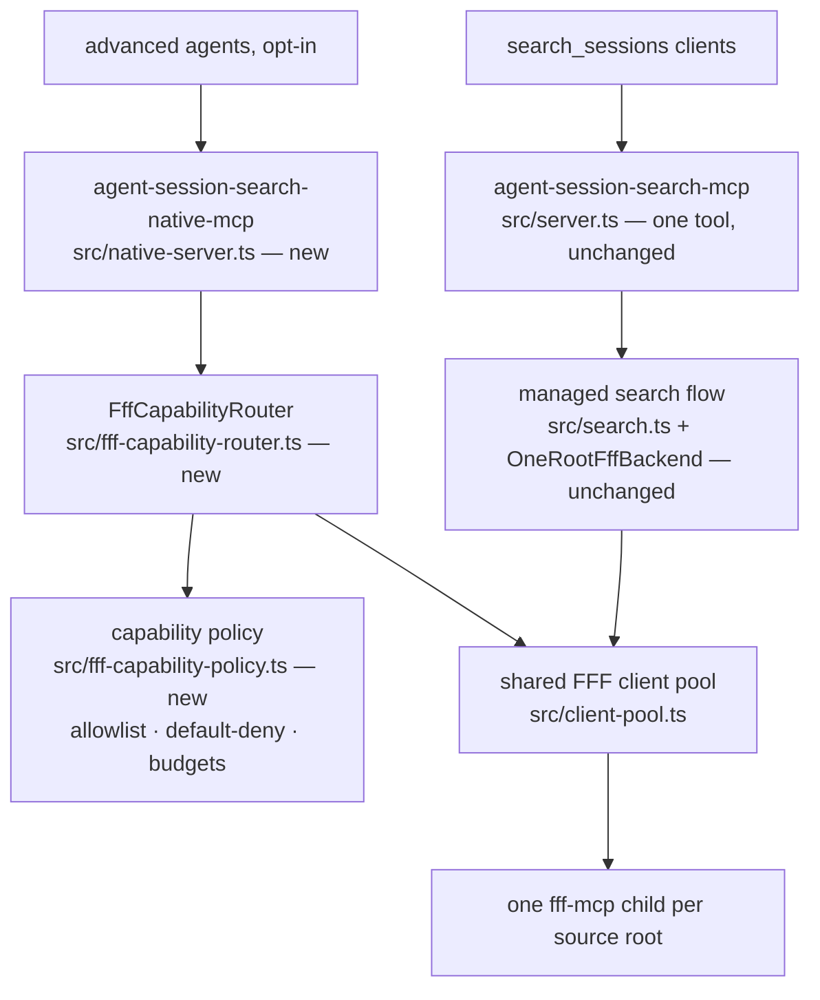

# feat: FFF Two-Lane Architecture — Capability Router Core, Opt-In Native Lane

## Summary

Adopt the two-lane architecture from the code-mode synthesis: keep `search_sessions` as the dependable, session-native managed product, and add an opt-in native FFF lane exposed through a separate MCP entrypoint (`agent-session-search-native-mcp`). The durable core — built first, internally — is a generic, source-bound `FffCapabilityRouter` (`listSources()`, `listTools()` with complete schemas, `call(source, tool, args)` returning the raw `CallToolResult`). Discovery of upstream FFF tools is automatic; **exposure is not**: every discovered tool passes read-only classification, call budgets, and explicit policy approval before it becomes executable. Code Mode and an npm SDK are deferred frontends on the same router, not part of this build. The managed lane's known correctness debts gate the native lane's ship date, not the router's construction.

---

## Problem Frame

Agent Session Search deliberately wraps FFF behind one managed MCP tool, and that remains the right product default. But the internal FFF adapter is narrow and lossy: `FffMcpClient.listTools()` in `src/fff-backend.ts` discards everything except tool names, only `grep` and `multi_grep` are callable, and an advanced agent has no path to upstream FFF capabilities without this repo hand-duplicating every parameter. The synthesis concluded:

1. The public `search_sessions` boundary stays session-native; its correctness fixes (strictness, pagination, completeness reporting, parser fidelity, coverage exclusions, `context`) are a separate, already-identified work stream.
2. The missing architectural piece is a generic source-bound capability router inside the package.
3. Advanced access ships as a second, opt-in lane generated from FFF's own MCP schemas — _automatic discovery, not automatic exposure_.
4. Server-side Code Mode and a published SDK are premature; both are possible later frontends of the router.

**Scope boundary:** this plan builds the router, the policy layer, the design-record amendment, the native proxy entrypoint, and doctor awareness. It does not implement the managed-lane correctness fixes (tracked separately), Code Mode, or an npm SDK.

---

## Requirements

Traceable to the origin document (`docs/investigations/fff-pass-through/2026-07-16-code-mode-synthesis.md`):

- **R1 (managed lane preserved):** `search_sessions` remains the only tool on `agent-session-search-mcp`; its behavior, result shapes, and guarantees are unchanged by this plan.
- **R2 (router core):** An internal `FffCapabilityRouter` offering `listSources()`, `listTools()` with complete tool schemas, and `call(source, tool, args)` returning the raw `CallToolResult`, one FFF child per real source root (no mirror directories), sharing children with the managed lane.
- **R3 (discovery ≠ exposure):** A policy layer classifies discovered FFF tools; only an explicit read-only allowlist is executable. Unknown tools are visible with schemas but never callable until promoted by a code change. Call budgets bound native-lane usage.
- **R4 (native lane, opt-in):** A separate binary `agent-session-search-native-mcp` dynamically mirrors approved FFF tool schemas, injects a required `source` parameter, and returns raw FFF results. Installing/registering the extra entrypoint is the opt-in.
- **R5 (raw-lane semantics documented):** Native-lane results are upstream content unmodified inside a thin provenance envelope (`source`, `root`, `tool`, warnings). No ranking, no snippet shaping, no canonical-path rewriting of result text, no typed output schema promise.
- **R6 (sequencing):** Router construction proceeds in parallel with the managed-lane correctness track, but the native entrypoint does not ship before that track is complete or explicitly accepted as tracked in Beads.
- **R7 (deferred frontends recorded):** Code Mode (`session_search_code`) and a CLI/SDK lane are deferred with explicit evaluation criteria written into the design record.

---

## Key Technical Decisions

1. **Router before any frontend.** `FffCapabilityRouter` is an internal module first; managed search, the native proxy MCP, a future code tool, and a future SDK all sit on it. This is the synthesis's central correction to the Code-Mode-first proposal and survives even if every frontend decision changes.
2. **Automatic discovery, not automatic exposure.** `tools/list` results are classified against a static, data-driven table: `internal` (used by the managed lane: `grep`, `multi_grep`), `exposable` (approved read-only tools for the native lane), `denied`, and `unknown` (default — listed, never executable). Promotion of an `unknown` tool is a reviewed code change, not runtime behavior.
3. **Separate entrypoint, not a second tool on the existing server.** `src/server.ts` keeps exactly one tool. DESIGN.md currently pins that one-tool boundary, so the amendment is an explicit plan unit (U4) and a human go/no-go gate for the native lane — not an afterthought.
4. **Raw means raw, plus a provenance envelope.** The native lane must not re-create managed-lane shaping; the only guaranteed structure is the envelope. Upstream results remain presentation-oriented text.
5. **Sibling consumer, not a managed-lane re-home.** The router shares the existing client pool (`src/client-pool.ts`) but `OneRootFffBackend` and `src/search.ts` are untouched. Re-homing the managed lane onto the router would prove the router under existing tests, but it churns the product lane this plan promises not to change (R1); the re-home is deferred follow-up work once the router is proven by the native lane.
6. **No server-side Code Mode now.** Sandboxed code execution inside a local Node/stdio package is a large infrastructure project, and DESIGN.md lists arbitrary code execution as a non-goal. Deferred with criteria (see Scope Boundaries).

---

## High-Level Technical Design



Native-lane startup flow: resolve sources (reusing `src/roots.ts` semantics — missing roots warn, they don't fail) → router lists upstream tools with complete schemas → policy filters to `exposable` → register one mirrored MCP tool per approved upstream tool, each schema being the upstream `inputSchema` plus an injected required `source` enum of resolved source names → calls route through `call(source, tool, args)` under budgets and timeouts → raw `CallToolResult` returns inside the provenance envelope.

---

## Implementation Units

Step 0 (parallel prerequisite track, planned separately): the `search_sessions` correctness fixes named in the origin document. This plan does not re-plan them; U5 binds to their completion or explicit acceptance in Beads.

### U1. Rich tool discovery and generic raw call in the FFF client layer

- **Goal:** The FFF client stops discarding everything but tool names and gains a generic raw call, so a router can exist at all.
- **Requirements:** R2.
- **Dependencies:** none.
- **Files:** `src/fff-backend.ts`, `src/client-pool.ts`, `test/fff-backend.test.ts`, `test/client-pool.test.ts`.
- **Approach:** Extend the `FffClient` type with an optional detailed listing (name, description, complete `inputSchema`) and an optional generic raw call (tool name + arguments → raw `FffToolResult`). Implement both on `FffMcpClient` beside the existing names-only `listTools`, deriving the names-only view from the detailed result so the multi_grep support probe in `OneRootFffBackend` (which consumes names) is provably unchanged. Thread the new members through the pool's client facade in `createFffBackendPool` the same way `listTools` is conditionally forwarded today, and expose a client-for-root accessor from the pool so the router shares children with the managed lane instead of spawning duplicates.
- **Patterns to follow:** existing conditional member forwarding in `createFffBackendPool`; existing `callTool` usage inside `FffMcpClient.grep`/`multiGrep`.
- **Test scenarios:** detailed listing preserves `inputSchema` verbatim from a stubbed MCP client; names-only view stays consistent with the detailed view; generic call passes name/args through untouched and returns the raw result including `isError: true`; pool forwards the new members only when the underlying client provides them; existing multi_grep recall-equivalence gating tests pass unchanged.
- **Verification:** typecheck and the fff-backend/client-pool test files green; zero diffs in managed-search test expectations.

### U2. Capability policy module

- **Goal:** A small, deterministic policy layer that classifies discovered tools and enforces budgets — the "not automatic exposure" half of the concept.
- **Requirements:** R3.
- **Dependencies:** none (pure module; U3 consumes it).
- **Files:** `src/fff-capability-policy.ts` (new), `test/fff-capability-policy.test.ts` (new).
- **Approach:** Static classification table keyed by tool name with classes `internal`, `exposable`, `denied`, `unknown` (default). Decisions return `{ allowed, class, reason }`. Budget config: per-call timeout (reuse the managed lane's timeout defaults) and a per-session call budget for the native lane. No runtime promotion.
- **Patterns to follow:** small data-driven modules like `src/query-rewriter.ts` (deterministic tables, exhaustive unit tests).
- **Test scenarios:** a known read-only tool classifies `exposable`; `grep`/`multi_grep` classify per the pinned table decision (see Open Question 4); an unrecognized name classifies `unknown` with `allowed: false` and a human-readable reason; budget exhaustion flips subsequent decisions to denied with a `budget_exhausted` reason; timeout config flows through to decisions.
- **Verification:** policy test file green; table review confirms every entry has an explicit class and reason.

### U3. FffCapabilityRouter

- **Goal:** The durable core: source-bound routing of capability discovery and raw calls, policy-gated, on the shared pool.
- **Requirements:** R2, R3, R5.
- **Dependencies:** U1, U2.
- **Files:** `src/fff-capability-router.ts` (new), `test/fff-capability-router.test.ts` (new).
- **Approach:** `listSources()` reuses root resolution from `src/roots.ts` with the managed lane's enablement/warning semantics. `listTools(source)` returns detailed descriptors annotated with policy class; `unknown` tools are listed (visible) but marked non-executable. `call(source, tool, args)` enforces policy and budgets, invokes the generic raw call on the pooled client for that source's root, and returns the raw result in an envelope `{ source, root, tool, result, warnings }`. Errors from one source never poison others.
- **Patterns to follow:** source-level warning behavior in `src/search.ts` fanout; pool lifecycle in `src/client-pool.ts`.
- **Test scenarios:** `call` against a `denied`/`unknown` tool returns a policy error without touching the client (assert via stub); `call` with an unresolvable source name returns a structured error listing valid sources; the envelope carries source/root while `result.content` is byte-identical to the stub's return; disabled sources are absent from `listSources()`; a root that fails to spawn yields a warning while other sources keep working; budget exhaustion surfaces as a structured error after N calls.
- **Verification:** router test file green; typecheck green; no new child processes spawned when the managed lane already has a client for the same root (assert via pool accessor stub).

### U4. Design record amendment (gate for U5)

- **Goal:** Make the two-lane boundary an accepted design decision instead of a violation of the current one.
- **Requirements:** R1, R4, R5, R7.
- **Dependencies:** U3 (router exists and is tested); this unit is the human go/no-go gate for U5.
- **Files:** `DESIGN.md`, `CONTEXT.md`, `AGENTS.md` (one-line surface note), optionally a first `docs/adr/` entry.
- **Approach:** Amend the product contract: the primary server remains one-tool; a second, explicitly opt-in binary exposes policy-approved upstream FFF tools with a required `source` argument, raw results, and no managed-lane guarantees. Record the classification policy, the unknown-tools-never-auto-exposed rule, and the deferred-frontend evaluation criteria (Scope Boundaries below) in DESIGN.md's design memory.
- **Test expectation:** none — documentation/design unit; `test/readme.test.ts` and `test/packaging.test.ts` guard doc/packaging drift in later units.
- **Verification:** the amendment is reviewed and accepted by the maintainer. If rejected, U1–U3 stand as internal improvements and the plan stops cleanly before any public surface changes.

### U5. Opt-in native proxy MCP entrypoint

- **Goal:** Ship the second lane: a separate MCP server that dynamically mirrors approved FFF tools with a required `source` parameter.
- **Requirements:** R4, R5, R6.
- **Dependencies:** U3; U4 accepted; Step 0 complete or explicitly accepted as tracked.
- **Files:** `src/native-server.ts` (new), `package.json` (new `bin` entry `agent-session-search-native-mcp`), `src/help.ts`, `docs/mcp.md`, `README.md`, `test/native-server.test.ts` (new), `test/packaging.test.ts`, `test/mcp-smoke.test.ts` or a sibling native smoke test.
- **Approach:** At startup, resolve sources, query the router for `exposable` tools, and register one MCP tool per approved upstream tool (namespaced, e.g. `fff_grep`), each schema being the upstream `inputSchema` plus an injected required `source` enum. Reuse `installProcessCleanupHandlers` from `src/server.ts` and child tracking from `src/child-process-cleanup.ts`. Follow the existing FastMCP text-JSON return convention. If schema fetch fails for a source at startup, degrade to the sources that work, with warnings.
- **Patterns to follow:** server bootstrap, cleanup handlers, and error-payload shape in `src/server.ts`; stdio smoke-test harness in `test/mcp-smoke.test.ts`; bin/packaging assertions in `test/packaging.test.ts`.
- **Test scenarios:** the server registers only `exposable` tools given a stub router with mixed classes; every registered schema contains a required `source` whose enum matches resolved source names; calling a mirrored tool with an invalid `source` returns a structured input error without a child call; a happy-path call returns raw upstream text inside the provenance envelope; the packaging test asserts the new bin maps to its dist entry; a stdio smoke test boots the real entrypoint against a fixture root and lists mirrored tools.
- **Execution note:** keep the opt-in strictly at the separate-binary level (no flag on the primary server); prefer a real stdio smoke test over mocks for the boot path.
- **Verification:** full suite, build, and smoke green; a manual run of the native entrypoint against a real `fff-mcp` lists mirrored tools and answers a `fff_grep` call with raw upstream output.

### U6. Doctor and operational awareness

- **Goal:** The diagnostic surface knows the second lane exists.
- **Requirements:** R4 (operational completeness).
- **Dependencies:** U5.
- **Files:** `src/fff-preflight.ts`, `test/fff-preflight.test.ts`, `docs/troubleshooting.md`.
- **Approach:** Doctor output mentions the native entrypoint when installed. Orphan reaping already covers all `fff-mcp` children generically — verify no assumptions break when a second server's children are present, and document multi-server child-process expectations.
- **Patterns to follow:** existing doctor sections and exit-code conventions in `src/fff-preflight.ts`.
- **Test scenarios:** doctor listing includes the native binary when present; orphan-listing behavior is unchanged with children spawned under a different server name.
- **Verification:** preflight test file green; troubleshooting doc names the second lane's process footprint.

---

## Scope Boundaries

**In scope:** router core, policy layer, design amendment, native proxy entrypoint, doctor awareness, documentation of raw-lane semantics.

**Out of scope (non-goals reaffirmed):** semantic/vector search, custom indexes, arbitrary code execution, server-side Code Mode, changes to `search_sessions` behavior or shape.

### Deferred to Follow-Up Work

- **Managed-lane re-home onto the router** — once the native lane proves the router, migrate `OneRootFffBackend`'s client usage behind it with zero behavior change (KTD 5 tradeoff).
- **`session_search_code` frontend (client-side Code Mode)** — evaluate only when programmable fanout, pagination, and result filtering show concrete demand the native MCP can't meet.
- **CLI/code SDK for coding agents** — blocked on `package.json` gaining `exports` and type declarations, plus a global-install module-resolution ergonomics spike before it can be a canonical lane.
- **Structured output schemas for native results** — upstream FFF work, not wrapper work.
- **Managed-lane correctness fixes** — Step 0's separate track (strictness, pagination, completeness, parser fidelity, coverage, `context`).

---

## Tests and Validation

Project validation commands (from `package.json` / AGENTS.md):

```bash
npm run check                                  # typecheck
npm test                                       # full vitest suite
npx vitest run test/fff-capability-policy.test.ts test/fff-capability-router.test.ts
npx vitest run test/native-server.test.ts      # post-U5
npm run build                                  # dist output incl. the native entrypoint
npm run smoke                                  # MCP stdio smoke
npm run check:fff                              # fff-mcp preflight
npm run dev:mcp                                # managed lane manual check
npx tsx src/native-server.ts                   # native lane manual check (post-U5)
```

Per AGENTS.md, run `npm run check` plus the touched-module tests before finishing each unit; the pre-commit hook adds `lint-staged` and `check:beads`.

---

## Risks & Dependencies

- **One-tool boundary is pinned in DESIGN.md.** Shipping U5 without U4's accepted amendment violates the repo's design record; U4 is deliberately a human gate, and rejection leaves U1–U3 as clean internal improvements.
- **Escape-hatch moral hazard.** If the native lane ships while `search_sessions` correctness bugs remain, agents will route around the managed product instead of it being fixed. Mitigation: Step 0 gates U5, not U1–U3 (R6).
- **`listTools` signature ripple.** The names-only view feeds the multi_grep support probe in `OneRootFffBackend` and the pool facade; U1 derives names from the detailed listing so that path is provably unchanged.
- **Upstream schema drift.** FFF tool schemas change between versions; `ensureFffMcpCompatible` already version-gates children, and default-deny means a new upstream tool degrades to visible-but-not-executable rather than silently executable.
- **Raw output is unstructured.** Presentation-oriented text with no typed output schema; the provenance envelope is the only guaranteed structure, and docs must say so loudly or users will file the gap as a bug.
- **Canonical-path guarantee weakens in the native lane.** Managed results guarantee canonical absolute paths; raw upstream text may not. Documented lane semantics, not a defect (R5).
- **Resource growth.** Two servers mean two sets of `fff-mcp` children when both lanes run; child tracking and doctor orphan reaping already exist, and U6 verifies rather than builds.
- **Security posture.** Read-only allowlist, call budgets, no arbitrary code execution. Server-side Code Mode stays out absent a dedicated design pass.

---

## Open Questions (order-changing)

1. **Is the managed-lane correctness track already planned/tracked in Beads?** If not, that plan should be written first; U5's gate binds to it while U1–U3 start regardless.
2. **Should the native lane require a config/env opt-in beyond the separate binary?** If yes, it lands in U5's startup path and `docs/mcp.md`; no unit reordering.
3. **Tool namespacing** (`fff_grep` vs bare `grep`): recommend namespaced for provenance clarity; a reversal touches only U5.
4. **Should `internal` tools (`grep`, `multi_grep`) also be `exposable`?** Recommended yes — they are read-only and the most useful — but if the council wants the native lane to expose only tools the managed lane doesn't use, U2's table changes and must be pinned before U5's tests are written.
5. **Does the router expose a diagnostics view of `unknown`/`denied` tools through the CLI (`capabilities --json`)?** Useful for operators, but it widens the CLI contract; decide at U4.

---

## Alternatives Considered

- **Widen `search_sessions` with a raw/native mode.** Rejected: bloats the managed contract with escape-hatch semantics, and DESIGN.md's product identity is a session-native single tool. The synthesis explicitly rejected forcing every FFF feature into the managed tool.
- **Code-Mode-first (server-side code execution tool).** Rejected for now: Cloudflare's server-side pattern relies on Dynamic Workers and is still experimental guidance; retrofitting sandboxed execution into a local Node/stdio package is a large project and conflicts with the arbitrary-code-execution non-goal.
- **SDK-first for coding agents.** Rejected for now: the package installs globally, publishes no library exports or type declarations, and arbitrary workspaces can't reliably import a global npm package. Recorded as deferred with an ergonomics spike as its gate.
- **Re-home the managed lane onto the router in this plan.** Considered seriously (it proves the router under the existing test suite). Deferred instead: it churns the lane this plan promises not to change, and the native lane exercises the router just as well with lower blast radius.

---

## Sources & Research

- Origin: `docs/investigations/fff-pass-through/2026-07-16-code-mode-synthesis.md` (two-lane synthesis, corrections, preferred sequence).
- Design records: `DESIGN.md` (one-tool boundary, non-goals, deferred ideas), `CONTEXT.md` (module map, guardrails), `AGENTS.md` (surface and validation rules).
- Code inspected: `src/fff-backend.ts` (`FffClient`, `FffMcpClient.listTools`, multi_grep gating), `src/client-pool.ts` (pool facade), `src/server.ts` (one-tool registration, cleanup handlers), `src/roots.ts`, `package.json` (bins, no `exports`).
- External patterns cited by the origin: Cloudflare Code Mode guidance and Anthropic's MCP code-execution article (both argue for generated interfaces over hand-duplicated wrappers; neither requires server-side execution here).
