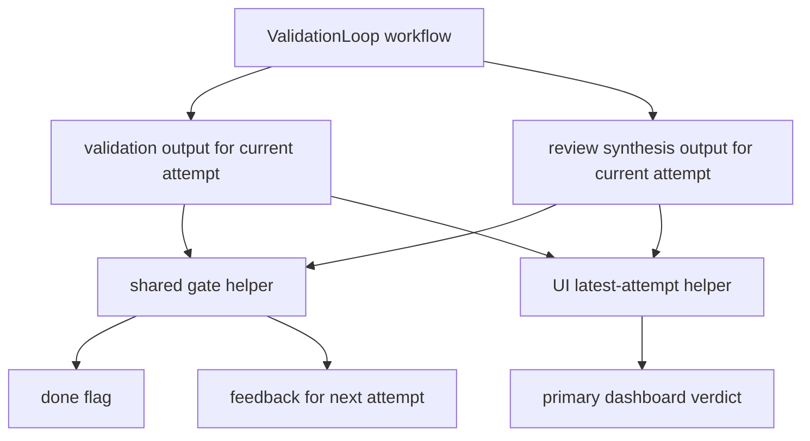

# fix: Repair Smithers Fan-In Follow-Up Gaps

## Summary

This plan closes the remaining Smithers fan-in contract gaps from review: every validation loop uses synthesized review authority, loop dashboards show the latest populated attempt, review panels fail on missing required slots instead of silently duplicating agents, and planner candidate labels stay tied to keyed semantic slots.

---

## Problem Frame

The first fan-in repair established synthesized review rows as authoritative for implement, RPI, and Kanban, but two workflows still call `ValidationLoop` without computing `done` or feedback from the synthesis row. Several loop UIs still query attempt `0`, so a later approved retry can look rejected. The review component also accepts arbitrary agent arrays while rendering three required lanes, and planner labels depend on `agents.planner` array order.

---

## Requirements

- R1. `debug` and `improve-test-coverage` must stop only when validation passes and the current synthesized review approves.
- R2. Rejected synthesized reviews must feed the next loop attempt for every `ValidationLoop` workflow.
- R3. Loop UIs that display validation or review verdicts must present the latest populated attempt as the primary verdict while preserving access to attempt details.
- R4. Required review lanes must require three configured reviewer slots without fallback duplication.
- R5. Planner candidate identity must be keyed by semantic slot, not inferred from array position.
- R6. Contract coverage must catch missing synthesis gates, stale iteration reads, missing review slots, and planner label drift.

---

## Key Technical Decisions

- KTD1. Extract a shared loop gate helper: keep the validation-plus-synthesis rule in one workflow-side helper, use Smithers `ctx.latest(table, nodeId)` for loop outputs, and require validation plus synthesis rows from the same attempt before returning `done: true`.
- KTD2. Use a bounded latest-attempt UI pattern: React hooks cannot run dynamically, so query a fixed attempt window that matches each workflow's configured `maxIterations` and select the highest attempt with meaningful output.
- KTD3. Make the review panel a strict tuple contract: `Review` should accept a three-slot reviewer tuple or a named exported review panel, failing typecheck on missing required slots.
- KTD4. Make planner slots keyed first: define `plannerSlots.codex` and `plannerSlots.opus` as the source of truth, then derive `agents.planner` and `plannerPanel` from those slots.
- KTD5. Prefer static contract checks over synthetic Smithers runtime tests: the current `.smithers` pack has typecheck scripts but no local test runner, so focused compile-time and lightweight static checks provide the first durable guard.

---

## High-Level Technical Design

The runtime contract and dashboard contract both point at the synthesized review row. Raw reviewer lanes remain evidence, and stale attempt `0` output cannot override a newer synthesis verdict.

---

## Implementation Units

### U1. Shared Synthesized Gate Helper

- **Goal:** Centralize how workflows compute `done` and retry feedback from validation plus synthesized review.
- **Requirements:** R1, R2, R6.
- **Dependencies:** None.
- **Files:** `.smithers/components/Review.tsx`, `.smithers/components/ValidationLoop.tsx`, `.smithers/workflows/implement.tsx`, `.smithers/workflows/research-plan-implement.tsx`, `.smithers/workflows/kanban.tsx`.
- **Approach:** Add an exported helper near the review/validation schemas that accepts the latest validation and synthesized review rows and returns `{ done, feedback }`. Workflows should read loop outputs with `ctx.latest("validate", nodeId)` and `ctx.latest("review", reviewSynthesisNodeId(...))`, then the helper should only approve completion when both rows exist, validation passes, synthesis approves, and their `iteration` values match. Keep `reviewSynthesisNodeId(...)` as the node-id source. Rewire the previously gated workflows to use the helper so the next unit can reuse the same contract.
- **Patterns to follow:** The current feedback assembly in `.smithers/workflows/implement.tsx` and ticket-specific helper in `.smithers/workflows/kanban.tsx`.
- **Test scenarios:**
  - Validation passes and synthesis approves in the same attempt, producing `done: true` and no feedback.
  - Validation passes and synthesis rejects, producing `done: false` and review feedback.
  - Validation fails and synthesis approves, producing `done: false` and validation feedback.
  - Validation and synthesis both fail, producing combined feedback in stable order.
  - Missing validation output produces `done: false` and no stale approval.
  - Attempt `0` rejects and attempt `1` approves, producing `done: true` from attempt `1`.
  - Attempt `1` validation exists but only attempt `0` synthesis exists, producing `done: false`.
- **Verification:** `.smithers` typecheck passes, and no workflow duplicates bespoke validation-plus-review feedback assembly except where it wraps the shared helper for ticket-specific node ids.

### U2. Wire Missing ValidationLoop Gates

- **Goal:** Make `debug` and `improve-test-coverage` use the synthesized review gate and feedback loop.
- **Requirements:** R1, R2, R6.
- **Dependencies:** U1.
- **Files:** `.smithers/workflows/debug.tsx`, `.smithers/workflows/improve-test-coverage.tsx`, `.smithers/components/ValidationLoop.tsx`.
- **Approach:** In each workflow, read validation output by its loop node id with `ctx.latest` and synthesized review output with `ctx.latest("review", reviewSynthesisNodeId("<idPrefix>:review"))`, then pass the shared helper result into `ValidationLoop`. Preserve existing agents, max iteration behavior, and prompt defaults.
- **Patterns to follow:** `.smithers/workflows/implement.tsx` after U1 and `.smithers/workflows/research-plan-implement.tsx`.
- **Test scenarios:**
  - `debug` validation plus approved synthesis completes before `maxIterations`.
  - `debug` rejected synthesis feeds review feedback to the next attempt.
  - `improve-test-coverage` validation plus approved synthesis completes before `maxIterations`.
  - `improve-test-coverage` validation failure feeds validation feedback to the next attempt.
  - A raw reviewer approval without synthesis approval does not complete either workflow.
- **Verification:** Static scan finds no bare `ValidationLoop` calls in loop workflows that omit `done` and `feedback`.

### U3. Latest-Attempt Loop UI Contract

- **Goal:** Make loop dashboards show the latest populated attempt as the primary state.
- **Requirements:** R3, R6.
- **Dependencies:** U1.
- **Files:** `.smithers/ui/implement.tsx`, `.smithers/ui/research-plan-implement.tsx`, `.smithers/ui/improve-test-coverage.tsx`, `.smithers/ui/debug.tsx`, `.smithers/ui/kanban.tsx`.
- **Approach:** Add small local or shared UI helpers for bounded attempt output collection. Query the configured attempt window for implementation loops, select the highest attempt with implement, validate, or synthesis output, and compute verdict from that attempt. Keep raw reviewer lanes visible as supporting evidence where the UI already renders them. For `debug`, default the selected tab to the latest populated attempt while preserving manual attempt tab selection. Audit Kanban's event-derived board so it does not introduce a stale attempt-`0` verdict if per-ticket validation or review summaries are added.
- **Patterns to follow:** The fixed-window iteration querying pattern in `.smithers/ui/grill-me.tsx` and the per-attempt panel shape in `.smithers/ui/debug.tsx`.
- **Test scenarios:**
  - Attempt `0` rejects and attempt `1` approves: primary verdict shows approved attempt `1`.
  - Attempt `0` has reviewer evidence but no synthesis and attempt `1` has synthesis: primary verdict comes from attempt `1`.
  - Only attempt `0` exists: UI remains unchanged except for latest-attempt labeling.
  - Running attempt `2` has implementation output but no review yet: UI shows that attempt as active without claiming approval.
  - Manual selection in `debug` can still inspect older attempts after the latest default is chosen.
- **Verification:** Static scan confirms the primary verdict queries in these UIs are not hardcoded solely to `iteration: 0` for loop outputs, while non-verdict initialization reads such as ticket discovery remain allowed.

### U4. Strict Review Panel Slots

- **Goal:** Prevent missing required reviewers from being silently backfilled.
- **Requirements:** R4, R6.
- **Dependencies:** None.
- **Files:** `.smithers/components/Review.tsx`, `.smithers/components/ValidationLoop.tsx`, `.smithers/workflows/review.tsx`, `.smithers/workflows/implement.tsx`, `.smithers/workflows/debug.tsx`, `.smithers/workflows/improve-test-coverage.tsx`, `.smithers/workflows/research-plan-implement.tsx`, `.smithers/workflows/kanban.tsx`, `.smithers/agents.ts`, `.smithers/agents/README.md`.
- **Approach:** Replace `AgentLike[]` for required reviewers with a three-slot tuple type in both `Review` and `ValidationLoopProps`. Export a named review panel from agent policy, or type `agents.review` as the tuple and pass it through unchanged. Remove fallback selection from `Review`; missing slots should fail at typecheck instead of duplicating the last reviewer or synthesis agent.
- **Patterns to follow:** `PlannerPanel` already accepts a fixed two-candidate tuple for planner fan-out.
- **Test scenarios:**
  - Three configured reviewers compile and render the same three task ids.
  - Removing one reviewer from the configured review panel fails typecheck.
  - Synthesis still depends on all three reviewer output schemas.
  - Runtime task ids stay `review:0`, `review:1`, `review:2`, and `review:synthesize` for dashboard compatibility.
- **Verification:** `.smithers` typecheck fails on a locally simulated missing reviewer and passes when all three slots are restored.

### U5. Keyed Planner Slot Policy

- **Goal:** Keep planner label identity stable if semantic planner pool order changes.
- **Requirements:** R5, R6.
- **Dependencies:** None.
- **Files:** `.smithers/agents.ts`, `.smithers/agents/README.md`, `.smithers/components/PlannerPanel.tsx`.
- **Approach:** Define keyed planner slots such as `plannerSlots.codex` and `plannerSlots.opus`, derive `plannerPanel` from those keys, and optionally derive `agents.planner` from the same values for compatibility. Keep workflow files importing `plannerPanel`, not providers.
- **Patterns to follow:** The existing `plannerPanel` tuple shape in `.smithers/components/PlannerPanel.tsx`.
- **Test scenarios:**
  - `plannerPanel.codex` or equivalent keyed source always labels the Codex candidate with the Codex agent.
  - `plannerPanel.opus` or equivalent keyed source always labels the Opus candidate with the Opus agent.
  - Reordering any compatibility `agents.planner` array does not change planner candidate labels.
  - Planner workflows still import no providers directly.
- **Verification:** Static scan confirms `plannerPanel` no longer indexes `agents.planner[0]` or `agents.planner[1]`.

### U6. Contract Checks And Validation

- **Goal:** Add durable checks for the follow-up bugs so the workflow pack does not regress quietly.
- **Requirements:** R6.
- **Dependencies:** U1, U2, U3, U4, U5.
- **Files:** `.smithers/package.json`, `.smithers/tests/workflow-contracts.test.ts`, `.smithers/tests/ui-contracts.test.ts`, `.smithers/tests/agent-policy-contracts.test.ts`, `.smithers/scripts/check-contracts.ts`.
- **Approach:** Add a small Bun test surface under `.smithers/tests` if Smithers pack dependencies support it. Favor source-level contract tests that parse files or import typed exports without launching workflows. Cover gate helper behavior, strict panel tuple shape, planner slot identity, and UI latest-attempt helper selection. If a test runner proves awkward in the Smithers pack, use `.smithers/scripts/check-contracts.ts` as the checked entry point and wire it through `.smithers/package.json`.
- **Patterns to follow:** The repo's existing preference for focused tests plus `.smithers` `typecheck` as the pack-level validation command.
- **Test scenarios:**
  - Gate helper returns the expected `done` and feedback for approval, rejection, validation failure, and missing-output cases.
  - Static scan fails if a workflow review gate scans raw review rows for approval.
  - Static scan fails if loop workflows call `ValidationLoop` without `done` and `feedback`.
  - Static scan fails if loop gates use `ctx.outputMaybe` instead of `ctx.latest` for validation or synthesis rows.
  - Latest-attempt helper selects the highest populated attempt over attempt `0`.
  - Agent policy check fails if the required review panel is not a three-slot tuple.
  - Static scan fails if `Review` accepts a plain `AgentLike[]` for required reviewers or if fallback backfilling reappears.
  - Static scan fails if `plannerPanel` is built from numeric `agents.planner` indexes.
- **Verification:** `.smithers` typecheck, Smithers workflow list/doctor, Smithers agents doctor, root `npm run check`, root `npm test`, and the new `.smithers` contract checks all pass.

---

## Scope Boundaries

- The plan repairs the four review findings and their direct regression coverage.
- The plan does not redesign Smithers workflow primitives, add quorum/tolerant review behavior, or broaden route-task coverage.
- The plan does not change provider choices beyond making review and planner policy structurally safer.

---

## Risks And Dependencies

- The UI latest-attempt helper depends on the gateway output hook supporting bounded fixed iteration queries; this matches existing local UI patterns but should be verified by typecheck.
- Adding `.smithers` tests may require a small script choice because the workflow pack currently exposes typecheck but no test script.
- Tightening review agent typing can surface existing config drift immediately, which is desirable but may require one compile-fix in `agents.ts`.

---

## Sources And Research

- `.smithers/components/Review.tsx` currently renders three required reviewer lanes while accepting `AgentLike[]` and backfilling missing agents.
- `.smithers/workflows/implement.tsx`, `.smithers/workflows/research-plan-implement.tsx`, and `.smithers/workflows/kanban.tsx` already show the intended synthesized gate pattern.
- `.smithers/workflows/debug.tsx` and `.smithers/workflows/improve-test-coverage.tsx` call `ValidationLoop` without `done` or `feedback`.
- `.smithers/node_modules/@smithers-orchestrator/driver/src/SmithersCtx.js` exposes `ctx.latest(table, nodeId)` and `iterationCount(...)` for loop-aware output reads.
- `.smithers/ui/grill-me.tsx` demonstrates the fixed-window iteration query pattern needed for loop dashboards.
- `.smithers/agents/README.md` documents semantic pools and says planner fan-out should use `plannerPanel` slots.

---

## Validation Plan

- `.smithers` typecheck succeeds.
- Smithers workflow list and workflow doctor discover the modified workflows.
- Smithers agents doctor reports no new capability or config errors.
- Root `npm run check` and `npm test` pass.
- Static scans confirm no workflow completion gate uses raw reviewer rows, no loop workflow omits synthesized gate inputs, loop UIs no longer treat attempt `0` as the final verdict, and planner panel identity is not numeric-index-based.
