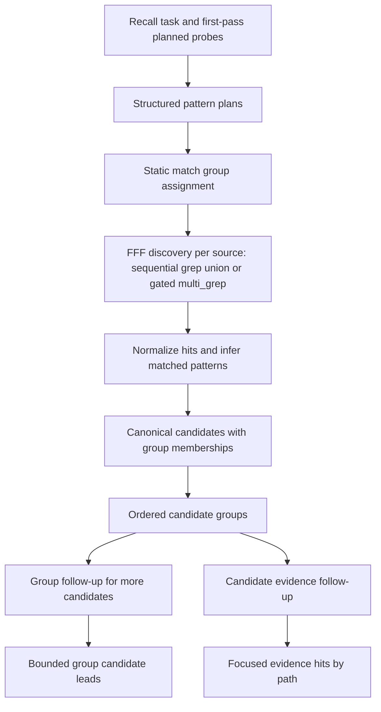

# feat: Add FFF-native progressive evidence groups

## Summary

Agent Session Search should become a more FFF-native recall wrapper for arbitrary multi-word queries. Default candidate search should return compact candidate groups with statically ordered match groups, bounded counts, representative leads, and follow-up payloads that let agents expand promising groups before requesting focused evidence. The grouped progressive-evidence surface must be able to ship on the reliable sequential `grep` union path, with `multi_grep` promoted only when the local FFF implementation proves recall-equivalent.

---

## Problem Frame

The current wrapper expands a recall task into literal patterns, but the FFF backend adapter still loops over `grep` one pattern at a time. FFF already exposes `multi_grep` for literal OR searches, but the wrapper must prove that a local `multi_grep` implementation is recall-equivalent to the existing sequential `grep` union before using it as the authoritative discovery path. Separately, the current flat candidate output gives agents too little structure when a multi-word query produces a mix of exact phrase hits, adjacent phrase hits, and loose fallback hits.

The goal is not a tuned relevance model. The goal is query-agnostic progressive evidence: strong match groups appear before weaker fallback groups, counts help agents decide where to spend context, and the existing focused evidence flow remains the way to inspect selected sessions.

---

## Requirements

### FFF-Native Search

- R1. The backend must preserve the existing sequential `grep` union as the authoritative default-safe discovery path unless FFF `multi_grep` is available and passes a recall-equivalence probe for multi-pattern literal search.
- R2. Multi-pattern searches must preserve source/root/path metadata, include filtering, path filtering, timeout handling, warmup retry behavior, and non-fatal source warnings.
- R3. Pattern attribution must remain query-agnostic and deterministic even when FFF returns a matching line without the matched pattern name.

### Match Groups And Progressive Evidence

- R4. Default candidate search must return `resultsShape: "candidate_groups"` with an ordered array of compact match groups rather than a flat relevance-score list.
- R5. Match groups must be derived from pattern provenance and literal match coverage, not from hardcoded query terms or LLM-generated synonyms.
- R6. Each non-empty candidate group must expose bounded per-count structures, `hasMore`, representative candidate leads, and generic guidance about how agents should interpret the group.
- R7. Candidates that match multiple groups must have one canonical candidate identity with group membership metadata, while the default grouped map places the lead under its strongest group.
- R8. Group-level follow-ups must let agents request more leads from one group before requesting line-level evidence.
- R9. Candidate-level `more.evidence` follow-ups must remain compatible and must continue to return bounded focused evidence for selected canonical paths.

### Bounds, Compatibility, And Diagnostics

- R10. Broad evidence and group expansion must remain bounded by default, and focused path evidence must preserve the current explicit cap semantics.
- R11. Normal output must not expose a public numeric relevance score; debug output may expose match group assignment, backend diagnostics, and tie-break inputs.
- R12. Empty groups must be omitted, successful no-hit searches must return an empty grouped result, and partial source failures must continue to appear as top-level warnings.
- R13. CLI help, MCP docs, capabilities output, README examples, and smoke tests must describe the grouped progressive evidence flow.
- R14. Dependency guidance must recognize current stable FFF MCP releases without silently installing nightlies or changing user-owned installations.
- R15. The new response surface must be self-describing for agents: include stable shape identifiers, contract/version metadata where this project already exposes capabilities, deterministic ordering, and copy-ready follow-up payloads.
- R16. Error responses for malformed group follow-ups or unsupported backend capabilities must teach the exact correction or safe fallback instead of only saying the request is invalid.
- R17. Tests must pin the agent-facing contract, including the default grouped response, group-follow-up request shape, focused evidence follow-up, and structured warnings/errors.

---

## High-Level Technical Design

### Search Flow

### Static Group Order

| Priority | Group                    | Match Meaning                                                                                                                    | Default Agent Guidance                          |
| -------- | ------------------------ | -------------------------------------------------------------------------------------------------------------------------------- | ----------------------------------------------- |
| 0        | Exact or structured      | quoted text, commands, paths, IDs, package names, error fragments, or the full literal recall phrase                             | Treat as strongest evidence and inspect first.  |
| 1        | Phrase or adjacent terms | deterministic multi-word windows from the query or planned probes                                                                | Use when exact structure is absent or sparse.   |
| 2        | Multi-term coverage      | one candidate covers multiple distinct planned terms or natural terms                                                            | Prefer over repeated hits for one generic term. |
| 3        | Distinctive term         | one high-specificity literal term matches                                                                                        | Use as a lead when higher groups are thin.      |
| 4        | Loose fallback           | broad single-term fallback from the original input, deterministic extractor output, or existing user-configured literal synonyms | Treat as exploratory evidence only.             |

The table is the public ordering contract. Existing recency, project match ordering signal, hit density, and current-session demotion remain internal tie-breakers within groups. This work must not add new synonym sources, LLM-generated alternatives, semantic expansion, query-specific boosts, or calibrated numeric ranking weights.

### Core Definitions

- **Match Group:** The static priority bucket/type assigned from pattern provenance and match coverage, such as exact or structured, phrase or adjacent terms, multi-term coverage, distinctive term, and loose fallback.
- **Candidate Group:** The rendered response object for one non-empty match group. It contains the group's metadata, counts, representative leads, and copy-ready follow-up payloads.

### Candidate Group Contract

Default candidate search returns:

- `resultsDisplayMode: "candidates"` and `resultsShape: "candidate_groups"`.
- `results` as an ordered array, where array order is the public priority contract.
- One object per non-empty candidate group with stable `id`, numeric `priority`, `label`, `guidance`, `patternIds`, `assignedCandidateCount`, `hitCount`, `shownLeadCount`, `hasMore`, `leads`, and optional `more.groupCandidates`.
- Candidate leads that include canonical identity, source/root/path metadata, strongest assigned group, all group memberships, matched literal patterns, and candidate-level `more.evidence` when focused evidence is available.

A candidate that matches several groups is displayed under its strongest group only. Its additional memberships remain visible as metadata, so the same session does not compete with itself in multiple default groups. `patternIds` lists the planned pattern identifiers that can place a candidate in the group and is echoed in server-prepared group follow-up payloads.

`assignedCandidateCount` is a structure such as `{ value, relation }` that counts canonical candidates assigned to that group before the displayed lead limit is applied. `hitCount` is a separate structure such as `{ value, relation }` that counts physical matched lines, not pattern-line pairs. If one physical line matches two patterns, it counts as one hit and records both matched patterns. `shownLeadCount` is the number of leads included in the current response.

### Cap Semantics Contract

Default candidate-group discovery should avoid passing a small user-facing cap directly into backend discovery, because backend caps can truncate the discovery set before grouping, canonicalization, and static priority ordering. This matters both for line-count caps and for ranked/file-level elimination where a backend may return only a subset of matching files. The implementation should either fetch an internal discovery budget and shape after canonicalization, or fetch uncapped broad discovery where safe. Returned leads remain bounded after grouping.

Explicit `maxResultsPerSource` caps caller-visible candidate leads per source after grouping. When a cap or internal budget prevents exact count knowledge, each affected count structure must use `relation: "gte"` or another explicit lower-bound marker and set `hasMore` conservatively.

Group follow-ups are stateless, server-prepared payloads for the same `search_sessions` tool. A `more.groupCandidates` payload must include the original query material, source/path constraints, `resultsDisplayMode: "candidates"`, a group discriminator such as `{ id, priority, patternIds }`, and pagination fields such as `offset` and `limit`. Echoing that payload re-runs discovery deterministically, re-applies canonicalization and group assignment, then slices the requested group at the wrapper level. It must not depend on an FFF cursor or backend pagination state. Candidate `more.evidence` remains the only line-level focused evidence path.

### Agent Ergonomics Contract

Agent-facing output should follow the project's existing response envelope and capabilities conventions, but the grouped candidate contract must make the next useful action obvious without an external doc lookup:

- Top-level metadata should repeat `resultsDisplayMode`, `resultsShape`, result limits, per-count relation semantics, backend mode used, and any fallback reason when `multi_grep` is unavailable or fails recall-equivalence gating.
- Non-empty groups should carry plain-language `guidance` plus copy-ready `more.groupCandidates` payloads. Candidate leads should carry copy-ready `more.evidence` payloads.
- All group and candidate arrays should have deterministic ordering so repeated identical searches produce stable output apart from documented volatile metadata.
- Structured warnings should include a short code and `recommendedAction` when the agent can do something useful, such as refreshing FFF, narrowing a source, or requesting focused evidence.
- Malformed follow-ups should fail closed with a user-input error that names the invalid field and provides the corrected server-prepared shape. For MCP, this should be reflected in error data as well as message text; for CLI JSON, stdout must remain parseable and diagnostics must stay separate.

---

## Key Technical Decisions

- KTD1. Static groups over tuned ranking: use fixed match-group priority as the normal relevance story, because it is auditable and avoids fragile score tuning.
- KTD2. New explicit result shape for grouped candidates: default `candidates` mode should return `resultsShape: "candidate_groups"` rather than overloading flat candidate arrays.
- KTD3. Pattern plans carry provenance: query rewriting should produce internal pattern metadata while preserving the existing `expandedPatterns` string list for compatibility and diagnostics.
- KTD4. Counts are navigation signals: groups should expose separate assigned-candidate and physical-hit count structures with exact or lower-bound relations, but raw count must not dominate group order.
- KTD5. One canonical candidate identity: a session may match several groups, but the response should avoid duplicate candidate objects competing with themselves.
- KTD6. Progressive evidence stays inside `search_sessions`: group-level candidate expansion and candidate-level evidence follow-ups are prepared payloads for the same MCP tool, not a new read tool.
- KTD7. FFF version handling is advisory: doctor and docs can recommend current stable FFF MCP and explain installed-version risk, but required behavior is gated by capability and recall-equivalence probes rather than version guesses. They should not auto-upgrade or install nightly builds.
- KTD8. Agent-facing ergonomics are part of the contract: grouped results should teach the next step through stable metadata, recommended actions, exact follow-up payloads, structured warnings, and schema-pinned examples rather than relying on an agent to infer hidden conventions.

---

## Implementation Units

### U1. Define Pattern Provenance And Match Group Contract

**Goal:** Add the internal vocabulary and type surface needed for static match groups, counts, group memberships, and group follow-ups.

**Requirements:** R4, R5, R6, R7, R8, R11, R12, R15, R16, R17

**Dependencies:** None

**Files:** `src/types.ts`, `src/tool.ts`, `src/query-rewriter.ts`, `test/query-rewriter.test.ts`, `test/tool.test.ts`

**Approach:** Introduce an internal pattern-plan shape that includes the literal pattern, source query, provenance, stable pattern id, and initial match group. Planned probes are first-pass patterns derived only from caller input and configuration before inspecting results. Keep `rewriteQueryPatterns()` as a compatibility wrapper that returns strings, and add a structured rewrite path for search coordination. Extend shared output types with separate Match Group and Candidate Group vocabulary, per-count structures such as `{ value, relation }`, group lead metadata, group membership metadata, recommended actions, structured warning codes, and group follow-up payloads.

**Patterns to follow:** Existing `SearchCandidate`, `SearchEvidenceGroup`, `more.evidence`, and `SearchSessionsDebug` types in `src/types.ts`; existing zod schema style in `src/tool.ts`.

**Test scenarios:**

- Bare multi-word queries produce structured pattern plans with the full phrase, adjacent phrase windows, and natural term fallbacks assigned to static groups without using query-specific term names.
- Structured fragments such as quoted text, paths, IDs, packages, and error fragments receive stronger group provenance than loose natural terms.
- `rewriteQueryPatterns()` still returns the existing string array for callers and tests that do not need provenance.
- No result-inspected probe generation is introduced in this work.
- No new synonym source, semantic expansion path, or LLM-generated fallback is introduced; existing user-configured literal synonym compatibility, if present, is classified as loose fallback.
- The MCP input schema accepts the server-prepared group follow-up fields only in the same `search_sessions` tool contract.
- Invalid group follow-up inputs fail as user-input errors rather than broadening into unscoped evidence.
- Invalid group follow-up errors include the invalid field, a short machine-readable code, and the corrected server-prepared payload shape.

**Verification:** Typecheck passes, and structured rewrite tests prove groups are derived from extractor origin and coverage rather than from specific example words.

### U2. Add Gated FFF `multi_grep` Backend Support

**Goal:** Use FFF's OR-capable literal search path for multi-pattern searches only after proving it preserves the existing backend contract's recall.

**Requirements:** R1, R2, R3, R10, R12, R15, R16

**Dependencies:** U1

**Files:** `src/fff-backend.ts`, `src/client-pool.ts`, `test/fff-backend.test.ts`, `test/client-pool.test.ts`

**Approach:** Extend `FffClient` and `FffMcpClient` with optional `multiGrep` plus capability detection through client creation or first use. Treat the sequential `grep` union as the authoritative default-safe implementation. Promote `multi_grep` to the broad discovery path only when the tool is present and a recall-equivalence smoke probe passes. If the tool is absent, returns an unknown-tool style error, or fails the recall-equivalence probe, fall back to sequential `grep` without losing the source. Normalize `multi_grep` text output through a parser covered by fixtures, then infer matched literal patterns from each returned line so matched pattern metadata remains available to search shaping.

Do not pass line-context requests through `multi_grep` for this feature unless parser fixtures prove support for context separators, read-suggestion lines, and summary lines. Line context should remain reserved for the existing evidence path until the parser contract is explicit.

**Patterns to follow:** Current warning construction, timeout wrapper, empty-result warmup retry, path normalization, and include/path filtering in `src/fff-backend.ts`.

**Test scenarios:**

- When gated as eligible, multiple patterns call `multi_grep` once with literal `patterns` and appropriate discovery budget where supported.
- A client without `multiGrep` falls back to existing sequential `grep` behavior.
- A client that advertises `multi_grep` but returns an unknown-tool error falls back without losing the whole source.
- A client that advertises `multi_grep` but fails recall equivalence falls back to sequential `grep` and records backend-mode metadata explaining the fallback.
- Fallback responses include backend mode metadata and an actionable warning such as "upgrade or configure FFF MCP with multi_grep support" without failing an otherwise usable search.
- Required F1 six-file corpus: `multi_grep(["auth token", "refresh"])` must return the same file set as the union of `grep("auth token")` and `grep("refresh")`; otherwise `multi_grep` is not eligible as authoritative discovery.
- One returned line that matches multiple literal patterns produces attribution for each matched pattern.
- One returned line that matches multiple literal patterns counts as one physical hit, not multiple duplicated hits.
- Timeout and backend error responses from `multi_grep` produce the same structured warning shape as `grep`.
- Path and include filters apply before caller-visible caps.
- Focused path evidence bypasses broad caps before filtering, while explicit caps still apply after filtering.
- Parser fixtures cover multiple files, `maxResults` edge cases, first-call empty retry behavior, and context-like non-hit output.
- Live FFF smoke verifies `multi_grep` works against a temporary root and passes recall-equivalence expectations when the installed binary is present.

**Verification:** Backend tests cover `multi_grep`, recall-equivalence gating, and fallback paths; live smoke remains skipped when `fff-mcp` is unavailable.

### U3. Shape Default Output As Grouped Candidates

**Goal:** Replace flat default candidate results with compact candidate groups ordered by static match groups.

**Requirements:** R4, R5, R6, R7, R10, R11, R12, R15, R17

**Dependencies:** U1

**Files:** `src/search.ts`, `test/search.test.ts`, `test/mcp-smoke.test.ts`

**Approach:** Carry pattern plan metadata through `expandPatternPlans()` and `queryByPattern`. Build grouped output over the current backend result contract first, so this unit works with the existing sequential `grep` union regardless of whether U2 is enabled. Build canonical candidates by `source + path` as today, attach all matched groups to the candidate, place each lead under its strongest non-empty group, and sort within a group using existing candidate ordering signals. Keep normal output score-free; expose group assignment details only in debug. Add stable metadata that names the response shape, backend mode, limits, and count semantics. Do not add calibrated numeric weights, query-specific boosts, or result-inspected ranking heuristics.

**Patterns to follow:** Current `toCandidates()`, `orderCandidates()`, current-session demotion, project-match scoring, and `capCandidatesPerSource()` behavior in `src/search.ts`.

**Test scenarios:**

- Default candidate mode returns `resultsShape: "candidate_groups"` with groups in static priority order.
- Empty groups are omitted.
- A candidate matching exact and fallback patterns appears once as a lead in the strongest group and carries all matched group metadata.
- Group ordering beats raw hit count: a higher-priority group with fewer hits appears before a lower-priority group with many hits.
- Existing recency, project match, and Codex current-session demotion still order leads within the same group.
- Candidate-mode debug includes group assignment and tie-break information without adding scores to normal output.
- Public counts distinguish assigned candidates, displayed leads, and physical matched lines, and use per-count lower-bound relations when caps prevent exact counts.
- Repeated identical searches produce deterministic group, candidate, and follow-up ordering apart from documented volatile metadata.
- Snapshot or schema tests pin the grouped response shape and required metadata fields.
- Successful no-hit searches return an empty grouped result with no broad-evidence warning.
- Partial source failures preserve searched-source status and top-level warnings.

**Verification:** Search tests prove static group priority, no duplicate candidate identity, no query-specific fixtures, and unchanged source warning behavior.

### U4. Add Group-Level Progressive Evidence Follow-Ups

**Goal:** Let agents expand a promising group before spending context on line-level evidence.

**Requirements:** R6, R8, R9, R10, R12, R15, R16, R17

**Dependencies:** U3

**Files:** `src/search.ts`, `src/types.ts`, `src/tool.ts`, `test/search.test.ts`, `test/tool.test.ts`

**Approach:** Add server-prepared `more.groupCandidates` payloads to non-empty groups. A group follow-up should scope the next `search_sessions` call to that group and return bounded candidate leads with the same grouped-candidate contract, without falling back to broad unscoped evidence. Implement group follow-up pagination by deterministically re-running discovery, canonicalizing and assigning groups, then slicing the requested group at the wrapper level using the server-prepared `offset` and `limit`; do not rely on FFF cursor pagination. Candidate `more.evidence` remains unchanged for selected paths. Treat the follow-up payloads as the agent's copy-ready command surface: every required field should be present, bounded, and safe to echo directly.

**Patterns to follow:** Existing `evidenceFollowup()` payload construction and existing evidence mode split between unscoped evidence groups and path-restricted evidence hits.

**Test scenarios:**

- A non-empty group includes a prepared follow-up payload when more leads may exist.
- Echoing a group follow-up returns additional bounded candidate leads from that group, not every line from every group.
- Echoing a candidate `more.evidence` continues to return focused evidence hits for the selected path.
- Ordinary unscoped evidence without paths remains capped and emits the existing broad evidence warning.
- Explicit `maxResultsPerSource` still caps focused evidence and group expansion.
- Group follow-up for an empty or unknown group fails safely instead of broadening the search.
- Group follow-up schema rejects malformed or extra ambiguous fields that would make the request broader than the server-prepared scope.
- Malformed follow-up errors teach the exact correction, name the invalid field, include a machine-readable error code or MCP error data field, and include the corrected server-prepared payload shape when one can be derived safely.
- The default response, group follow-up response, and focused evidence response form a pinned three-step agent task fixture.

**Verification:** Progressive disclosure tests cover default map, group expansion, and focused evidence as three distinct steps inside the same tool.

### U5. Update CLI, MCP, And Documentation Surfaces

**Goal:** Teach callers how to interpret grouped progressive evidence and how to request more detail.

**Requirements:** R6, R8, R9, R11, R13, R15, R16, R17

**Dependencies:** U3, U4

**Files:** `README.md`, `DESIGN.md`, `UBIQUITOUS_LANGUAGE.md`, `docs/mcp.md`, `docs/cli.md`, `docs/configuration.md`, `docs/troubleshooting.md`, `src/help.ts`, `test/cli.test.ts`, `test/readme.test.ts`

**Approach:** Update the public contract docs to describe match groups, per-count relation semantics, `hasMore`, group follow-ups, structured warnings, recommended actions, and unchanged candidate evidence follow-ups. Add or update ubiquitous-language entries for Candidate Group, Match Group, and Group Follow-Up; reserve Evidence Group for unscoped evidence mode. Update machine-readable capabilities and human CLI help to guide agents toward candidates first, group expansion second, and focused evidence third.

**Patterns to follow:** Existing docs in `docs/mcp.md` for result modes and `src/help.ts` robot guidance.

**Test scenarios:**

- CLI capabilities mention `candidate_groups` and group follow-ups.
- Capabilities include contract/version metadata using existing capabilities conventions, response-shape names, warning/error code meanings, and compact examples for default search, group expansion, and focused evidence.
- Human help explains the progressive order without exposing internal scores.
- README and MCP docs include examples for default grouped output, group follow-up, and focused candidate evidence.
- Troubleshooting explains why broad loose groups are bounded and how to request more evidence.
- CLI JSON examples keep stdout data parseable and route diagnostics to warnings or stderr according to the existing CLI conventions.

**Verification:** Documentation tests pass and examples use repo-neutral terms rather than the investigation's sample query terms.

### U6. Refresh FFF Dependency Guidance And Doctor Diagnostics

**Goal:** Help users recognize stale or incompatible FFF MCP installations without taking ownership of upgrades.

**Requirements:** R1, R14, R15, R16

**Dependencies:** U2

**Files:** `src/fff-preflight.ts`, `scripts/postinstall.mjs`, `docs/troubleshooting.md`, `README.md`, `test/fff-preflight.test.ts`, `test/packaging.test.ts`

**Approach:** Keep the current install prompt and live smoke test. Add advisory diagnostics that report the installed `fff-mcp` version, the recommended current stable install channel, whether `multi_grep` support is available, whether the recall-equivalence smoke probe passes, and the exact command or documented path the user should follow when an upgrade is needed. Do not auto-install nightlies or mutate an existing user installation.

**Patterns to follow:** Existing doctor output, installer guidance, and package postinstall behavior.

**Test scenarios:**

- Doctor passes for a working binary that supports live smoke and `multi_grep`.
- Doctor treats `multi_grep` as usable only when the recall-equivalence smoke probe passes.
- Doctor reports actionable guidance when `fff-mcp` is missing.
- Doctor warns, without failing, when the binary is older than the recommended stable version but still supports required tools.
- Doctor fails the smoke path when required search capability is unavailable.
- Doctor output separates machine-readable status from human diagnostics according to the existing CLI conventions.
- Postinstall remains non-destructive and still prompts only when `fff-mcp` is missing.

**Verification:** Doctor and packaging tests pass with fake binaries and fixture version strings.

---

## Acceptance Examples

- AE1. Given a query with a quoted phrase, an adjacent two-word phrase, and several loose terms, when the caller requests default candidates, then the response returns non-empty groups in static priority order with counts and bounded leads.
- AE2. Given a lower-priority loose group with many matches and a higher-priority phrase group with one match, when the default response is shaped, then the phrase group appears first and raw hit count does not reorder groups.
- AE3. Given a candidate that matches multiple groups, when the default response is shaped, then the candidate appears once under its strongest group and still reports all matched groups.
- AE4. Given a group with more possible leads than shown, when the caller echoes the group follow-up, then the response returns more bounded leads for that group without dumping all evidence hits.
- AE5. Given a selected candidate path, when the caller echoes `more.evidence`, then the response returns focused evidence hits and preserves the existing path-restricted cap behavior.
- AE6. Given one missing source and one searchable source, when the search succeeds on the searchable source, then grouped results are returned with the missing source warning preserved.
- AE7. Given a successful search with no hits, when the default response is shaped, then it returns an empty grouped result without fabricating fallback evidence.
- AE8. Given one physical line that matches two literal patterns, when the default response is shaped, then the candidate records both matched patterns but the line contributes one physical hit.
- AE9. Given an agent that has only the default grouped response, when it wants more from a promising group, then it can echo the provided `more.groupCandidates` payload without inventing fields or reading external docs.
- AE10. Given a malformed group follow-up, when the tool rejects it, then the error response names the invalid field, includes a stable error code, and provides the corrected payload shape rather than broadening the search.
- AE11. Given two identical searches against unchanged session data, when the responses are compared, then group order, lead order, count metadata, and follow-up payload ordering are deterministic apart from documented volatile metadata.
- AE12. Given a local FFF `multi_grep` implementation that drops files compared with the sequential `grep` union, when broad candidate discovery runs, then the wrapper uses sequential `grep` as the authoritative discovery path and reports the gated fallback in backend metadata or diagnostics.

---

## Scope Boundaries

### In Scope

- Gated FFF `multi_grep` batching for literal probes after recall-equivalence validation.
- Static match groups derived from pattern provenance and match coverage.
- Bounded group counts, group leads, group follow-ups, and focused evidence follow-ups.
- Debug-only group diagnostics.
- Advisory FFF version and capability diagnostics.

### Deferred to Follow-Up Work

- Adaptive second-pass query planning after inspecting first-pass results.
- Richer context-line rendering beyond FFF's current output and existing truncation boundaries.
- More formal judged retrieval benchmarks beyond focused fixture tests.
- New synonym sources or semantic expansion beyond existing user-configured literal synonym compatibility.

### Out of Scope

- Hardcoded handling for the sample investigation terms.
- LLM-generated synonyms or semantic expansion.
- Embeddings, custom indexes, SQLite stores, markdown exports, or transcript aggregation.
- New public MCP tools for lower-level FFF calls or arbitrary file reading.
- Automatic nightly installation or silent upgrade of user-owned `fff-mcp` binaries.

---

## Risks & Dependencies

- `multi_grep` completeness risk: a local FFF release may expose `multi_grep` but return a smaller file set than the sequential `grep` union for the same literal patterns. The wrapper must keep sequential `grep` as the authoritative fallback and gate `multi_grep` promotion on a recall-equivalence probe.
- `multi_grep` attribution risk: FFF text output does not include the matched pattern, so the wrapper must infer literal pattern matches from returned content and test multi-match lines carefully.
- `multi_grep` parser risk: context output can include separators, read-suggestion lines, and summaries that the current parser may mistake for paths. This plan avoids routing line-context requests through `multi_grep` until fixture-backed parsing proves support.
- Cap semantics risk: FFF `multi_grep` caps total returned lines and may perform ranked/file-level elimination, while sequential `grep` can behave like a cap per pattern. Default candidate-group discovery should avoid small backend caps and mark counts as lower-bound when public caps or internal budgets prevent exact totals.
- Public shape risk: changing default `resultsShape` affects clients that assume flat candidate arrays. Docs and tests should make the new grouped shape explicit.
- Count interpretation risk: counts can mislead when caps or sampling are in play. The response must label each count's relation and expose `hasMore` conservatively.
- Agent ergonomics risk: a technically correct grouped response can still be hard for agents if it lacks exact next actions, stable metadata, or teaching errors. Contract tests should verify the first-call, group-follow-up, and focused-evidence loop as an agent task, not only as isolated objects.
- Version dependency: local machines may have `fff-mcp` 0.8.x even though stable 0.9.5 is current as of 2026-06-18. Required behavior should be capability-checked, not version-guessed.

---

## System-Wide Impact

The change affects the core MCP/CLI response contract, the FFF backend adapter, search result shaping, debug output, ubiquitous-language docs, public docs, and smoke tests. It should not affect source-root resolution, canonical path normalization, configured source enablement, current-session demotion semantics, or the one-tool MCP boundary.

---

## Sources & Research

- `DESIGN.md` and `CONTEXT.md` define the one-tool MCP boundary, FFF backend responsibility, deterministic query rewriting, and canonical path requirements.
- `UBIQUITOUS_LANGUAGE.md` defines Candidate, Evidence Follow-Up, Evidence Group, Evidence Hit, and Progressive Evidence terminology.
- `docs/prototypes/findings/recency-ranking-prototype-findings.md` records that sharp planned probes outperformed long natural queries and that public candidate output should not expose ranking scores.
- `docs/prototypes/findings/fanout-prototype-findings.md` records the source-slot fanout and cap-accounting constraints.
- FFF MCP source and README document `multi_grep` as literal OR search and recommend one multi-pattern call instead of repeated greps.
- `agent-ergonomics-and-intuitiveness-maximization-for-cli-tools` informed the self-documenting response contract, copy-ready follow-up payload requirement, deterministic output checks, teaching-error expectations, and schema-pinned agent task fixtures.
- Elasticsearch and Meilisearch docs support named match explanations, ordered ranking rules, score-free normal output, and debug-only relevance detail.
- Azure and OpenSearch hybrid search docs support combining multiple evidence lists without treating raw scores as comparable.
