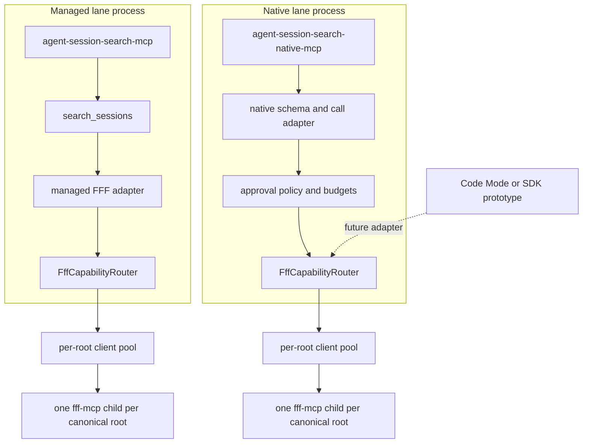
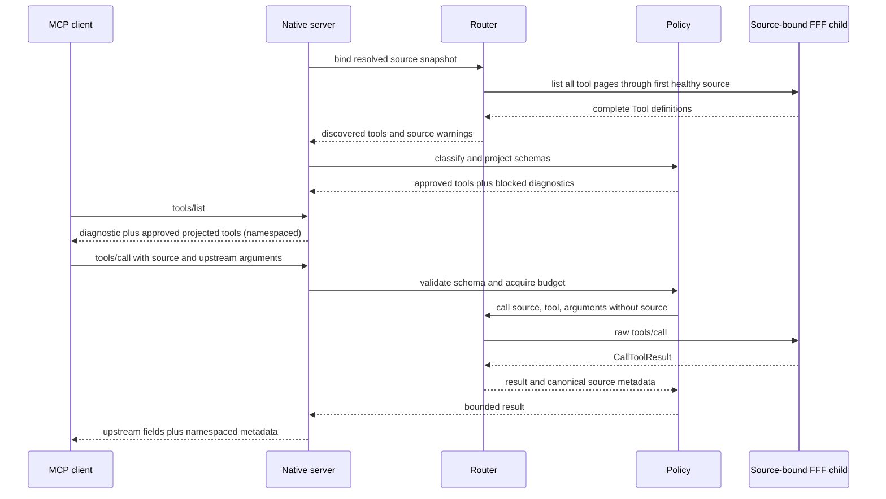
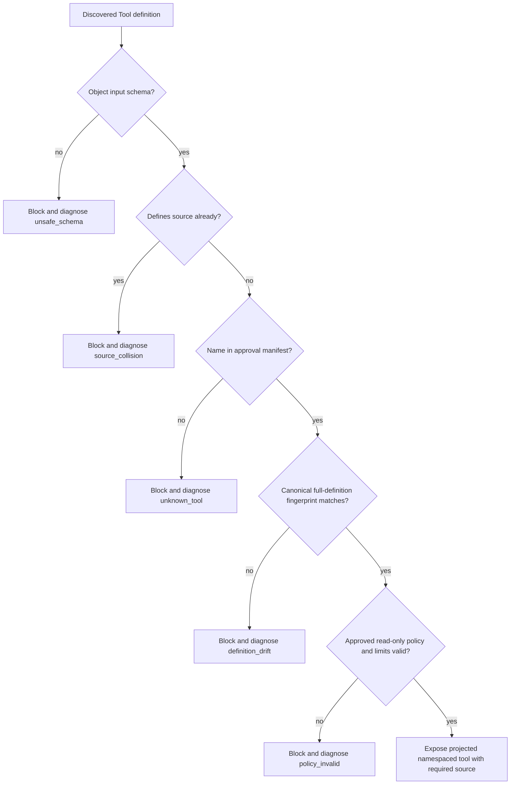

# feat: FFF two-lane architecture — capability router core and opt-in native lane

## Summary

Keep `search_sessions` as the single managed recall product, and add a separate opt-in native MCP lane (`agent-session-search-native-mcp`) that exposes a small, locally audited set of FFF's own tools through a generic, source-bound `FffCapabilityRouter`. The durable architectural core is the router (`listSources` / full-schema `listTools` / raw `call`), not Code Mode: Code Mode and an npm SDK remain deferred frontends behind explicit prototype gates.

This plan synthesizes all three plan-council drafts (`draft-kimi-k3`, `draft-codex-56-sol-x-high`, `draft-fable`) against the resolved concept document. A prior two-draft synthesis exists at `docs/plans/2026-07-16-001-feat-fff-two-lane-architecture-plan.md`; this plan supersedes it by incorporating the fable draft and by revising the points listed under "Deltas from the 001 plan" below.

Where the drafts disagreed, this plan decides:

- **Managed-lane re-home through the router: yes, as a behavior-neutral unit (kimi Phase 2 step 8, codex U3/KTD9), with fable's dissent recorded.** Fable (KTD 5) prefers a sibling-consumer design that never touches the managed lane in this plan. Two of three drafts favor the re-home, and the concept's sequence ("introduce the router internally" before the native lane) is best served by proving the abstraction under the managed regression suite before a second frontend depends on it. Fable's blast-radius concern is mitigated: characterization assertions land first, the rewiring is a standalone revertable commit, and U3 waits for any active managed-correctness patch.
- **The native server uses the low-level MCP SDK, not FastMCP (codex KTD3).** FastMCP fits the static managed tool but not runtime-discovered JSON Schemas. Kimi's `fff_call(source, tool, args)` meta-tool is the documented fallback if the U5 opening spike proves the SDK path unworkable.
- **Exposure policy is fail-closed by name plus canonical full-definition fingerprint (codex KTD5), strengthened with kimi's `policyVersion` and unclassified-tool tripwire test, and fable's four-class vocabulary** (`internal`, `exposable`, `denied`, `unknown`).
- **Mirrored native tools are namespaced (`fff_grep`, `fff_multi_grep`)** (codex U4, fable open question 3). Bare upstream names are rejected for provenance clarity.
- **The DESIGN.md amendment is its own unit and a human go/no-go gate before the native binary ships (fable U4).** Rejection leaves U1–U3 as clean internal improvements with no public surface change.
- **The native lane ships only after the managed-lane correctness track has landed or been explicitly accepted as tracked in Beads (fable R6, concept sequence step 1).** This closes the escape-hatch moral hazard: agents must not be routed around a broken managed product.

### Deltas from the 001 plan

- Incorporates the fable draft: design-amendment gate unit, ship gate on the correctness track, four-class policy vocabulary, namespaced mirrored tool names, and fable's dissent on the managed re-home recorded under Alternatives Considered.
- Restores codex's **root-wide visibility disclosure** (codex KTD11/AE7), dropped in 001: native source binding is the canonical root, managed `include` patterns do not confine native calls, and the diagnostic plus docs must say so.
- Reverts fingerprint canonicalization to codex's conservative form: recursively sort object keys, **preserve every array exactly**. 001 sorted "set-like" schema arrays, which requires judging which arrays are order-insensitive — exactly the mis-normalization risk codex warned against. A false block on harmless array reordering is preferred.
- Restructures to six units: U4 is now the design-record amendment gate; native server implementation moves to U5; packaging/doctor/docs release gate is U6.

## Goal Capsule

- **Objective:** Preserve `search_sessions` as the dependable managed lane while shipping `agent-session-search-native-mcp`, an opt-in stdio binary that mirrors policy-approved FFF tools under namespaced names with a required `source` parameter, over a shared source-bound capability router.
- **Authority:** The resolved concept document defines the two-lane product intent and its corrections (automatic discovery, not automatic exposure; partial parity only; Code Mode not foundational; SDK install friction). `DESIGN.md` and `CONTEXT.md` define managed-search invariants. The installed MCP SDK and existing tests define executable integration constraints.
- **Execution profile:** Deep, cross-cutting TypeScript work across the FFF client/pool, a new policy boundary, a design-record amendment, a second stdio MCP server, packaging, doctor, and agent-facing documentation.
- **Scope:** Build the generic router, fail-closed native policy, behavior-neutral managed-lane integration, the design amendment gate, the native MCP entrypoint, tests, package wiring, doctor check, and design documentation. Do not implement Code Mode, a published SDK, arbitrary code execution, or the separately tracked managed-search correctness fixes.
- **Stop conditions:** Stop and revise the design if approved FFF schemas cannot be projected without changing their meaning, if schema drift can make an unreviewed capability executable, if the managed server's one-tool contract cannot remain behavior-identical, or if the low-level SDK cannot deliver dynamic `tools/list`/`tools/call` and the meta-tool fallback is judged too weak to ship.
- **Tail ownership:** The implementer owns code, tests, documentation, and package validation through the Definition of Done. Code Mode and SDK evaluation require later prototype findings and a new productionization decision.

---

## Product Contract

### Summary

Agent Session Search will have two explicit MCP lanes. The existing `agent-session-search-mcp` remains the managed, session-native product and continues to expose only `search_sessions`. A new `agent-session-search-native-mcp` binary exposes a small audited subset of FFF's own tools for advanced agents that need upstream parameters and raw results. Both lanes build on a generic source-bound `FffCapabilityRouter`; neither lane executes unknown, drifted, or write-capable tools. Installing and registering the second entrypoint is the opt-in; the default install experience is unchanged.

### Problem Frame

The managed lane adds semantics FFF does not provide: configured-source fanout, canonical path handling, deterministic query rewriting, candidate ranking, progressive evidence, and partial-failure reporting. Its current FFF adapter is also lossy: `FffMcpClient.listTools()` at `src/fff-backend.ts` retains only tool names, and the wrapper can call only hand-modeled `grep` and `multi_grep` inputs. Expanding `search_sessions` with every upstream option would erode the managed contract; making Code Mode the foundation would force sandboxed execution into a local stdio package whose design record treats arbitrary code execution as a non-goal.

The missing layer is a capability-aware router that preserves complete MCP tool definitions and raw call results while binding every call to one configured source root. The native lane is then generated from that router without weakening the default lane: automatic discovery of upstream tools, but never automatic exposure.

### Requirements

**Lane boundaries**

- R1. `agent-session-search-mcp` must continue to advertise exactly one tool, `search_sessions`, with its existing input, output, error, source-warning, and cleanup behavior. The one-tool boundary in `DESIGN.md` is re-scoped to the managed server only (U4 amendment).
- R2. Native FFF access must be opt-in through a separate `agent-session-search-native-mcp` stdio binary shipped in the same npm package.
- R3. The native server must advertise only locally approved read-only FFF tools under namespaced names plus one wrapper-owned capability diagnostic (`fff_native_capabilities`); it must never add raw/native modes to `search_sessions`.

**Router and source semantics**

- R4. `FffCapabilityRouter` must provide complete source snapshots, paginated full-schema tool discovery, and generic source-bound calls that return the upstream `CallToolResult` envelope unmodified.
- R5. Router calls must reuse one lazily created FFF child per canonical root, preserve the existing temporary-database and child-process cleanup model, and reject unknown or unhealthy sources before invoking FFF. No mirror directories. Native source binding is root-wide: managed `include` patterns remain a managed-lane post-search filter and are never represented as native FFF enforcement.
- R6. Native tool schemas must preserve the approved upstream schema and add one required `source` enum derived from healthy enabled roots; schemas that cannot be safely composed or that already define `source` must remain unexposed.

**Policy and result contract**

- R7. Exposure must fail closed by matching each discovered tool against a checked-in policy entry containing its name, canonical full-definition fingerprint, classification (`internal` / `exposable` / `denied` / `unknown`), audited local annotations, and argument limits, under a `policyVersion` constant.
- R8. The first release approves only audited `grep` and `multi_grep` definitions whose inputs and observed behavior remain confined to their source root; both are classified `internal` and `exposable`. New names, changed definitions, path-escaping behavior, and write-capable tools require a reviewed policy update and package release.
- R9. Native calls must enforce a process-local budget of 256 attempted upstream calls, at most four concurrent calls, the existing 15-second FFF timeout, a 50-result default and 200-result ceiling for approved search tools, and a 4 MiB serialized-result ceiling. Restarting the explicitly registered native server resets the lifetime budget.
- R10. Successful and upstream-error responses must preserve upstream `content`, `structuredContent`, `isError`, existing `_meta`, and other valid result fields, adding only a collision-checked `_meta["dev.benvenker.agent-session-search/native"]` entry for `source`, canonical `root`, and upstream tool name.

**Packaging and discoverability**

- R11. Package, CLI capability output, doctor, design records, MCP documentation, configuration documentation, and troubleshooting guidance must distinguish the managed default from the native opt-in lane, document restart-based source/schema refresh, and state that native calls can inspect the entire selected root even when managed search has narrower `include` patterns.
- R12. Code Mode and a CLI/importable SDK must remain deferred frontends until prototypes demonstrate enough value and solve sandboxing or global-install module-resolution constraints.
- R13. The native lane must not ship before the managed-lane correctness track (strictness, pagination, completeness reporting, parser fidelity, coverage exclusions, `context`) has landed or been explicitly accepted as tracked in Beads. Router construction (U1–U3) is not gated.

### Acceptance Examples

- AE1. A client connected to `agent-session-search-mcp` lists tools and sees only `search_sessions`; the new native binary does not alter that list or its schema.
- AE2. A client connected to `agent-session-search-native-mcp` with healthy `codex` and `claude` roots sees `fff_native_capabilities` plus policy-approved namespaced tools (`fff_grep`, `fff_multi_grep`) whose schemas require `source` with enum values `codex` and `claude`.
- AE3. When an approved tool's discovered definition differs from its checked-in fingerprint, `fff_native_capabilities` reports it as `definition_drift`, the tool is absent from `tools/list`, and `tools/call` cannot execute it.
- AE4. When a client calls an approved tool with `source: "codex"`, the router sends the remaining arguments to the FFF child for the canonical Codex root and returns the upstream result fields unchanged with namespaced source metadata.
- AE5. When a call omits `source`, violates the projected upstream schema, exceeds policy argument limits, exhausts the process call budget, or arrives while four calls are active, the native server returns a typed MCP error or bounded tool error without invoking FFF.
- AE6. When no configured root is healthy, the native server still starts with `fff_native_capabilities`, reports the root warnings, and exposes no mirrored FFF tools.
- AE7. When a source has a narrow managed `include` pattern, `fff_native_capabilities` reports root-wide native coverage alongside that include pattern, and the documentation warns that the native lane does not promise managed include filtering.

### Success Criteria

- The main MCP server and managed search regression suite are unchanged in observable behavior.
- Native tool discovery preserves complete FFF schemas across `tools/list` pagination and exposes no unapproved capability.
- Every native call is attributable to one configured source and one pooled FFF child.
- Native root-wide visibility is explicit in diagnostics and documentation rather than being mistaken for managed include-filtered coverage.
- Schema drift, unsafe schema composition, unhealthy sources, budget exhaustion, and upstream failures have deterministic tested outcomes.
- The installed tarball contains and can launch both MCP binaries, while the README continues to present the managed lane as the default.

### Scope Boundaries

**In scope**

- Generic full-schema FFF discovery and raw source-bound call routing.
- Shared per-root client pooling and cleanup primitives.
- Fail-closed native capability policy with versioned fingerprints and bounded execution.
- The DESIGN.md/CONTEXT.md/AGENTS.md amendment establishing the two-lane boundary.
- A separate low-level-SDK stdio MCP server with dynamic tool listing and calling.
- Package, doctor, design, CLI capability, configuration, MCP, and troubleshooting documentation.

#### Deferred to Follow-Up Work

- **Managed-lane correctness fixes (predecessor work stream, tracked separately in Beads):** strictness, pagination, completeness reporting, parser fidelity, coverage exclusions, and `context` semantics inside the managed path. This plan does not excuse or absorb them; U3 coordinates with them (Sequencing) and R13 gates the native ship on them.
- **Managed-lane re-home beyond U3:** none — U3 completes the re-home. (Fable's deferred re-home is resolved by doing it here under the behavior-neutral contract.)
- A `session_search_code` Code Mode frontend is evaluated only after native-lane usage shows programmable fanout, pagination, and result filtering justify it. Server-side sandboxed execution stays out of scope; a first prototype would be client-side generated TypeScript against the native server, run in a throwaway worktree per `docs/agents/prototyping.md`, with findings recorded in `docs/prototypes/findings/`.
- A CLI/code SDK is evaluated only after a prototype proves import ergonomics from a global install (the package publishes only `bin` entries today). If module resolution is unreliable, the SDK concept goes CLI-first (`agent-session-search native call ...`) and the npm-library shape is dropped.
- Additional read-only FFF tools require an audited policy entry; write-capable tools require a new design pass.
- Typed result schemas remain upstream-owned. The wrapper does not infer structured outputs from FFF's presentation-oriented text, and native tool descriptions must say so.

**Outside this product's identity**

- Arbitrary server-side code execution, custom indexing, embeddings, durable derived stores, mirror directories, and automatic exposure of newly discovered tools.

---

## Planning Contract

### Recommended Implementation Shape

Add one policy-free internal router and one policy-enforcing native transport adapter. A generalized `FffClientPool` owns lazy clients and closure by canonical root. Each `FffCapabilityRouter` is a lightweight immutable view over one resolved-source snapshot and that pool; it discovers complete MCP `Tool` objects across list pagination and routes raw calls. Managed search creates a fresh router view per request after resolving roots so existing config-reload behavior survives, while the native server keeps one startup snapshot for a stable MCP process lifetime. The native server projects approved upstream schemas, validates calls with the MCP SDK's JSON Schema validator, applies budgets, and delegates to the router in its own process.

```ts
type FffCapabilityRouter = {
  listSources(): Promise<RouterSourceInfo[]>; // resolved roots + health warnings
  listTools(source?: SourceName): Promise<FffToolSchema[]>; // full Tool definitions, not names
  call(
    source: SourceName,
    tool: string,
    args: unknown
  ): Promise<RawCallToolResult>;
};
```

### Key Technical Decisions

| ID    | Decision and rationale                                                                                                                                                                                                                                                                                                                                                                                                                                                                                                                                                                                                                                                  |
| ----- | ----------------------------------------------------------------------------------------------------------------------------------------------------------------------------------------------------------------------------------------------------------------------------------------------------------------------------------------------------------------------------------------------------------------------------------------------------------------------------------------------------------------------------------------------------------------------------------------------------------------------------------------------------------------------- |
| KTD1  | **Router before frontend.** Make `FffCapabilityRouter` the durable abstraction; managed search, the native MCP server, and any future Code Mode/SDK are adapters on top. This decouples upstream parity from any sandboxing strategy and proves the abstraction with real managed traffic before a second frontend exists.                                                                                                                                                                                                                                                                                                                                              |
| KTD2  | **Separate binary in the existing package.** Ship `agent-session-search-native-mcp` beside the managed server rather than adding tools or a raw mode to `search_sessions`. Installation stays simple, opt-in is explicit, and versioning/lifecycle code is not duplicated across packages.                                                                                                                                                                                                                                                                                                                                                                              |
| KTD3  | **Low-level MCP SDK for the native adapter.** Implement `tools/list` and `tools/call` with the installed `Server`, request schemas, stdio transport, and AJV-backed JSON Schema validator. FastMCP remains right for the static managed tool but does not fit runtime-discovered JSON Schemas (mirrors the known `outputSchema` limitation recorded in `DESIGN.md`). Fallback if the U5 spike fails: one `fff_call(source, tool, args)` meta-tool.                                                                                                                                                                                                                      |
| KTD4  | **Native startup snapshot with restart refresh.** The native lane resolves sources and discovers definitions once before accepting calls, keeping its advertised catalog stable for the process lifetime; config or FFF upgrades apply on restart. The managed lane retains per-request root resolution. No live reload or tool-list-changed notification in the first release.                                                                                                                                                                                                                                                                                         |
| KTD5  | **Fail-closed manifest by name and full-definition fingerprint.** Trust neither upstream annotations, descriptions, nor names alone. Unknown, drifted, non-object, reserved-name, or `source`-colliding definitions are diagnostic-only until a reviewed package change approves them. Canonicalization recursively sorts object keys and preserves every array exactly; a semantically harmless array reordering may block a tool, which is preferable to normalizing an order-sensitive field incorrectly. A checked-in `policyVersion` and a tripwire test that fails on any unclassified discovered tool force a conscious classification decision on FFF upgrades. |
| KTD6  | **Approved launch set is `grep` and `multi_grep`, classified both `internal` and `exposable`.** Already used and characterized by the managed lane (resolves fable open question 4: yes, the internal tools are also the most useful native ones). The native lane adds upstream argument access and raw results without claiming every discovered tool is safe.                                                                                                                                                                                                                                                                                                        |
| KTD7  | **Required source projection, namespaced tool names.** Add `source` to a copy of the upstream input schema, validate the projected shape locally, strip `source` at call time, and forward remaining arguments unchanged. Mirrored tools are registered as `fff_<tool>` (e.g. `fff_grep`) so provenance is unambiguous in mixed-server clients. The upstream schema stays the semantic authority for every other field.                                                                                                                                                                                                                                                 |
| KTD8  | **Bounded raw pass-through.** Preserve upstream result fields and add only namespaced `_meta`; enforce fixed call, concurrency, timeout, result-count, and serialized-size limits before returning data to an agent context. Tool descriptions must state results are FFF presentation text, not typed structures.                                                                                                                                                                                                                                                                                                                                                      |
| KTD9  | **Behavior-preserving managed integration.** Route managed `grep`/`multi_grep` calls through the generic router while leaving parsing, multi_grep recall-equivalence gating, canonicalization, ranking, response shaping, and managed limits in their existing modules. Land the rewiring as its own commit with no other changes.                                                                                                                                                                                                                                                                                                                                      |
| KTD10 | **Correctness coordination, not scope fusion.** The managed-search correctness backlog is a separate predecessor work stream. U1–U3 may proceed in parallel with it except that U3 waits for any active correctness patch touching `src/fff-backend.ts`, `src/client-pool.ts`, or `src/search.ts` to land first. The native ship (U6) additionally requires the correctness track landed or explicitly accepted as tracked in Beads (R13).                                                                                                                                                                                                                              |
| KTD11 | **Native scope is the selected canonical root.** Do not claim that raw pass-through honors managed `include` patterns, because those filters are enforced by the managed wrapper after FFF returns presentation-oriented text. Registration remains opt-in, the diagnostic reports root-wide coverage, and docs call out sensitive sibling files; true include-confined native results require a later tool-specific translation design.                                                                                                                                                                                                                                |

### High-Level Technical Design

#### Component topology



Each server process owns its own router and child pool. The shared abstraction is code, not cross-process state.

#### Native startup and call protocol



#### Exposure decision flow



### Sequencing

0. **Predecessor (separate work stream):** managed-lane correctness fixes — pagination/completeness in `src/search.ts`, parser fidelity and coverage in `src/fff-backend.ts`, `context` field clarification, and the `multi_grep` recall-equivalence re-probe. Tracked in Beads, not in this plan's units. If that patch is active when implementation starts, it lands before U3. It must be landed or explicitly accepted as tracked before U6 ships the native lane (R13).
1. Complete U1 to make full-schema discovery and generic source-bound calls possible without changing public behavior.
2. Implement U2 and U3 after U1. U2 establishes the security boundary; U3 proves the router under the managed regression suite. They may proceed in parallel unless the correctness patch overlaps U3.
3. Draft U4 (design-record amendment) in parallel with U2–U3; it must be **accepted by the maintainer** before U5 merges to mainline. Rejection stops the plan cleanly after U3.
4. Implement U5 only after U2 can reject every unapproved capability and validate projected schemas, and U4 is accepted. Start U5 with the low-level-SDK dynamic-registration spike.
5. Complete U6 after both lanes pass their focused tests and the R13 gate is satisfied, so public docs, doctor, and the tarball describe behavior that is already executable.

### Order-Changing Open Questions

- **Correctness-patch coordination:** Is a managed-search correctness patch active when implementation starts? If yes, complete U1 and U2 first, land or rebase the correctness patch, then execute U3 before U5. If no, use the normal dependency order.
- **Schema composability:** Do the audited FFF `grep`/`multi_grep` schemas contain a top-level `source`, a non-object root, unsupported references, no numeric `maxResults` bound, or another shape the SDK validator cannot compile and safely cap? If yes, stop after U1 and revise the policy/projection contract before writing approval fingerprints or starting U5. Approve a tool only after identifying a schema-native bounded equivalent; do not special-case the schema in the transport.
- **Low-level SDK viability:** Does the installed MCP SDK's low-level `Server` cleanly support dynamic `tools/list` with arbitrary projected JSON Schemas and validated `tools/call`? The U5 opening spike answers this. If no, U5 falls back to a single `fff_call(source, tool, args)` meta-tool; that weaker surface may reprioritize the deferred CLI/SDK lane above Code Mode.
- **Mutating upstream tools:** Does the supported FFF release expose (or announce) mutating tools? If yes, the policy table grows an explicit `denied` enforcement path with human opt-in, which expands U2 scope before U5.
- **Managed lane as router consumer for `context`:** If the correctness stream decides to implement bounded surrounding-line reads via an upstream file-read capability, that item merges into U2/U3 scope rather than the correctness patch; confirm before starting U3.

### System-Wide Impact

- **Public interfaces:** The managed MCP and CLI search contracts remain stable. The package gains a second executable plus new capability/doctor output and documentation.
- **Process lifecycle:** Native and managed servers each lazily spawn their own per-root FFF children. Both reuse the same tracking, process-group termination, temporary-database cleanup, and stdio EOF handling.
- **Agent parity:** Advanced agents gain raw approved FFF actions without forcing human CLI users or managed agents to understand upstream schemas. `fff_native_capabilities` explains blocked capabilities, current budgets, and effective coverage.
- **Privacy and context size:** Native results bypass managed truncation, grouping, and ranking. Opt-in registration, source binding, result-count limits, a serialized-size ceiling, and explicit docs are the safety boundary.
- **Source coverage:** Native tools operate over the selected canonical root. `fff_native_capabilities` reports each source's root-wide native coverage next to its managed `include` patterns so users do not infer file-level confinement the raw protocol cannot guarantee (KTD11).
- **Configuration lifecycle:** Source and schema snapshots are stable for one server process. Config edits and FFF upgrades require an MCP server restart.
- **Maintenance:** A supported FFF schema change becomes a visible, reviewable policy update (new fingerprint + `policyVersion` bump) rather than silently altering an agent-facing tool.

### Threat Model

- A compromised or upgraded FFF process may advertise a familiar name with write semantics, agent-steering descriptions, or a widened schema. Full-definition fingerprints, audited local annotations, and fail-closed classification prevent exposure until review.
- A caller may try to cross source boundaries through `source`, paths, or upstream arguments. Required source enums, canonical root binding, local schema validation, and observed root-confinement tests keep every call attached to one approved root. The boundary is the root itself, not the managed lane's post-search `include` filter.
- A caller may exhaust processes, transport capacity, or context through loops, concurrency, or oversized results. Per-process call and concurrency budgets, the existing timeout, result-count limits, and the serialized-size ceiling bound the native lane; opt-in registration contains the remaining privacy risk.

### Risks and Mitigations

| Risk                                                | Impact                                                                                                                                       | Mitigation                                                                                                                                                                                                                      |
| --------------------------------------------------- | -------------------------------------------------------------------------------------------------------------------------------------------- | ------------------------------------------------------------------------------------------------------------------------------------------------------------------------------------------------------------------------------- |
| Upstream definition drift                           | A familiar tool name could acquire unsafe, incompatible, or agent-steering semantics.                                                        | Canonical full-definition fingerprints fail closed; diagnostics name the drift; `policyVersion` + tripwire test force review on FFF upgrades.                                                                                   |
| Fingerprint brittleness                             | Semantically harmless array reordering could disable a tool.                                                                                 | Canonicalize object keys only, preserve arrays exactly, keep fixtures proving both behaviors, and prefer a false block over incorrectly normalizing a meaningful order change.                                                  |
| Dynamic-schema validation gaps                      | Low-level MCP handlers do not automatically validate tool arguments against advertised schemas.                                              | Compile every projected schema with the SDK's AJV validator at startup and validate before budget acquisition or routing.                                                                                                       |
| Raw result volume or sensitive content              | An agent can request more session evidence than the managed lane would return.                                                               | Opt-in lane, required source, capped results and serialized output, docs stating managed redaction/truncation does not apply.                                                                                                   |
| Root-wide native visibility                         | Built-in roots such as `~/.codex` contain files outside the managed session `include` patterns.                                              | Report effective root-wide coverage in `fff_native_capabilities`, warn in setup/docs, keep native registration explicit, and defer any include-confinement claim until a tool-specific enforcement prototype proves it (KTD11). |
| Escape-hatch moral hazard                           | If the native lane ships while `search_sessions` correctness bugs remain, agents route around the managed product instead of it being fixed. | R13: the native ship (U6) gates on the correctness track landed or explicitly accepted as tracked in Beads; router construction (U1–U3) is not gated.                                                                           |
| Scope creep into automatic exposure                 | Pressure to make discovered tools callable without classification breaks the safety model.                                                   | Reject at review time; the tripwire test and fingerprint manifest make silent exposure impossible.                                                                                                                              |
| Behavior drift during U3 rewiring                   | Routing managed search through the new abstraction can subtly change fanout, multi_grep fallback, canonicalization, or error semantics.      | Behavior-neutral requirement guarded by existing golden-shape tests; land the rewiring as a standalone commit.                                                                                                                  |
| Low-level SDK churn                                 | `Server` is an advanced surface relative to `McpServer`.                                                                                     | Confine it to `src/native-server.ts`, pin behavior with client-driven contract tests, keep SDK-specific types out of policy/router modules.                                                                                     |
| Child-process growth                                | Native calls across many sources can spawn many FFF children.                                                                                | Lazy root-keyed clients, reuse, concurrency cap, existing cleanup/orphan diagnostics; U6 verifies doctor orphan reaping with both servers' children present.                                                                    |
| Presentation-oriented FFF output                    | Raw pass-through returns FFF text blocks, not typed structures.                                                                              | Native tool descriptions state the limitation; the wrapper never promises structured output it cannot deliver.                                                                                                                  |
| Canonical-path guarantee weakens in the native lane | Managed results guarantee canonical absolute paths; raw upstream text may not contain them.                                                  | Documented lane semantics (R5/R10), not a defect; the `_meta` envelope still carries the canonical root.                                                                                                                        |
| Dirty-worktree overlap                              | In-flight doctor/docs work and the correctness stream touch adjacent files.                                                                  | Land units in dependency order, preserve unrelated edits, re-read diffs before U3 and U6.                                                                                                                                       |

### Rollback Notes

- **U1–U2** add new modules and generalize internal seams without changing public behavior; rollback is a clean revert.
- **U3** lands as its own commit containing only the managed rewiring; any managed regression reverts that single commit to restore the direct-adapter path while keeping the router in place.
- **U4** is documentation only; reverting it restores the one-tool design language, and U5 must not ship without it.
- **U5** adds only new files plus the `server-lifecycle.ts` extraction; the native lane is absent unless registered, so rollback is reverting the unit. No managed-lane behavior depends on the native server at any point.
- **U6** is packaging and docs; removing the `bin` entry and docs references fully unpublishes the lane.
- No database migrations, config format changes, or persisted state are introduced, so no data rollback path is needed.

### Alternatives Considered

| Alternative                                                                                         | Decision                                                                                                                                                                                                                                                                                                           |
| --------------------------------------------------------------------------------------------------- | ------------------------------------------------------------------------------------------------------------------------------------------------------------------------------------------------------------------------------------------------------------------------------------------------------------------ |
| Add `raw` mode and upstream flags to `search_sessions`                                              | Rejected: couples the managed product contract to every FFF schema change and recreates hand-maintained parameter plumbing.                                                                                                                                                                                        |
| Expose every discovered tool whose upstream annotation says read-only                               | Rejected: discovery metadata is not local policy approval; annotations can be missing, stale, or wrong.                                                                                                                                                                                                            |
| Hand-write a static native `grep`/`multi_grep` proxy                                                | Rejected: does not preserve complete upstream schemas and requires wrapper code per new parameter.                                                                                                                                                                                                                 |
| Build server-side Code Mode first                                                                   | Deferred: sandboxing and arbitrary execution would become prerequisites for native access and conflict with current non-goals.                                                                                                                                                                                     |
| Publish an importable SDK first                                                                     | Deferred: the package installs globally and publishes neither library exports nor declarations; an ergonomics spike must precede any decision.                                                                                                                                                                     |
| Publish the native lane as a separate npm package                                                   | Rejected for first release: duplicates versioning, installation, FFF compatibility, and lifecycle code; a separate executable already provides the opt-in boundary.                                                                                                                                                |
| Sibling consumer only — never re-home the managed lane onto the router (fable KTD 5)                | Not adopted: two of three drafts and the concept's sequencing favor proving the router under managed traffic, and leaving two parallel FFF access paths invites long-term divergence. Fable's churn concern is mitigated by the standalone-commit, characterization-first, correctness-coordination gates on U3.   |
| Wrap native results in a full envelope object `{ source, root, tool, result, warnings }` (fable R5) | Not adopted: re-wrapping mutates the upstream result shape more than codex's additive, collision-checked namespaced `_meta` entry, and "raw means raw" is better served by preserving upstream fields verbatim. Warnings surface through `fff_native_capabilities` and call-time errors, not by rewriting content. |

---

## Implementation Units

### U1. Generalize the FFF client pool and add the capability router

- **Goal:** Preserve complete FFF MCP definitions and support generic calls bound to resolved source roots.
- **Requirements:** R4, R5, R10; KTD1, KTD4.
- **Dependencies:** None.
- **Files:** Create `src/fff-capability-router.ts` and `test/fff-capability-router.test.ts`; modify `src/fff-backend.ts`, `src/client-pool.ts`, `src/types.ts`, `test/fff-backend.test.ts`, and `test/client-pool.test.ts`.
- **Approach:** Change the low-level MCP client seam so `listTools` returns complete SDK `Tool` definitions (`{ name, description, inputSchema, outputSchema, annotations, ... }`) across every cursor page, replacing the name-only accessor at `src/fff-backend.ts:557`, and add a generic `callTool` returning the SDK `CallToolResult`. Keep `grep`/`multi_grep` convenience behavior only as adapters. Generalize `src/client-pool.ts` into the lifecycle owner that returns one client per canonical root and can create router views without duplicating pools; expose a client-for-root accessor so the router shares children with the managed lane instead of spawning duplicates. Dependency direction: `fff-backend` → `client-pool` → `fff-capability-router` → entrypoint/search adapters; the router must not import `search.ts` or server modules. Each router binds an immutable resolved-source snapshot, selects the first healthy source for homogeneous capability discovery (failing through to the next healthy source on discovery error), routes calls by source name, and returns canonical source metadata beside the raw result. A call never falls through to a different source. Cache discovered schemas per source keyed to child process lifetime; invalidate on client recreation.
- **Patterns to follow:** `src/roots.ts` resolved-source statuses and warnings; `src/client-pool.ts` root-keyed promise cache and failed-creation eviction; `src/child-process-cleanup.ts` lifecycle tracking; `test/client-pool.test.ts` fake-client call capture.
- **Test scenarios:**
  - Full discovery: two paginated `tools/list` pages containing descriptions, input/output schemas, annotations, and execution metadata return one ordered complete tool set without name-only loss.
  - Discovery fallback: the first healthy source's child fails during listing, the next healthy source succeeds, and the router records the failed-source warning without merging heterogeneous tool sets.
  - Source routing: two source names with different canonical roots receive calls on their own pooled clients and return their own `source`/`root` metadata.
  - Pool reuse: repeated discovery and calls for one root create one client; concurrent first calls coalesce; closing the owning pool closes every fulfilled client exactly once while discarding a router view does not tear down shared clients.
  - Error paths: unknown, missing, or unreadable sources fail before client creation; an upstream `isError` result is returned rather than thrown or rewritten.
- **Verification:** A fake MCP client proves full-schema pagination and raw-result preservation, while existing backend/pool tests continue to prove warm reuse and cleanup.

### U2. Add fail-closed capability projection and call budgets

- **Goal:** Turn automatic FFF discovery into a locally approved, validated, and bounded native exposure set.
- **Requirements:** R6–R9; AE3, AE5; KTD5–KTD8.
- **Dependencies:** U1.
- **Files:** Create `src/fff-native-policy.ts` and `test/fff-native-policy.test.ts`.
- **Approach:** Audit the supported FFF release's `grep` and `multi_grep` definitions and check in canonical full-definition fingerprints plus local read-only annotations and search-result limits, under a `policyVersion` constant. The fingerprint covers the complete discovered `Tool` object (name, agent-visible description, input schema, output schema, annotations, execution metadata) so a schema-stable prompt or contract change also fails closed. Canonicalization recursively sorts object keys and preserves every array exactly; a fixture must prove both that object-key reordering retains the fingerprint and that array reordering changes it. Classification returns `approved` (`internal`, `exposable`, or both), `denied`, `unknown_tool`, `definition_drift`, `unsafe_schema`, `reserved_name`, `source_collision`, and `policy_invalid` states. Projection copies the upstream schema, adds required `source`, tightens `maxResults` to the local default/ceiling, and compiles the result with the SDK's bundled AJV validator. A process-local budget counts every validated upstream attempt, rejects a fifth concurrent call, applies the existing FFF timeout, and rejects results over the serialized-size ceiling.
- **Patterns to follow:** `src/fff-runtime.ts` pinned FFF compatibility constants; `src/tool.ts` teaching input errors; small data-driven deterministic modules like `src/query-rewriter.ts`; SDK `AjvJsonSchemaValidator` from `@modelcontextprotocol/sdk/validation/ajv`.
- **Test scenarios:**
  - Approved schema: exact audited `grep` and `multi_grep` definitions project with required source enums, preserved upstream fields, local annotations, and enforceable result limits.
  - Drift and unknowns: a changed description, annotation, output schema, optional input property, required list, or new tool name remains diagnostic-only and cannot acquire a validator or executor.
  - Upgrade tripwire: a fixture-driven test fails when router discovery returns any tool with no policy classification, forcing a conscious decision (classify or explicitly exclude) on every FFF upgrade.
  - Fingerprint canonicalization: object-key reordering retains the approved fingerprint, while any array reordering changes it and blocks exposure pending review.
  - Unsafe composition: boolean/non-object roots, unresolvable schemas, an upstream `source` property, or a collision with `fff_native_capabilities` fails closed with stable reason codes.
  - Input validation: missing source, invalid source, invalid upstream arguments, and `maxResults` above 200 fail before the router call; omitted `maxResults` forwards the local default of 50.
  - Budget boundaries: call 256 is permitted, call 257 is rejected, no more than four upstream promises run concurrently, timeout returns an error, and a result above 4 MiB is replaced with a bounded error result.
- **Verification:** Policy fixtures make every exposure decision deterministic and show that an FFF upgrade cannot silently expand the native tool surface.

### U3. Re-home managed FFF calls without changing managed search behavior

- **Goal:** Prove the router under the existing managed lane while preserving `search_sessions` semantics.
- **Requirements:** R1, R4, R5; AE1; KTD9, KTD10.
- **Dependencies:** U1. Wait for any active managed-search correctness patch before modifying overlapping adapter files.
- **Files:** Modify `src/client-pool.ts`, `src/fff-backend.ts`, `src/search.ts`, `test/client-pool.test.ts`, `test/fff-backend.test.ts`, `test/search.test.ts`, `test/server-pool.test.ts`, and `test/mcp-smoke.test.ts`.
- **Approach:** After `CoordinatedSessionSearch` resolves roots for a request, create a router view over that snapshot and the long-lived default client pool, then create each per-source managed adapter through `FffCapabilityRouter.call`. This preserves per-request config resolution while keeping clients warm by canonical root. Keep sequential grep, multi-grep recall-equivalence promotion, response-text parsing, include/path filtering, canonicalization, candidate ranking, evidence grouping, warnings, and managed request limits in their existing modules. Managed calls do not consume native-server budgets because each lane has its own adapter and process policy. Land the rewiring as a standalone commit with no other changes.
- **Execution note:** Add characterization assertions before changing the adapter wiring, especially for MCP introspection, multi-grep fallback, partial-source failure, raw parser output, canonical paths, and pooled child reuse.
- **Patterns to follow:** `OneRootFffBackend` as the managed translation boundary; `CoordinatedSessionSearch` for source-level failure isolation; `test/mcp-smoke.test.ts` for client-visible contracts.
- **Test scenarios:**
  - Single-pattern and multi-pattern managed searches produce the same result shapes, warnings, backend metadata, and caps before and after router integration.
  - A multi-grep schema is discoverable but a recall-equivalence failure still demotes it to sequential fallback for the rest of the backend lifetime.
  - One source's router/client failure marks only that source failed while other source results and canonical paths remain available.
  - Repeated MCP searches reuse one FFF child per root and process shutdown removes temporary databases and tracked children.
  - Managed `tools/list` continues to contain only `search_sessions` with no native policy or source enum fields.
- **Verification:** The full existing managed tests pass without snapshot updates that alter public `search_sessions` behavior.

### U4. Design-record amendment (human go/no-go gate for U5)

- **Goal:** Make the two-lane boundary an accepted design decision instead of a violation of the current one-tool rule.
- **Requirements:** R1, R4, R5, R11, R12; KTD2, KTD11.
- **Dependencies:** U3 for acceptance; drafting may proceed in parallel with U2–U3. This unit is the maintainer go/no-go gate for U5.
- **Files:** `DESIGN.md`, `CONTEXT.md`, `AGENTS.md` (one-line surface note), optionally a first `docs/adr/` entry recording the two-lane decision.
- **Approach:** Amend the Product Contract: the primary server remains one-tool; a second, explicitly opt-in binary exposes policy-approved upstream FFF tools under namespaced names with a required `source` argument, raw results, and no managed-lane guarantees. Record the classification policy, the unknown-tools-never-auto-exposed rule, the root-wide coverage disclosure (KTD11), and the deferred-frontend evaluation criteria (Code Mode, SDK) in `DESIGN.md`'s design memory. Update `CONTEXT.md` Key Modules with `fff-capability-router.ts` and `fff-native-policy.ts` (add `native-server.ts` in U6 once it exists).
- **Test expectation:** None — documentation/design unit; `test/readme.test.ts` and `test/packaging.test.ts` guard doc/packaging drift in later units.
- **Verification:** The amendment is reviewed and accepted by the maintainer. If rejected, U1–U3 stand as internal improvements and the plan stops cleanly before any public surface change.

### U5. Implement the opt-in native MCP server

- **Goal:** Expose the approved source-bound FFF tools through a separate dynamic stdio MCP entrypoint.
- **Requirements:** R2, R3, R6–R10; AE2–AE7; KTD2–KTD8, KTD11.
- **Dependencies:** U1, U2; U4 accepted.
- **Files:** Create `src/native-server.ts`, `src/server-lifecycle.ts`, `test/native-server.test.ts`, and `test/native-mcp-smoke.test.ts`; modify `src/server.ts`, `test/mcp-smoke.test.ts`, and `test/server-pool.test.ts`.
- **Approach:** **Spike first (timeboxed):** confirm the installed MCP SDK's low-level `Server` can register runtime-discovered projected JSON Schemas for `tools/list` and validate `tools/call` arguments. If the spike fails, fall back to a single `fff_call(source, tool, args)` meta-tool shape and record the decision in the unit PR. Then extract transport-agnostic shutdown handling from `src/server.ts` into `src/server-lifecycle.ts` so both entrypoints share EOF, signal, timeout, and child-reaping behavior. Build the native server with `Server`, `ListToolsRequestSchema`, `CallToolRequestSchema`, and `StdioServerTransport`. Before connecting, resolve sources, discover definitions, classify them, compile projected validators, and prepare a stable tool catalog registered under namespaced names (`fff_grep`, `fff_multi_grep`). `fff_native_capabilities` reports source statuses, effective root-wide native coverage next to each source's managed `include` patterns, approved/blocked tool names and reasons, supported FFF release, `policyVersion`, and remaining budgets. Approved calls validate, acquire a budget slot, strip `source`, route, enforce the result ceiling, preserve existing result metadata, add the reserved namespaced metadata entry only when collision-free, and preserve upstream errors. Unknown tool names use MCP method errors; invalid arguments use invalid-params errors; budget and upstream failures use bounded tool-error results. Stdout remains protocol-only; summaries and blocked-capability diagnostics go through the diagnostic tool or bounded stderr logging that never includes result content.
- **Patterns to follow:** `src/server.ts` preflight and stdio entrypoint structure; `src/entrypoint.ts` main guard; `test/mcp-smoke.test.ts` SDK client/stdio testing; `src/child-process-cleanup.ts` process tracking.
- **Test scenarios:**
  - Introspection: server identity is distinct, `tools/list` includes the diagnostic plus approved projected namespaced tools, each approved schema requires a healthy source, and no blocked tool appears.
  - Valid call: upstream arguments other than `source` arrive unchanged at the correct fake client; content, structured content, error state, and existing metadata survive with the collision-free namespaced source metadata added.
  - Invalid call: missing/unknown source, schema-invalid arguments, unknown tool, drifted tool, exhausted budget, concurrency overflow, timeout, and oversize result each produce the documented error class without misrouting.
  - Root failures: a missing root appears in diagnostics but not source enums; zero healthy roots still permits initialization and diagnostic calls.
  - Coverage disclosure: a source with a narrow managed include reports that include alongside root-wide native coverage, and the server makes no include-confinement claim in its projected tool metadata.
  - Root confinement: a temporary sibling file outside the selected root cannot be returned, including when any approved upstream path-like argument is supplied with an absolute path or `..` traversal.
  - Lifecycle: stdin close, SIGINT, SIGTERM, and normal client close settle the router once and reap all tracked FFF children.
  - Live smoke: with a temporary configured root and installed FFF, an SDK client lists native tools, calls `fff_grep`, and receives the fixture hit with canonical source metadata.
- **Verification:** Client-driven tests prove the native server's advertised schema, validation, pass-through, diagnostics, and shutdown behavior independently of FastMCP.

### U6. Package, document, doctor, and release-gate both lanes

- **Goal:** Make the native lane installable, diagnosable, and understandable without weakening the managed default or promising Code Mode/SDK support.
- **Requirements:** R1–R3, R11–R13; all success criteria.
- **Dependencies:** U3, U5; the R13 correctness-track gate satisfied.
- **Files:** Modify `package.json`, `package-lock.json`, `src/help.ts`, `src/cli.ts`, `src/fff-preflight.ts`, `test/cli.test.ts`, `test/packaging.test.ts`, `test/fff-preflight.test.ts`, `test/readme.test.ts`, `README.md`, `DESIGN.md`, `CONTEXT.md`, `AGENTS.md`, `docs/mcp.md`, `docs/configuration.md`, and `docs/troubleshooting.md`; create `docs/native-mcp.md` if a dedicated guide is clearer than expanding `docs/mcp.md`.
- **Approach:** Add the `agent-session-search-native-mcp` bin target and assert that build, tarball, global-style install, and SDK connection work from the installed package. Add a doctor check in `src/fff-preflight.ts` that the native server starts and lists tools, reported alongside existing FFF health checks; verify orphan reaping still covers `fff-mcp` children spawned under the second server name. Keep `capabilities --json` explicit: managed MCP advertises one tool; native MCP is a separate opt-in entrypoint with dynamic approved tools. Finish the `DESIGN.md` Product Contract entry (fourth binary, one-tool guardrail scoped to the managed server) and record Code Mode/SDK evaluation criteria under Deferred Ideas. Update `CONTEXT.md` Key Modules with `native-server.ts`; update `AGENTS.md` to name both servers. Document native budgets, restart semantics, root-wide coverage vs. managed include filtering, raw-result/privacy tradeoffs, and the presentation-text limitation. Preserve unrelated in-progress doctor and documentation edits when touching shared files.
- **Patterns to follow:** `test/packaging.test.ts` installed-tarball assertions; `src/help.ts` machine-readable capability contracts; existing doctor sections and exit-code conventions in `src/fff-preflight.ts`; `README.md` managed-first quick start; `DESIGN.md` concise durable decisions rather than backlog detail.
- **Test scenarios:**
  - Build output and packed tarball contain executable `dist/native-server.js` and the new bin symlink, with no test or local-agent artifacts added.
  - An installed managed server lists only `search_sessions`; an installed native server lists the diagnostic and approved source-bound namespaced tools.
  - `capabilities --json` identifies both entrypoints without placing native tools in the managed `mcp.tools` array; robot-docs mentions the native lane as opt-in.
  - Doctor reports native-server startup/tool-listing health, produces the same pre-handshake compatibility exit behavior for both server binaries when `fff-mcp` is missing or stale, and orphan listing is unchanged with children spawned under a different server name.
  - Documentation contract tests find the opt-in warning, source requirement, budget defaults, definition-drift behavior, restart requirement, the root-wide coverage warning, and deferred Code Mode/SDK boundaries; docs never describe configured `include` patterns as a native security boundary.
- **Verification:** A packed-install smoke proves both entrypoints launch from the published artifact, and a documentation review can identify which lane owns a requested capability and what approval it needs.

---

## Verification Contract

| Gate                            | Command                                                                                                                           | Proves                                                                                                          |
| ------------------------------- | --------------------------------------------------------------------------------------------------------------------------------- | --------------------------------------------------------------------------------------------------------------- |
| Type safety                     | `npm run check`                                                                                                                   | Router, SDK tool/result types, projected schemas, and both server entrypoints compile under strict TypeScript.  |
| Focused router and policy tests | `npm test -- test/fff-backend.test.ts test/client-pool.test.ts test/fff-capability-router.test.ts test/fff-native-policy.test.ts` | Full discovery, source routing, pooling, fail-closed classification, validation, and budgets work in isolation. |
| MCP boundary tests              | `npm test -- test/mcp-smoke.test.ts test/native-server.test.ts test/native-mcp-smoke.test.ts test/server-pool.test.ts`            | Both stdio servers advertise and execute only their intended contracts and clean up children.                   |
| Packaging and docs              | `npm test -- test/packaging.test.ts test/cli.test.ts test/readme.test.ts test/fff-preflight.test.ts`                              | The tarball ships both binaries and agent-facing discovery/docs/doctor distinguish the lanes.                   |
| Full regression                 | `npm test`                                                                                                                        | Managed search, CLI, doctor, root resolution, packaging, and new native behavior remain mutually compatible.    |
| Build                           | `npm run build`                                                                                                                   | All production entrypoints emit to `dist/`, including `dist/native-server.js`.                                  |
| Managed smoke                   | `npm run smoke`                                                                                                                   | The existing default MCP path still searches a deterministic fixture through FFF.                               |
| FFF availability                | `npm run check:fff`                                                                                                               | The pinned `fff-mcp` compatibility checks pass for both lanes.                                                  |
| Capability surface              | `npm run dev:cli -- capabilities --json`                                                                                          | The native lane is documented as a separate opt-in entrypoint.                                                  |
| Guardrails                      | `npm run check:dcg`                                                                                                               | Repository destructive-command protections remain active before landing the implementation.                     |

Live native validation should also connect an SDK client to the built `agent-session-search-native-mcp`, inspect tools, call one approved tool against a temporary root, then restart after a simulated config/schema change and confirm the new snapshot is the only one advertised. End-to-end: configure a scratch MCP client with both servers; confirm the default server still shows exactly `search_sessions`, and the native server lists mirrored namespaced FFF tools and executes `fff_grep` against a fixture root with canonical source metadata in results.

---

## Definition of Done

- U1 is done when full paginated FFF tool definitions and raw results survive the low-level client/router boundary, all source calls are deterministic, and pool cleanup is proven.
- U2 is done when only exact audited `grep` and `multi_grep` definitions can be projected, every blocked state is diagnostic, inputs compile and validate, the unclassified-tool tripwire test exists, and all fixed budgets have boundary tests.
- U3 is done when the managed lane uses the router-backed adapter and every existing `search_sessions` contract test passes without public behavior changes.
- U4 is done when the maintainer accepts the design-record amendment, or the plan stops cleanly after U3.
- U5 is done when the separate native server initializes with zero or more healthy roots, lists only approved namespaced tools plus diagnostics, routes valid calls, fails closed on invalid calls, preserves raw results with namespaced metadata, discloses root-wide coverage, and cleans up every child.
- U6 is done when the built and packed npm artifact launches both binaries, doctor reports native-lane health, all design/capability/configuration/MCP/README/troubleshooting docs describe the two-lane contract consistently, and the R13 correctness-track gate is satisfied.
- `DESIGN.md` continues to forbid arbitrary code execution and scopes the one-tool rule to the managed server.
- No unapproved FFF tool, schema drift, write-capable operation, Code Mode runtime, or library export is present in the production diff.
- `npm run check`, `npm test`, `npm run build`, `npm run smoke`, and `npm run check:dcg` pass in the required Node environment.
- Experimental, dead-end, duplicate pooling, and abandoned server-adapter code is removed before completion.

---

## Sources and Research

- `docs/investigations/fff-pass-through/2026-07-16-code-mode-synthesis.md` establishes the two-lane intent, router-first sequencing, automatic-discovery-not-exposure correction, partial-parity limit, Code Mode/SDK deferrals, and the correctness-first ordering pressure (resolved here as the R13 ship gate plus U3 coordination).
- `docs/investigations/fff-pass-through/plan-council/draft-kimi-k3.md` contributed the phased framing, `policyVersion` + unclassified-tool tripwire, doctor/preflight check for the native lane, the FastMCP meta-tool fallback, and the managed-lane re-home as proof-of-abstraction.
- `docs/investigations/fff-pass-through/plan-council/draft-codex-56-sol-x-high.md` contributed the ce-plan skeleton, requirement/acceptance IDs, fingerprint-based fail-closed policy with conservative canonicalization, budget constants, low-level-SDK decision, root-wide coverage disclosure (KTD11/AE7), threat model, and the unit breakdown this plan adapts.
- `docs/investigations/fff-pass-through/plan-council/draft-fable.md` contributed the design-amendment gate unit (U4), the escape-hatch ship gate (R13), the four-class policy vocabulary, namespaced mirrored tool names, doctor-awareness scope, and the recorded dissent on the managed re-home and result-envelope shape.
- `docs/plans/2026-07-16-001-feat-fff-two-lane-architecture-plan.md` is the prior two-draft synthesis this plan supersedes; see "Deltas from the 001 plan".
- `DESIGN.md` and `CONTEXT.md` define the current managed one-tool boundary, source-root model, canonical path guarantees, FFF child topology, result behavior, and arbitrary-code non-goal.
- `src/fff-backend.ts` contains the current name-only `listTools` loss and specialized `grep`/`multi_grep` calls; `src/client-pool.ts` contains the reusable root-keyed lifecycle seam; `src/roots.ts` and `src/search.ts` show that configured `include` patterns are enforced after FFF returns results, which is why the native lane's boundary is the canonical root.
- `src/server.ts`, `test/mcp-smoke.test.ts`, and `test/server-pool.test.ts` provide managed stdio, introspection, and cleanup patterns.
- `package.json` and `test/packaging.test.ts` define the executable and installed-tarball contract.
- The installed `@modelcontextprotocol/sdk` exposes complete `Tool` and `CallToolResult` types, low-level `tools/list`/`tools/call` request handlers, stdio transport, result validation, and an AJV-backed JSON Schema validator — supporting dynamic native registration without a second server framework.
