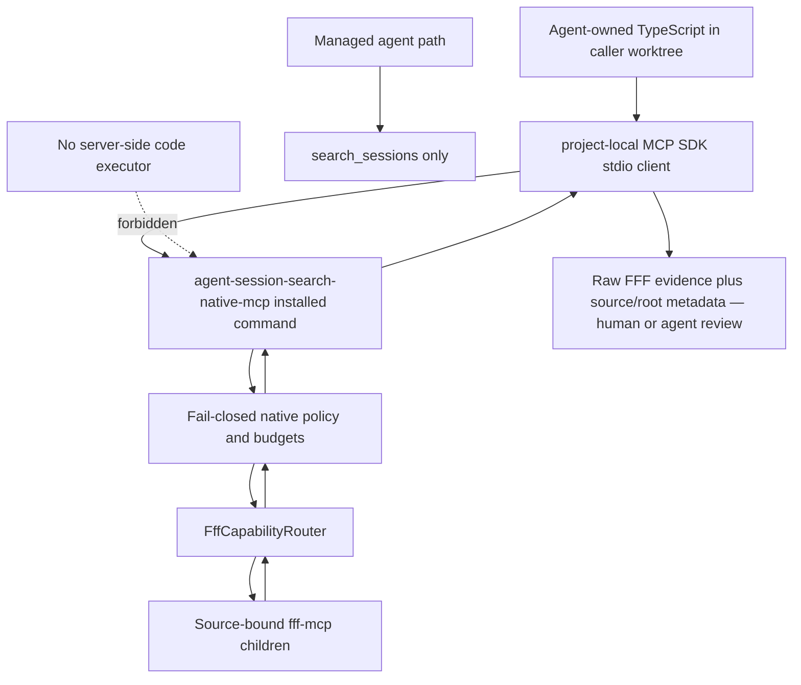
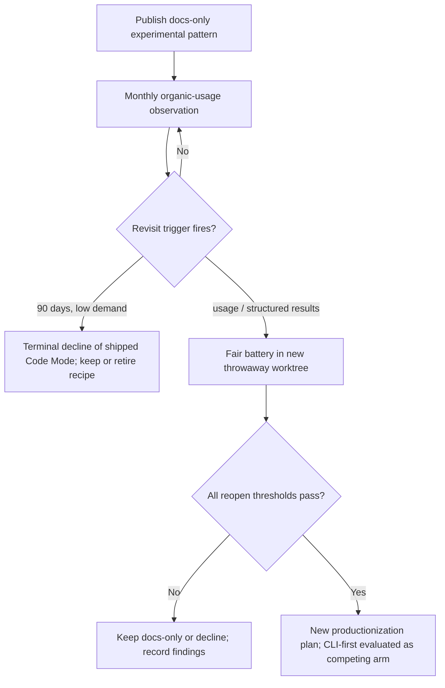

# feat: Code Mode R12 gate — documented client-side pattern, shipped tool declined

## Summary

**R12 gate recommendation: proceed-as-documented-pattern.** Do not ship a `session_search_code` tool in any form on the current evidence; publish an explicitly experimental client-side composition recipe over the existing opt-in native lane; keep the gate open behind named revisit triggers with a 90-day terminal decision.

The decisive measured evidence against shipping a tool now:

- The managed-lane comparison arm was never validly run (0/0 retained on all five tasks, undiagnosed, handicapped arming), so the central comparative question — does generated code beat the managed lane an agent already has? — is unanswered.
- Filtering precision was measured circularly (`decisive = retained.length`); hand scoring found only **9/19** retained generated hits decisive, including 0/3 on native-lane adoption and 0/2 on R13 archaeology.
- Self-contamination invalidates the strongest cells: 6/19 retained hits trace to contemporaneous pipeline sessions; decontaminated, the byte-savings criterion passes cleanly on exactly **one** task (root-wide: 26,229 → 623 bytes, 97.63%, 2/2 decisive) against a two-task threshold.
- Pagination never changed an answer, and both native arms stacked `maxResults: 10` pages — beating a 10-result page, not the default 50 or ceiling 200 a manual agent gets in one call.
- Raw FFF presentation text proved a brittle extraction interface: **10/19** retained hits were plausible false positives under lexical filtering — the most robust substantive negative, and structural, because typed result schemas are pinned upstream-owned.

The decisive evidence for the documented-pattern step: an 88-line shared harness over `@modelcontextprotocol/sdk` `Client` + `StdioClientTransport` drove capabilities discovery, 7-source fanout, cursor pagination, and filtering against `node dist/native-server.js` — under the ~150 LOC ergonomics ceiling, the one criterion that passed cleanly — with zero budget, timeout, concurrency, or 4 MiB failures across 101 calls. The findings council assessed evidence FOR productizing as weak, AGAINST productizing now as moderate; no reviewer would reverse the do-not-productize conclusion.

This is a docs-and-tests plan. No `src/`, `package.json`, managed-lane, or native-policy changes are authorized.

---

## R12 Gate Recommendation

**Verdict: proceed-as-documented-pattern** — the composite of the middle two pre-declared outcomes from the input concept ("documented client-side pattern only" + "defer pending evidence"), rejecting "ship a tool" and "decline outright."

| Gate criterion      | Prototype measurement                                                                      | Council-adjusted assessment                                                                                                                      | Verdict                                                           |
| ------------------- | ------------------------------------------------------------------------------------------ | ------------------------------------------------------------------------------------------------------------------------------------------------ | ----------------------------------------------------------------- |
| Fanout replacement  | 13 generated native calls/task vs 7 manual first-page; one shared script hid orchestration | Mechanically proven; backend work increased, no concurrency exercised, manual arm answered clean tasks from page one                             | Does not pass product-value gate                                  |
| Context reduction   | 91.95%–98.24% serialized-byte reduction across five tasks                                  | Clean on one task after decontamination (below the two-task threshold); recall of discarded hits never audited; end-to-end tokens never measured | Below threshold                                                   |
| Pagination value    | Extra retained lexical hits on all five tasks                                              | 10-result stacked pages only; no answer changed; decontaminated incremental value ≤1 decisive hit on an already-answered task                    | Fails                                                             |
| Filtering precision | Automated metric 1.0; hand scoring 9/19 decisive                                           | Circular metric, unrecorded rubric, unscored raw baseline; 10/19 false positives from raw-text parsing                                           | Fails; blocks unattended productization over the current contract |
| Ergonomics          | 88-line shared harness (< ~150 LOC ceiling)                                                | Real but amortized over five known-answer tasks; excludes probes and hand-scoring labor                                                          | Narrow feasibility pass                                           |
| Failure dominance   | 0 budget/timeout/concurrency/4 MiB failures in 101 calls                                   | Infrastructure held under light load; mode-664 EACCES reproduced only in worktree build                                                          | Not the blocker                                                   |
| Organic demand      | 0 decisive post-ship native-usage hits                                                     | ~1-day window, n=3, contamination-prone — absence of evidence, not evidence of absence                                                           | Gate remains open                                                 |

**What flips the verdict toward a shipped frontend** (all required): (1) a fair rerun shows generated code beating a _fully armed_ managed lane on answerability; (2) a typed/structured native result contract exists so client filtering no longer parses presentation text; (3) organic contamination-controlled usage appears, or answer-changing pagination is demonstrated at realistic page sizes; (4) pre-registered end-to-end token economics show a real margin.

**Why not decline outright:** feasibility evidence is complete evidence for a doc — the pattern's entire cost is a page and its correctness was directly demonstrated. Declining discards the round's only clean win and guarantees the next advanced agent re-derives the recipe badly (repeating the self-contamination, 10-result pagination, and unverified lexical filtering this round already paid for).

**Why not pure defer:** the adoption null is weak (lane shipped 2026-07-17; one day of observation), and the framing must stay "do not ship on this evidence; rerun a fair gate" — never "Code Mode was rejected."

---

## Draft Disagreements — What This Plan Decides

The three drafts converged on the verdict (documented pattern yes, shipped tool no, server-side execution permanently out). They disagreed on four points; this plan decides each:

1. **Where the recipe lives.** kimi: new `docs/recipes/code-mode-client-pattern.md`; codex: new `docs/code-mode.md`; fable: a section inside `docs/native-mcp.md`. **Decision: `docs/code-mode.md`** — a dedicated boundary page matching the repo's flat `docs/` layout (no new directory), linked from `docs/native-mcp.md`, `README.md`, and `docs/README.md`. A section inside `docs/native-mcp.md` undersells the experimental status and crowds the native reference doc; a new `docs/recipes/` directory invents a taxonomy for one page.

2. **Tested recipe vs. prose-only.** fable: `test/native-recipe.test.ts` extracting the doc's fenced block; codex: extend `test/native-mcp-smoke.test.ts` + packaging/readme contract tests; kimi: manual per-release checklist only. **Decision: codex's approach** — the executable contract lives in tests (extend `test/native-mcp-smoke.test.ts` with capabilities-first bounded fanout across two fixture sources; extend `test/packaging.test.ts`; extend `test/readme.test.ts` with positive/negative documentation assertions). Doc-block extraction is rejected as a brittle test mechanism (fable's own risk table flagged it); a manual-only recipe rots silently. This also answers fable's open question Q1: tested, not prose-only.

3. **Launch instruction in the recipe.** kimi/fable: document `node dist/native-server.js` with the mode-664 workaround; codex: installed command only, never a repo `dist/` path. **Decision: installed command `agent-session-search-native-mcp` is the documented primary path**; the recipe carries one clearly-marked repo-development note for `node dist/native-server.js` noting that repo builds restore exec bits via `npm run build` (mode-664/EACCES fixed on main, c7c889f). Both audiences (installed users, repo developers) are real; codex's hard line would make the recipe unfollowable from a repo checkout, and kimi's framing would paper over a source-tree build-output defect as normal usage. The packaging test (U2) asserts the installed command launches — if it cannot, work stops and a packaging bead is filed rather than documenting around it (codex's order-changing question, adopted).

4. **Verdict record: ADR vs. DESIGN.md only.** fable: new `docs/adr/0002-code-mode-r12-gate-round-1.md`; kimi/codex: DESIGN.md Deferred Ideas only. **Decision: both** — ADR 0002 is the durable, auditable gate record (mirroring ADR 0001's role and the two-lane plan's U4 acceptance-gate pattern); DESIGN.md's "Read-only Code Mode" Deferred Ideas bullet becomes a one-line pointer to the ADR and recipe. An ADR is the repo's established format for decisions that must be hard to relitigate from vibes.

Additionally, kimi's typed-contract follow-up (its highest-leverage Q1) is adopted as a filed Beads decision record rather than an implementation unit: it collides with the two-lane plan's "typed schemas stay upstream-owned" deferral and needs its own explicit decision, not a smuggled scope item. Fable's complementary point is preserved: the wrapper's existing `structuredContent` pass-through posture means upstream FFF structured results would arrive at zero wrapper cost; envelope-level JSON remains the only admissible local fallback shape, and only at round 2.

---

## Problem Frame

R12 of `docs/plans/2026-07-16-002-feat-fff-two-lane-architecture-plan.md` gates a `session_search_code` Code Mode frontend on native-lane usage showing programmable fanout, pagination, and result filtering justify it. One prototype round plus a four-model findings council has produced the first gate evidence: feasibility is proven, comparative product value is not, and the current raw-text result contract is a demonstrated brittleness that a supported unattended surface must not inherit. The product must capture the feasibility win at documentation cost, record the gate outcome durably, and keep evidence accumulating so the decision does not freeze on one methodologically weak round.

### Requirements

- R1. The R12 verdict must state that no shipped `session_search_code` MCP tool, binary, runtime, CLI command, or importable SDK is authorized by this evidence round.
- R2. Publish a minimal, explicitly experimental client-side composition recipe over the existing `agent-session-search-native-mcp` server, authored fresh — no copying or promoting `.worktrees/code-mode-proto` scripts.
- R3. The managed lane stays one tool (`search_sessions` contract untouched); the native lane keeps exactly `fff_native_capabilities` plus policy-approved source-bound tools; the native policy stays fail-closed (ADR 0001).
- R4. Example code executes in the caller's own worktree/process over stdio; no server ever executes submitted code; server-side arbitrary code execution remains a `DESIGN.md` non-goal.
- R5. The recipe is capabilities-first (calls `fff_native_capabilities`, selects advertised healthy sources, respects returned budgets) and preserves native source/root provenance; it treats raw FFF presentation text as opaque evidence requiring review, never as a parseable contract.
- R6. FFF remains the only search engine — no re-implemented search, indexing, embeddings, derived stores, or wrapper-inferred structured output.
- R7. The recipe documents that `@modelcontextprotocol/sdk` is a client-worktree dependency, not an export of the installed package.
- R8. Evidence collection reuses the local session corpus — no telemetry, usage database, or session-content logging added to any binary.
- R9. The decision stays revisitable: a documented revisit protocol with quantified triggers, a fair-rerun methodology contract, and a 90-day terminal low-demand decision.
- R10. The deferred CLI-first SDK fallback (`agent-session-search native call ...`) is named as the competing transport; the two tracks share this plan's evidence triggers instead of racing.

### Acceptance Examples

- AE1. An MCP client listing the managed server after this work still sees only `search_sessions`; no `session_search_code` symbol exists in any shipped schema.
- AE2. An advanced agent follows `docs/code-mode.md` from a separate TypeScript worktree, starts the installed native command, calls `fff_native_capabilities`, then issues a bounded approved `fff_grep`/`fff_multi_grep` against an advertised source.
- AE3. Documentation-contract tests fail if the recipe implies a shipped code tool, a typed result schema, a package-internal import, semantic parsing of presentation text, or promotion of the prototype harness.
- AE4. The packed npm tarball ships `docs/code-mode.md`, and its installed native command passes the same capabilities smoke the recipe describes.
- AE5. A future investigator reads `docs/investigations/code-mode/revisit-protocol.md` and can classify organic usage, build a fair battery, reject a contaminated round, and reach either a new productionization plan or a terminal decline without inventing methodology.

### Scope Boundaries

**In scope now**

- ADR 0002 recording the round-1 gate verdict, triggers, and rerun methodology contract.
- `docs/code-mode.md` — the experimental client-side composition recipe, plus inbound links.
- Test coverage pinning the recipe's protocol, disclaimers, provenance, and packaging assumptions.
- `docs/investigations/code-mode/revisit-protocol.md` — the evidence ledger, triggers, and fair-rerun contract.
- Three follow-up Beads (filed, not implemented).

**Deferred to follow-up work**

- A typed/structured native result contract — decision record Bead (upstream-owned vs. wrapper-inferred), highest leverage.
- The CLI-first `agent-session-search native call ...` fallback — evaluated before any SDK or Code Mode surface if module-resolution friction recurs (shares this plan's triggers).
- A second client-side prototype round when a revisit trigger fires.
- A productionization plan for any shipped `session_search_code` surface if a reopened gate passes all thresholds.
- ~~Verification of the mode-664 executable-bit question from a packed artifact~~ — resolved during planning: Session A landed the fix on main (c7c889f: `npm run build` chmods `bin` targets 0o755; packed-install verified executable; packaging test asserts the owner-exec bit and direct bin invocation). No bead needed.

**Outside this product's identity (hard non-goals)**

- Server-side arbitrary code execution, sandboxed or otherwise, in either MCP server.
- A code-taking mode on `search_sessions`, a third server binary, or automatic exposure of FFF tools.
- Custom search, embeddings, derived databases, durable telemetry, or session aggregation.
- Promotion or copying of `.worktrees/code-mode-proto` scripts into `src/`, `scripts/`, `examples/`, or packaged documentation.
- Re-doing the three native-lane eval fixes inside this work — they landed on main via Session A during planning (c7c889f bin modes, bcd4e3b `shownLeadCount` docs, 36f7f11 doctor `multi_grep` probe).

---

## Key Technical Decisions

| ID    | Decision and rationale                                                                                                                                                                                                                                                                                                                                                 |
| ----- | ---------------------------------------------------------------------------------------------------------------------------------------------------------------------------------------------------------------------------------------------------------------------------------------------------------------------------------------------------------------------- |
| KTD1  | **Split the gate.** Close R12 for a shipped frontend; open a docs-only experimental pattern. Feasibility suffices to teach advanced agents, not to create a supported runtime. (All three drafts agree.)                                                                                                                                                               |
| KTD2  | **Execution stays client-side.** Agent-authored TypeScript runs with the caller's own permissions and talks to the native server over stdio; no code crosses into the server. The `DESIGN.md` arbitrary-code non-goal is untouched and no path toward overcoming it is recommended.                                                                                    |
| KTD3  | **The native lane is the only low-level authority.** Every call remains source-bound, fingerprint-checked, validated, budgeted (256 attempted / 4 concurrent / 15s / 50–200 results / 4 MiB), and routed to FFF. Client composition cannot widen exposure — the recipe must say so explicitly.                                                                         |
| KTD4  | **Document transport, not raw-text interpretation.** The recipe covers connection, capabilities discovery, bounded fanout, default-size pagination, and provenance preservation. It contains no cursor scraper, no lexical/semantic hit scorer, no known-answer filter; it leads with the 10/19 false-positive measurement and mandates human review of retained hits. |
| KTD5  | **Fresh minimal example; executable contract in tests.** The recipe's code block is authored against the public MCP surface; `test/native-mcp-smoke.test.ts` proves the same protocol against fixture roots. The 88-line prototype harness remains throwaway evidence.                                                                                                 |
| KTD6  | **Recipe lives at `docs/code-mode.md`; verdict lives in ADR 0002.** Dedicated flat docs page (not a new `docs/recipes/` taxonomy, not buried in `docs/native-mcp.md`); ADR 0002 mirrors ADR 0001's role for a decision that must resist relitigation. (Disagreement resolutions 1 and 4.)                                                                              |
| KTD7  | **Installed command primary, repo fallback documented.** `agent-session-search-native-mcp` is the recipe's launch surface; `node dist/native-server.js` appears once as a repo-development note naming the mode-664 fix (c7c889f: repo builds chmod bins via `npm run build`). Packaging tests enforce the installed path. (Disagreement resolution 3.)                |
| KTD8  | **Zero-instrumentation evidence collection.** Monthly manual corpus checks via `search_sessions`/`cass` with session-id exclusions; no telemetry in any binary. A future opt-in usage counter is its own plan.                                                                                                                                                         |
| KTD9  | **CLI-first fallback shares this plan's triggers.** The TS recipe serves agents that can generate code; the CLI shape serves those that cannot. Both are gated by the same prerequisite (a typed/envelope JSON result mode); they share one evidence track rather than racing.                                                                                         |
| KTD10 | **Fresh implementation worktree; throwaway experiment worktrees.** Land U1–U4 from a new normal worktree branched after this plan's acceptance; every future battery gets its own throwaway worktree and merges findings only. Never reuse or promote the first prototype worktree.                                                                                    |

---

## High-Level Technical Design

### Client/server topology



### Documented client protocol

```mermaid
sequenceDiagram
  participant C as Client-owned code
  participant N as Native MCP server
  participant F as FFF through router
  C->>N: fff_native_capabilities (first, always)
  N-->>C: healthy sources, budgets, policy version
  C->>N: bounded approved calls, source-bound, default page size
  N->>F: validated source-bound calls
  F-->>N: raw CallToolResult envelopes
  N-->>C: raw results plus native provenance
  C->>C: structural filtering (path/date/source id); retained hits are leads, not answers
```

### R12 evidence lifecycle



---

## Implementation Units

### U1. Record the R12 gate verdict durably (ADR 0002 + DESIGN.md + doc-contract assertions)

- **Goal:** Make the do-not-ship/docs-only decision durable, auditable, and impossible to mistake for a new product surface.
- **Requirements:** R1, R3, R4, R6; AE1; KTD1, KTD2, KTD3, KTD6.
- **Dependencies:** none.
- **Files:** create `docs/adr/0002-code-mode-r12-gate-round-1.md`; modify `DESIGN.md`; modify `test/readme.test.ts`.
- **Approach:** ADR 0002 records, in ADR 0001's format: the verdict (documented pattern yes; shipped `session_search_code` declined on the 2026-07-18 evidence; gate open, not failed); evidence pointers (digest brief, prototype findings, findings-council report) with the per-criterion table above; the revisit triggers T1–T4 and terminal 90-day decision (see Evidence Maintenance); and the methodology contract any round-2 rerun must satisfy (fair managed arm, session-id contamination exclusion, non-circular recorded-rubric precision with scored raw baseline, realistic 50/200 page arms, recall audit of discarded hits, frozen corpus or pre-experiment cutoff, pre-registered token thresholds). It states explicitly that the adoption null is absence of evidence and the verdict must not be quoted as a rejection. In `DESIGN.md`, replace the "Read-only Code Mode" Deferred Ideas bullet with a one-line dated pointer to ADR 0002 and `docs/code-mode.md`; the arbitrary-code-execution non-goal sentence is unchanged. Extend `test/readme.test.ts` with assertions pinning the verdict language and links (positive: ADR 0002 linked; negative: no language implying a shipped code tool, typed raw hits, or server-executed code).
- **Patterns to follow:** `docs/adr/0001-fff-core-and-native-policy-strictness.md` for ADR shape; `test/readme.test.ts`'s existing required-text loop.
- **Test scenarios:**
  - Documentation test asserts ADR 0002 exists-linked and DESIGN.md points at it; passes after the edits, fails if either pointer is removed.
  - Documentation test fails on text implying `session_search_code` ships, that results are typed, or that the server runs submitted code.
  - Reviewer check: `DESIGN.md`'s non-goals section is byte-identical except the single Deferred Ideas bullet.
- **Verification:** A reader can learn the verdict, the evidence, and the exact reopen conditions from ADR 0002 alone, and reach it from DESIGN.md in one hop.

### U2. Publish the experimental recipe page with executable and packaging coverage

- **Goal:** Give advanced agents a small reproducible composition recipe that cannot silently rot, without creating an SDK or supporting raw-text interpretation.
- **Requirements:** R2, R3, R4, R5, R7; AE2, AE3, AE4; KTD2–KTD7.
- **Dependencies:** U1 (the page links ADR 0002 and inherits its verdict framing).
- **Files:** create `docs/code-mode.md`; modify `docs/native-mcp.md`, `README.md`, `docs/README.md`, `test/native-mcp-smoke.test.ts`, `test/packaging.test.ts`, `test/readme.test.ts`.
- **Approach:** `docs/code-mode.md` is titled and introduced as an **experimental, unsupported** client-side native-composition pattern — not a `session_search_code` feature. It opens by pointing at `search_sessions` first, scopes itself to compositions the managed lane cannot express, and instructs filing such cases as evidence (feeding the revisit protocol). One fenced TypeScript block (~40–60 lines, fresh-authored): project-local `@modelcontextprotocol/sdk` `Client` + `StdioClientTransport`; launch the installed `agent-session-search-native-mcp` command (one repo-development note for `node dist/native-server.js` naming the mode-664 fix, c7c889f); call `fff_native_capabilities` first and read sources + budgets from it (never hardcode source names); bounded fanout of approved calls across healthy sources at ≤4 concurrency; paginate at the **default page size** (the council's page-size lesson, encoded); exclude the caller's own sessions **by session id/path**, never by preview-token filters (6/19 contamination hits came from that mistake); prefer structural filters (path, date, source) over lexical scoring; treat retained hits as leads requiring human review. Mandatory stated content (asserted by test): the unsupported/experimental warning with named supported surfaces (`search_sessions`, the CLI, the native tools); the 10/19 false-positive measurement and raw-text caveat; the project-local SDK dependency (R7); the budget cross-reference; the root-wide coverage warning (native roots are not managed-include confinement); no stability promise; prototype harness not included and not promoted. `docs/native-mcp.md` gains one short "Client-side composition" note linking the page and retaining its root-wide warning; `README.md` and `docs/README.md` link it labeled experimental. Extend `test/native-mcp-smoke.test.ts`: using the existing `StdioClientTransport` + `fixtureSearchEnv` machinery with two configured fixture roots, a client calls capabilities first, discovers two healthy sources, issues bounded calls against both, and each result retains correct namespaced `source`, canonical `root`, and upstream `tool` attribution; unadvertised tools remain unavailable. Extend `test/packaging.test.ts`: the packed tarball contains `docs/code-mode.md` and the installed native command launches and answers a capabilities call. Extend `test/readme.test.ts`: the new links and disclaimers are pinned.
- **Execution note:** Prove the two-source capabilities-first smoke and the installed-command packaging assertion before polishing prose — the documentation must describe behavior the tests actually exercise.
- **Patterns to follow:** `test/native-mcp-smoke.test.ts` (SDK client/stdio setup, fixture roots); `test/packaging.test.ts` (packed-install behavior); `docs/native-mcp.md` (concise opt-in and root-wide warnings).
- **Test scenarios:**
  - Happy path: fixture client calls capabilities before mirrored tools, fans out bounded calls to two sources, and receives results with correct per-source provenance — no cross-source attribution.
  - Error path: an unknown/unadvertised tool call fails; the example has no route around native policy validation.
  - Packaging: tarball file list includes `docs/code-mode.md`; installed native binary lists capabilities and an approved tool (Covers AE4).
  - Docs contract: every command in the recipe is copy-paste runnable from repo root; links from `docs/native-mcp.md`, `README.md`, `docs/README.md` resolve; assertions fail on typed-schema, package-import, or parser-promising language (Covers AE3).
  - Docs review: the example prints/returns opaque envelopes; no test or doc depends on parsing cursor or decisive-hit meaning from presentation text (Covers AE2, R5).
- **Verification:** Targeted smoke, packaging, and docs tests prove the documented protocol without adding a production helper, public API, or `src/` diff.

### U3. Write the revisit protocol (evidence ledger, triggers, fair-rerun contract)

- **Goal:** Keep R12 evidence accumulating so one inconclusive round cannot harden into permanent limbo or a misquoted rejection.
- **Requirements:** R8, R9, R10; AE5; KTD8, KTD9.
- **Dependencies:** U1 (ADR 0002 summarizes and links it). May be authored in parallel with U2.
- **Files:** create `docs/investigations/code-mode/revisit-protocol.md`; modify `docs/code-mode.md` (one link).
- **Approach:** A durable internal evidence contract defining: the qualifying-task ledger schema (observation date, source/session id, project, non-eval task description, native tools called, agent-visible round trips, pages and result caps, returned/retained tokens, decisive-evidence rubric, answer outcome, failure mode, contamination exclusions — identifiers and measurements only, never copied session content); the monthly zero-instrumentation observation procedure (managed-lane `search_sessions` with `queries: ["fff_grep", "fff_multi_grep", "fff_native_capabilities", "StdioClientTransport", "native-mcp"]` scoped post-2026-07-17; best-effort `cass` with `timeout`, recording degradation; metadata-based date/project scoping — not path regexes, a recorded round-1 defect; exclusion of pipeline/eval/planning sessions by exact session id and predeclared cutoff); the triggers and rerun thresholds (see Evidence Maintenance); and the fair-rerun methodology contract (frozen corpus with fingerprint, randomized arm order, blind tasks with ground-truth evidence sets not encoded into filters, fully armed managed lane — concise `query`, explicit literal `queries`, `operationalContext`, `callerSession` demotion, candidate-group continuation, `more.evidence` follow-ups, diagnosed-before-concluding; realistic native arms — single page at default 50, single page at ceiling 200, manual cursor pagination, generated composition, CLI-first transport when triggered; recorded-rubric scoring of retained **and** discarded hits with independent adjudication against the scored raw baseline; end-to-end token accounting with pre-registered thresholds, bytes as secondary diagnostic only; answer-change as the pagination measure; honest ergonomics accounting including probes and hand-scoring labor; packaging claims only from packed artifacts; no known-answer filters). It states that future prototype code lives in a new throwaway worktree and only findings merge.
- **Patterns to follow:** `docs/agents/prototyping.md` (evidence-over-scaffolding promotion); `docs/investigations/code-mode/2026-07-18-digest-brief.md` (falsifiable criteria); the findings-council report's methodology corrections.
- **Test scenarios:** Test expectation: none — internal evidence protocol with no runtime behavior. Review it against each council methodology issue and each reopen threshold.
- **Verification:** A future investigator can classify organic use, build a fair battery, reject a contaminated round, and reach a new production plan or a terminal decline without inventing methodology (AE5).

### U4. File the follow-up Beads (tracking only — no implementation)

- **Goal:** Convert this decision into tracked work without starting any of it.
- **Requirements:** R9, R10.
- **Dependencies:** U1–U3 landed (the beads link ADR 0002 and the revisit protocol).
- **Files:** none (Beads via `br`).
- **Approach:** File three beads (titles, not specs): (1) "Typed/structured native result contract — decision record needed (upstream-owned vs. wrapper-inferred)" — highest leverage; carries the tension with the two-lane plan's typed-schema deferral and must resolve whether raw presentation text is the permanent extraction ceiling; (2) "R12 gate rerun — fair managed-arm comparison per revisit-protocol.md" — blocked on triggers; (3) "Code Mode evidence watch — monthly organic native-lane usage check" — recurring-lite process bead carrying the observation queries and the dated ledger. A fourth candidate (packed-install executable-bit verification) was dropped during planning — satisfied by Session A's c7c889f on main; no bead needed.
- **Test scenarios:** Test expectation: none — issue-tracker operations.
- **Verification:** `br list` shows beads 1–3 with links to ADR 0002 and `docs/investigations/code-mode/revisit-protocol.md`; no packaging bead is filed (satisfied by c7c889f).

### Sequencing

U1 first (verdict record gates the rest). U2 and U3 in parallel after U1. U4 last. Land U1–U3 together from the implementation worktree after the full verification contract passes; file U4 immediately after landing.

---

## Implementation Venue

**Yes — implement in a fresh git worktree**, branched from the main line after this plan is accepted (e.g. `.worktrees/code-mode-recipe`). Do not implement from the throwaway `.worktrees/code-mode-proto` worktree and do not copy files from it; the current `.worktrees/code-mode` planning worktree merges planning artifacts only (council drafts, this synthesis).

Reasoning:

1. **Repo convention:** `docs/agents/prototyping.md` isolates work-in-progress and merges durable docs, not scaffolding; the pre-commit hook runs full `check`/`test`, so iterating on a doc-linked test belongs off the main line.
2. **Concurrency isolation:** Session A's three native-lane eval fixes landed on main during planning (c7c889f, bcd4e3b, 36f7f11, touching packaging, preflight, and docs); the implementation worktree branches from main after those commits, so no interleaving or mid-stream rebase is needed.
3. **Clean rollback boundary:** docs + tests land as one reversible change; if the verdict is revisited, the worktree is discarded with zero mainline footprint.
4. **Prototype hygiene precedent:** the first round ran in `.worktrees/code-mode-proto`, merged findings, abandoned scripts — this plan continues that rule, and every future fair battery gets its own throwaway worktree.

---

## Evidence Maintenance

R12 evidence keeps accumulating through three mechanisms, all specified in `docs/investigations/code-mode/revisit-protocol.md` (U3) and tracked by the U4 beads:

1. **Monthly organic-usage observation (zero instrumentation).** Manual corpus checks via the managed lane and best-effort `cass`, post-2026-07-17, with exact session-id exclusions of pipeline/eval/planning sessions and metadata-based scoping. Results append to a dated evidence log in the rerun bead. No telemetry is added to any binary; if transcripts prove blind to tool-use identity, an opt-in usage counter becomes its own separate plan.
2. **Revisit triggers (any one opens gate round 2):**
   - **T1 — organic usage:** ≥10 qualifying non-pipeline tasks across ≥3 distinct sessions and ≥2 projects observed via the monthly sweep, earliest 2026-08-17 (≥30 days after the native lane shipped). Three independently observed tasks with auditable fanout/pagination burden can fire an early targeted round.
   - **T2 — typed results land:** upstream FFF ships `structuredContent`/typed results for `grep`/`multi_grep` (arriving via the native lane's pass-through at zero wrapper cost), or the U4-bead-1 decision record resolves with a shipped structured/envelope-JSON result mode. Most likely to flip the verdict.
   - **T3 — packaging confirmed fixed:** ~~the packed/installed artifact is verified executable~~ **satisfied 2026-07-18 during planning** — Session A landed c7c889f on main (build chmods bins; packed-install verified; packaging test pins the exec bit). No longer a live trigger; kept for the rerun contract's history.
   - **T4 — time:** 90 days from this decision (≈ 2026-10-16) with no other trigger and fewer than 10 qualifying tasks — stop deferring: record insufficient demand, decline a shipped `session_search_code`, and decide whether the recipe page still earns maintenance. "No news" becomes a deliberate re-confirmation, not a silent freeze.
   - **CLI-friction sub-trigger:** if two qualifying tasks are blocked or materially complicated by SDK/module-resolution setup, prototype the CLI-first `native call` transport first, as a competing arm — one composition frontend maximum (R10).
3. **Methodology-fixed rerun protocol.** Any round 2 is a new throwaway-worktree prototype satisfying the full methodology contract in U3 (fair managed arm, contamination control, non-circular scored metrics with recall audit, realistic page arms, pre-registered token thresholds, no known-answer filters, honest ergonomics accounting, packed-artifact packaging claims). **Reopen thresholds (all must pass):** fanout — one generated program replaces ≥5 agent-visible sequential round trips on ≥2 blind tasks with matched-or-better correctness; context cost — ≥2 tasks cut end-to-end tokens ≥50% while preserving every ground-truth decisive item; pagination — ≥1 task changes from unanswered/wrong to correct against both fair 50- and 200-result single-page arms; filtering — ≥2 tasks improve decisive-hit precision ≥20 points over the scored raw/manual baseline without lowering recall; ergonomics — shared client infrastructure <200 readable lines, task logic <50 lines, no presentation-text parser; reliability — no unhandled call, provenance, timeout, budget, or result-size failure. Passing feasibility or byte reduction alone never reopens the gate.

---

## Risks and Mitigations

| Risk                                                                 | Impact                                                         | Mitigation                                                                                                                                                                       |
| -------------------------------------------------------------------- | -------------------------------------------------------------- | -------------------------------------------------------------------------------------------------------------------------------------------------------------------------------- |
| Recipe calcifies into an unsupported de-facto API                    | Users depend on a snippet whose imports or MCP behavior change | Experimental label with named supported surfaces asserted by test; no exported helper, no semver promise; ADR 0002 states no shipped surface exists                              |
| Recipe teaches brittle raw-text parsing                              | Product teaches the behavior that blocked productization       | Recipe leads with the 10/19 false-positive measurement; mandates structural-over-lexical filtering and human review; contains no parser/scorer; prohibition pinned in docs tests |
| Root-wide native access misunderstood as managed-include confinement | Client fanout inspects sibling files outside managed includes  | Capabilities-first discovery required; root-wide warning retained beside the example; provenance asserted in tests                                                               |
| Module-resolution friction hidden by repo-local success              | Recipe works only where the SDK is already installed           | R7's explicit project-local dependency statement; installed-command primary path; CLI-friction sub-trigger routes to the CLI-first fallback                                      |
| Self-observation contaminates future adoption evidence               | Planning/prototype sessions masquerade as organic use          | Session-id exclusions, predeclared cutoffs, non-eval-outcome requirement in the ledger schema                                                                                    |
| Fair managed arm handicapped again                                   | Rerun credits Code Mode for managed-lane capabilities          | Full managed arming is a required rerun arm; rounds rejecting or skipping it are invalid per the protocol                                                                        |
| Verdict freezes or is misquoted as "rejected"                        | Lost option value; premature closure                           | ADR 0002's not-rejected framing; T4 terminal 90-day decision; monthly evidence-log bead                                                                                          |
| Typed-contract follow-up stalls behind the two-lane deferral         | Code Mode silently capped at the documented pattern forever    | U4 bead 1 forces an explicit decision record; if the answer is "upstream-owned, no plans," DESIGN.md says so out loud                                                            |
| Token economics never measured                                       | Next gate repeats the byte-vs-raw-envelope strawman            | Pre-registered end-to-end token thresholds are a rerun entry requirement                                                                                                         |
| Worktree/prototype scaffolding leaks into the release                | Throwaway scripts become package surface                       | Separate implementation/experiment worktrees; packaging test inspects the packed file list; only the new markdown page may appear                                                |
| Scope creep into the three eval fixes                                | This work duplicates landed work                               | They landed on main via Session A during planning (c7c889f, bcd4e3b, 36f7f11) and are referenced as landed prerequisites only                                                    |
| Docs drift from shipped native-lane behavior                         | Recipe rots silently                                           | Executable smoke coverage (U2) plus revalidation on any release touching `src/native-server.ts`, `src/fff-native-policy.ts`, or `src/fff-capability-router.ts`                   |

---

## Rollback

All units land as one reversible docs-and-tests change. If the recipe proves misleading: remove the `README.md` / `docs/README.md` / `docs/native-mcp.md` links and `docs/code-mode.md`, update the documentation-contract assertions, and keep ADR 0002, the revisit protocol, and the investigation artifacts as dated historical evidence (amend ADR 0002 with a status note rather than deleting it). No runtime code, config format, persistent state, or server registration changes exist, so rollback requires no migration. A future failed prototype round rolls back by discarding its worktree and merging only its findings.

---

## Order-Changing Open Questions

- **Q1 (highest leverage): typed result contract vs. the two-lane plan's deferral.** If upstream FFF publishes a stable structured `grep`/`multi_grep` contract before U2 lands, revise the recipe and test plan around that contract and consider folding the recipe into round 2 instead of shipping it twice. If the decision record lands on "upstream-owned, no plans," raw presentation text is the permanent extraction ceiling — say so in DESIGN.md. Resolved via U4 bead 1; blocks any future shipped-tool gate, not U1–U3.
- **Q2: installed-command verification.** If `test/packaging.test.ts` shows the installed tarball cannot launch `agent-session-search-native-mcp`, stop U2 and file a packaging bead; do not ship a recipe whose primary path is broken.
- **Q3: managed-lane dominance.** If a fairly armed managed lane already solves the first revisit tasks at comparable correctness and context cost, cancel the Code Mode rerun and record a decline or a managed-lane improvement opportunity instead.
- **Q4: CLI-first subsumption.** If the CLI-first fallback gains envelope-level JSON output first, the TS recipe may shrink to a niche; the two tracks share the T-triggers precisely so this is evaluated, not raced.

---

## Verification Contract

| Gate             | Command                                                                                | Proves                                                                                                                   |
| ---------------- | -------------------------------------------------------------------------------------- | ------------------------------------------------------------------------------------------------------------------------ |
| Type safety      | `npm run check`                                                                        | Extended smoke/docs tests compile under strict TS.                                                                       |
| Focused contract | `npm test -- test/readme.test.ts test/native-mcp-smoke.test.ts test/packaging.test.ts` | Verdict language, links, disclaimers, capabilities-first fanout, provenance, installed-command behavior, packaged docs.  |
| Full regression  | `npm test`                                                                             | Managed lane, native policy, CLI, doctor, packaging unchanged (zero `src/` diff expected).                               |
| Build            | `npm run build`                                                                        | No docs/test change breaks the ESM build or native binary output.                                                        |
| Guardrails       | `npm run check:dcg`                                                                    | Destructive-command protections active before landing.                                                                   |
| Manual review    | Read `README.md`, `docs/native-mcp.md`, `docs/code-mode.md`, ADR 0002 as a new user    | Experimental label, trust boundary, SDK dependency, root-wide warning, and no-server-execution boundary are unambiguous. |

---

## Definition of Done

- ADR 0002 records the round-1 verdict (documented pattern yes; shipped `session_search_code` declined on the 2026-07-18 evidence; gate open, not rejected), triggers T1–T4, and the rerun methodology contract; DESIGN.md points to it in one line.
- `docs/code-mode.md` documents only the experimental client-side pattern and carries every mandatory warning, asserted by tests.
- Managed tool list, native tool list, CLI commands, package exports, and all of `src/` are unchanged.
- The recipe is fresh-authored, capabilities-first, source-bound, budget-aware, default-page-size, session-id-decontaminated, structural-over-lexical, and explicit about its project-local SDK dependency and installed-command launch path.
- Neither docs nor tests promote the prototype harness or parse raw presentation text as a contract.
- The packed tarball ships `docs/code-mode.md`; the installed native command passes the capabilities smoke.
- `docs/investigations/code-mode/revisit-protocol.md` defines the ledger, observation procedure, triggers, fair-rerun contract, reopen thresholds, and the 90-day terminal decision.
- Three follow-up Beads exist with the stated links.
- Implementation landed from a fresh worktree; no prototype scaffolding, stray snippets, or unrelated changes in the final diff.
- `npm run check`, the focused test command, `npm test`, `npm run build`, and `npm run check:dcg` pass.

---

## Sources and Research

- `docs/investigations/code-mode/plan-council/input-concept.md` — gate-evaluation task, hard constraints, required decision surfaces.
- `docs/investigations/code-mode/2026-07-18-digest-brief.md` — falsifiable R12 thresholds; the null organic-usage prior.
- `docs/prototypes/findings/2026-07-18-code-mode-client-side-prototype.md` — measurements and the initial do-not-productize recommendation.
- `docs/investigations/code-mode/2026-07-18-prototype-findings-council.md` — council narrowing, contamination and baseline defects, methodology corrections.
- Plan-council drafts synthesized here: `docs/investigations/code-mode/plan-council/draft-kimi-k3.md`, `docs/investigations/code-mode/plan-council/draft-codex-56-sol-x-high.md`, `docs/investigations/code-mode/plan-council/draft-fable.md`.
- `docs/plans/2026-07-16-002-feat-fff-two-lane-architecture-plan.md` — origin R12, CLI-first fallback, upstream-owned typed-schema deferral.
- `docs/adr/0001-fff-core-and-native-policy-strictness.md` — FFF-as-core and fail-closed native policy; ADR format for U1.
- `DESIGN.md`, `CONTEXT.md`, `AGENTS.md`, `docs/agents/prototyping.md` — non-goals, managed one-tool boundary, worktree/promotion lifecycle.
- `src/native-server.ts`, `test/native-mcp-smoke.test.ts`, `test/packaging.test.ts`, `test/readme.test.ts` — existing capabilities, stdio, packaging, and documentation patterns extended (never modified in `src/`).
